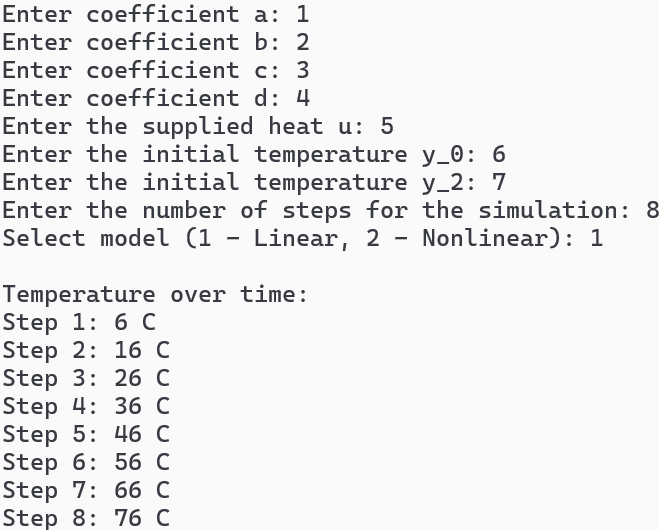
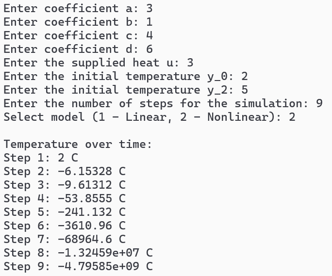

 Министерство образования Республики Беларусь

Учреждение образования

“Брестский Государственный технический университет”

Кафедра ИИТ

       

Лабораторная работа №1

По дисциплине “Общая теория интеллектуальных систем”

Тема: “Моделирование температуры объекта”

     

Выполнил:

Студент 2 курса

Группы ИИ-28

Шумский И.Н.

Проверил:

Иванюк Д.С.

     

Брест 2025

Общее задание
1. Написать отчет по выполненной лабораторной работе №1 в .md формате (readme.md) и с помощью запроса на внесение изменений (**pull request**) разместить его в следующем каталоге: **trunk\ii0xxyy\task_01\doc** (где **xx** - номер группы, **yy** - номер студента, например **ii02302**).
2. Исходный код написанной программы разместить в каталоге: **trunk\ii0xxyy\task_01\src**.
3. Выполнить рецензирование ([review](https://linearb.io/blog/code-review-on-github), [checklist](https://linearb.io/blog/code-review-checklist)) запросов других студентов (минимум 2-е рецензии).
4. Отразить выполнение работы в файле readme.md в соответствующей строке (например, для студента под порядковым номером 1 - https://github.com/brstu/OTIS-2023/edit/main/readme.md?#L17-L17).

Task 1. Modeling controlled object Let's get some object to be controlled. We want to control its temperature, which can be described by this differential equation: (dy(τ)/dτ) = (u(τ)/C) + ((Y[0] - y(τ))/RC) (1) where τ – time; y (τ) – input temperature; u (τ) – input warm; Y0 – room temperature; C , R C – some constants. After transformation we get these linear (2) and nonlinear (3) models: y[τ + 1] = a*y[τ] + b*u[τ] (2) ⁡y[τ + 1] = a*y[τ] - b*y[τ - 1]^2 +c*u[τ] + dsin(u[t - 1]) (3) where τ – time discrete moments ( 1 , 2 , 3 … n ); a, b, c, d – some constants. Task is to write program (С++), which simulates this object temperature.

Код программы:
C++
#include <iostream>
#include <cmath>
#include <vector>

struct ModelParams {
    double a;
    double b;
    double c;
    double d;
};

// Линейная модель
double linear_model(double y_prev, double u, double a, double b) {
    return a * y_prev + b * u;
}

// Нелинейная модель
double nonlinear_model(double y_prev, double y_prev_2, double u, const ModelParams& p) {
    return p.a * y_prev - p.b * std::pow(y_prev_2, 2) + p.c * u + p.d * std::sin(u);
}

int main() {
    ModelParams params{};
    double u;
    double y_0;
    int num_steps;
    int model_choice;

    std::cout << "Enter coefficient a: ";
    std::cin >> params.a;
    std::cout << "Enter coefficient b: ";
    std::cin >> params.b;
    std::cout << "Enter coefficient c: ";
    std::cin >> params.c;
    std::cout << "Enter coefficient d: ";
    std::cin >> params.d;

    std::cout << "Enter the supplied heat u: ";
    std::cin >> u;

    std::cout << "Enter the initial temperature y_0: ";
    std::cin >> y_0;

    std::cout << "Enter the number of steps for the simulation: ";
    std::cin >> num_steps;

    std::cout << "Select model (1 – Linear, 2 – Nonlinear): ";
    std::cin >> model_choice;

    std::vector<double> temperatures(num_steps);

    double y_1 = y_0;
    double y_2 = y_0;

    for (int t = 0; t < num_steps; ++t) {
        temperatures[t] = y_1;

        if (model_choice == 1) {
            y_1 = linear_model(y_1, u, params.a, params.b);
        }
        else if (model_choice == 2) {
            double y_next = nonlinear_model(y_1, y_2, u, params);
            y_2 = y_1;
            y_1 = y_next;
        }
        else {
            std::cout << "Wrong model choice!" << std::endl;
            return -1;
        }
    }

    std::cout << "\nTemperature over time:\n";
    for (int t = 0; t < num_steps; ++t) {
        std::cout << "Step " << t + 1 << ": " << temperatures[t] << " C" << std::endl;
    }

    return 0;
}

Результат программы:
Вывод линейной симуляции:
 

 
Вывод нелинейной симуляции:
 

