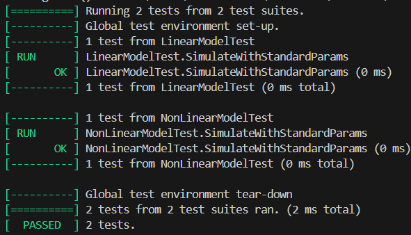
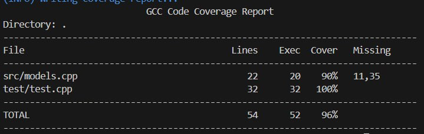

<p align="center">Министерство образования Республики Беларусь</p>
<p align="center">Учреждение образования</p>
<p align="center">“Брестский Государственный технический университет”</p>
<p align="center">Кафедра ИИТ</p>
<br><br><br><br><br><br><br>
<p align="center">Лабораторная работа №2</p>
<p align="center">По дисциплине “Общая теория интеллектуальных систем”</p>
<p align="center">Тема: “Модульное тестирование.”</p>
<br><br><br><br><br>
<p align="right">Выполнил:</p>
<p align="right">Студент 2 курса</p>
<p align="right">Группы ИИ-27</p>
<p align="right">Глаголева Е.В.</p>
<p align="right">Проверил:</p>
<p align="right">Дворанинович Д.А.</p>
<br><br><br><br><br>
<p align="center">Брест 2025</p>

# Общее задание #
Написать модульные тесты для программы, разработанной в лабораторной работе №1.

1. Использовать следующий фреймворк для модульного тестирования - [Google Test](https://google.github.io/googletest/).
2. Написать модульные тесты для основных функций программы. Разместить тесты в каталоге: **trunk\ii0xxyy\task_02\test**.
3. Исходный код модифицированной программы разместить в каталоге: **trunk\ii0xxyy\task_02\src**.
4. В файле `readme.md` отразить количество написанных тестов и процент покрытия кода тестами (использовать любой инструмент для анализа покрытия, например, [gcovr](https://gcovr.com/en/stable/)).
5. Также необходимо отразить выполнение работы в общем файле [`readme.md`](https://github.com/brstu/OTIS-2025/blob/main/README.md) в соответствующей строке (например, для студента под порядковым номером 1 - https://github.com/brstu/OTIS-2025/blob/b2d60c2765b369aed21af76af8fa4461da2c8da6/README.md?plain=1#L13).


## Код юнит-тестов
```C++
#include <gtest/gtest.h>
#include <gmock/gmock.h>
#include <memory>
#include <vector>

#include "../src/models.hpp"

TEST(LinearModelTest, SimulateWithStandardParams) {
    const double y0 = 0.0;
    const double u = 1.0;
    const int t = 5;
    const double a = 0.5;
    const double b = 0.5;

    std::vector<double> expected = 
        {0.0, 0.5, 0.75, 0.875, 0.9375, 0.96875};
    std::vector<double> result = simulateLinearModel(y0, u, t, a, b);

    ASSERT_EQ(result.size(), expected.size());
    for (int i = 0; i < result.size(); i++) {
        EXPECT_NEAR(result[i], expected[i], 1e-6) << "Mismatch at index " << i;
    }
}

TEST(NonLinearModelTest, SimulateWithStandardParams) {
    const double y0 = 0;
    const double u = 1;
    const int t = 5;
    const double a = 0.5;
    const double b = 0.5;
    const double c = 0.3;
    const double d = 0.5;

    std::vector<double> expected = {
        0,
        0.686663,
        1.13606,
        1.10542,
        0.545132,
        0.0812084
    };

    std::vector<double> result = simulateNonLinearModel(y0, u, t, a, b, c, d);

    ASSERT_EQ(result.size(), expected.size());
    for (int i = 0; i < result.size(); i++) {
        EXPECT_NEAR(result[i], expected[i], 1e-5) << "Mismatch at index " << i;
    }
}
```

## Результаты юнит-тестирования


## Покрытие тестами
