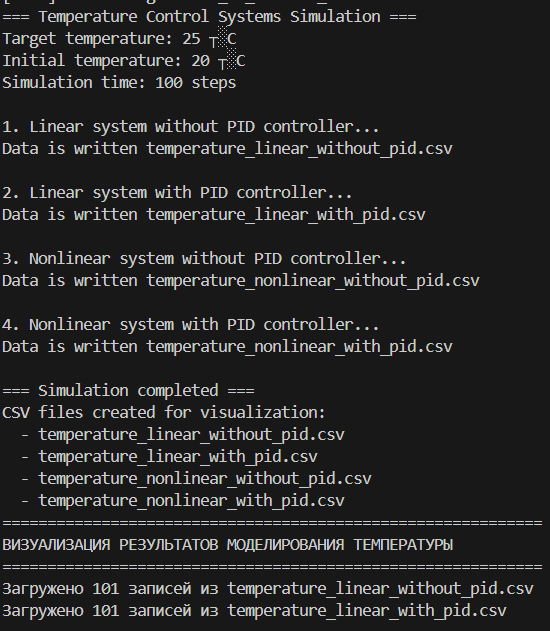
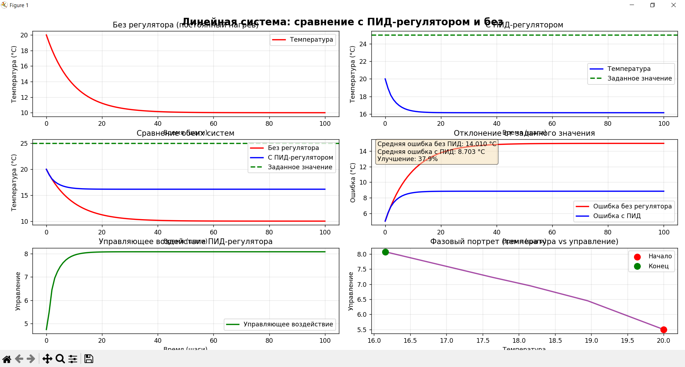
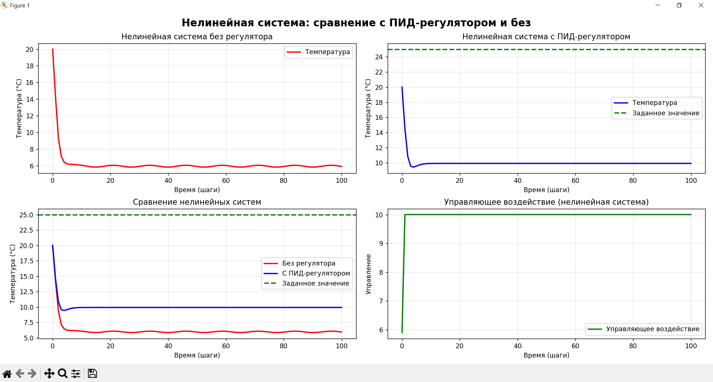
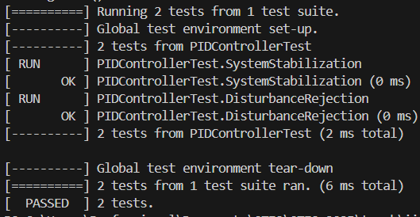

<p align="center">Министерство образования Республики Беларусь</p>
<p align="center">Учреждение образования</p>
<p align="center">“Брестский Государственный технический университет”</p>
<p align="center">Кафедра ИИТ</p>
<br><br><br><br><br><br><br>
<p align="center">Лабораторная работа №3</p>
<p align="center">По дисциплине “Общая теория интеллектуальных систем”</p>
<p align="center">Тема: “ПИД Регулирование.”</p>
<br><br><br><br><br>
<p align="right">Выполнил:</p>
<p align="right">Студент 2 курса</p>
<p align="right">Группы ИИ-27</p>
<p align="right">Глаголева Е.В.</p>
<p align="right">Проверил:</p>
<p align="right">Дворанинович Д.А.</p>
<br><br><br><br><br>
<p align="center">Брест 2025</p>

1. Написать отчет по выполненной лабораторной работе №3 в .md формате (*readme.md*) и разместить его в следующем каталоге: **trunk\ii0xxyy\task_03\doc**.
2. Исходный код написанной программы разместить в каталоге: **trunk\ii0xxyy\task_03\src**.
3. Отразить выполнение работы в файле readme.md в соответствующей строке (например, для студента под порядковым номером 1 - https://github.com/brstu/OTIS-2025/edit/main/readme.md?#L17-L17).
4. Документировать исходный код программы с помощью комментариев в стиле **Doxygen**. Полученную документацию разместить в каталоге: **trunk\ii0xxyy\task_03\doc\html**. Настроить `GitHub Pages` для автоматической публикации документации из этого каталога.
5. Разработанная программа также должна быть покрыта модульными тестами, написанными с использованием **Google Test**. Тесты разместить в каталоге: **trunk\ii0xxyy\task_03\test**.

**Лабораторная работа №3.**

**ПИД-регуляторы**

Структурная схема системы автоматического управления с обратной связью показана на рис.1.


Здесь w(t) - алгоритм функционирования системы; u(t) - управляющее воздействие; z(t) - внешние возмущающие воздействия, влияние которых нужно свести к минимуму; y(t) - выходная переменная; e(t) = w(t) - y(t) - отклонение выходной переменной y(t) от желаемого значения w(t).
Выходной переменной может быть температура в печи, скорость вращения вала двигателя, уровень жидкости в баке, рассовмещение знаков привязки фотошаблонов и т.п. Целью управления может быть изменение выходной переменной по заданному закону w(t). Для этого нужно свести к минимуму ошибку управления e(t).
Эта задача решается автоматическим регулятором G<sub>R</sub> (рис.1), который описывается некоторым законом регулирования u(t) = G<sub>R</sub>[e(t)]. Для правильного выбора закона регулирования нужно знать математическую модель объекта управления y(t) = G<sub>O</sub>[u(t)]. Математическая модель обычно представляет собой систему обыкновенных нелинейных дифференциальных уравнений или дифференциальных уравнений в частных производных. Нахождение вида и коэффициентов этих уравнений представляет собой задачу идентификации объекта управления. Для традиционно используемых объектов управления математические модели часто известны и тогда задача идентификации конкретного объекта сводится к отысканию значений коэффициентов уравнений. Во многих случаях эти коэффициенты можно подобрать опытным путем в процессе настройки системы.
Выбор закона регулирования u(t) = G<sub>R</sub>[e(t)] является основным звеном в процессе проектирования системы автоматического регулирования. Синтез оптимального регулятора, дающего максимальные показатели качества регулирования, представляет собой достаточно сложную задачу. Кроме того, реализация оптимального регулятора может оказаться экономически неоправданной. Однако во многих случаях для автоматизации производственных процессов могут быть использованы простейшие и наиболее распространенные типы линейных регуляторов - П-, ПИ-. и ПИД-регуляторы.
Идеализированное уравнение ПИД-регулятора имеет вид


где K - коэффициент передачи, T - постоянная интегрирования, T<sub>D</sub> - постоянная дифференцирования.
Эти три параметра подбирают в процессе настройки регулятора таким образом, чтобы максимально приблизить алгоритм функционирования системы к желаемому виду.
В зависимости от типа объекта управления может быть достаточным применение более простого П-регулятора


или ПИ-регулятора


которые являются частными случаями ПИД-регулятора при соответствующем выборе постоянных интегрирования и дифференцирования.
Графики переходных процессов регулируемой величины представлены на рис. 2-4. Зеленым цветом показана реакция на скачок объекта регулирования, синим цветом - выходная переменная в процессе регулирования, красным - изменение регулируемого параметра во времени.


Рисунок 0.2 П-регулятор. К = 10, T=0, TD=0


Рисунок 0.3 ПИ-регулятор. К=10, T=0.1, TD=0


Рисунок 0.4 ПИД-регулятор. K=10, T=0.1, TD =50

Описанная система автоматического регулирования является непрерывной, т.е. использует непрерывное время. При построении регулятора на базе компьютера входные и выходные переменные регулятора необходимо квантовать по времени с некоторым шагом T<sub>O</sub> , и преобразовать в цифровую форму с помощью аналого-цифровых и цифро-аналоговых преобразователей. При этом уравнении ПИД-регулятора должно быть преобразовано в разностное с помощью замены производных конечной разностью, а интеграла - конечной суммой. В зависимости от выбранного метода перехода от непрерывных операторов к их дискретным аналогам возникает несколько различных уравнений, описывающих дискретные ПИД-регуляторы. При использовании метода прямоугольников для замены интеграла конечной суммой получим:


где - порядковый номер отсчета дискретного времени.
Недостатком такого представления уравнения регулятора является необходимость помнить значения отклонений е(k) для всех моментов времени от начала процесса регулирования.
Этот недостаток можно устранить, если для вычисления текущего значения управляющей переменной u(k) использовать ее предыдущее значение u(k-1) и поправочный член. Для получения такого рекуррентного алгоритма достаточно вычесть из уравнения (4) следующее уравнение:


В результате получим:


где 


Таким образом, для вычисления текущего значения управляющего воздействия u(k) на объект управления достаточно хранить в памяти только величины u(k-1), e(k), e(k-1), e(k-2), то есть величины


Итак, алгоритм работы ПИД-регулятора может быть представлен в следующем виде:


При переходе от непрерывных операторов к дискретным возникает погрешность, величина которой пропорциональна остаточному члену ряда Тейлора функции e(t) . Поэтому полученные дискретные уравнения можно считать эквивалентными непрерывным только при условии, что e(t) изменяется слабо в пределах такта квантования.
Однако с помощью аппарата z-преобразования можно показать, что основные свойства ПИД-регулятора сохраняются и при больших шагах квантования, если параметры регулятора q<sub>0</sub>, q<sub>1</sub>, q<sub>2</sub> выбирать не на основании параметров его непрерывного аналога (13), а независимо от них, методами параметрической оптимизации, выбрав необходимый критерий качества оптимизации исходя из цели регулирования. Такт квантования выбирают аналогично.

**Задание.**
На **C++** реализовать программу, моделирующую рассмотренный выше ПИД-регулятор.  В качестве объекта управления использовать математическую модель, полученную в предыдущей работе.
В отчете также привести графики для разных заданий температуры объекта, пояснить полученные результаты.

## Link to doc
[https://lusha322.github.io/OTIS-2025/](https://lusha322.github.io/OTIS-2025/)

## Код программы [ src/main.cpp ]
```C++
#include <iostream>
#include <vector>
#include <string>
#include <cmath>
#include <fstream>
#include <iomanip>
#include "models.hpp"
#include "pid.hpp"

/**
 * @brief Сохранение данных в CSV файл
 * @param filename Имя файла для сохранения
 * @param time Вектор временных меток
 * @param values Вектор значений
 * @param controls Вектор управляющих воздействий (опционально)
 * @param setpoint Заданное значение (уставка) (опционально)
 */
void saveToCSV(const std::string& filename, 
               const std::vector<int>& time,
               const std::vector<double>& values,
               const std::vector<double>& controls = {},
               double setpoint = 0.0) {
    std::ofstream file(filename);
    if (!file.is_open()) {
        std::cerr << "Error " << filename << std::endl;
        return;
    }
    
    // Заголовок CSV файла
    file << "Time,Value,Setpoint";
    if (!controls.empty()) {
        file << ",Control";
    }
    file << "\n";
    
    // Запись данных
    for (size_t i = 0; i < time.size(); ++i) {
        file << time[i] << "," 
             << std::fixed << std::setprecision(6) << values[i] << ","
             << setpoint;
        
        if (!controls.empty() && i < controls.size()) {
            file << "," << std::fixed << std::setprecision(6) << controls[i];
        }
        
        file << "\n";
    }
    
    file.close();
    std::cout << "Data is written " << filename << std::endl;
}

/**
 * @brief Моделирование линейной системы без ПИД-регулятора
 * @param filename Имя файла для сохранения результатов
 * @param initial_y Начальное состояние системы
 * @param constant_u Постоянное входное воздействие
 * @param simulation_time Время симуляции
 * @param a Коэффициент при предыдущем значении y
 * @param b Коэффициент при входном воздействии u
 */
void simulateLinearSystemWithoutPID(const std::string& filename,
                                    double initial_y,
                                    double constant_u,
                                    int simulation_time,
                                    double a, double b) {
    std::vector<int> time_points;
    std::vector<double> temperature_values;
    
    double y = initial_y;
    
    for (int t = 0; t <= simulation_time; t++) {
        time_points.push_back(t);
        temperature_values.push_back(y);
        
        // Обновление состояния системы
        y = a * y + b * constant_u;
    }
    
    // Сохранение данных
    saveToCSV(filename, time_points, temperature_values, {}, 0.0);
}

/**
 * @brief Моделирование линейной системы с ПИД-регулятором
 * @param filename Имя файла для сохранения результатов
 * @param setpoint Заданное значение температуры
 * @param initial_y Начальное состояние системы
 * @param simulation_time Время симуляции
 * @param a Коэффициент при предыдущем значении y
 * @param b Коэффициент при входном воздействии u
 * @param pid ПИД-регулятор
 */
void simulateLinearSystemWithPID(const std::string& filename,
                                 double setpoint,
                                 double initial_y,
                                 int simulation_time,
                                 double a, double b,
                                 PIDController& pid) {
    std::vector<int> time_points;
    std::vector<double> temperature_values;
    std::vector<double> control_signals;
    
    double y = initial_y;
    
    for (int t = 0; t <= simulation_time; t++) {
        time_points.push_back(t);
        temperature_values.push_back(y);

        double u = pid.calculate(setpoint, y);
        control_signals.push_back(u);
        y = a * y + b * u;
    }
    
    saveToCSV(filename, time_points, temperature_values, control_signals, setpoint);
}

/**
 * @brief Моделирование нелинейной системы без ПИД-регулятора
 * @param filename Имя файла для сохранения результатов
 * @param initial_y Начальное состояние системы
 * @param initial_u Начальное входное воздействие
 * @param simulation_time Время симуляции
 * @param a Линейный коэффициент при y
 * @param b Коэффициент при квадрате предыдущего значения y
 * @param c Коэффициент при входном воздействии u
 * @param d Коэффициент при синусоидальном члене
 */
void simulateNonLinearSystemWithoutPID(const std::string& filename,
                                       double initial_y,
                                       double initial_u,
                                       int simulation_time,
                                       double a, double b,
                                       double c, double d) {
    std::vector<int> time_points;
    std::vector<double> temperature_values;
    
    const double y_offset = 0.1;
    const double u_offset = 0.1;
    const double u_step = 0.5;
    
    double y = initial_y;
    double prevY = initial_y - y_offset;
    double prevU = initial_u - u_offset;
    
    for (int t = 0; t <= simulation_time; t++) {
        time_points.push_back(t);
        temperature_values.push_back(y);
        
        // Сохранение текущих значений
        double currentY = y;
        
        // Обновление состояния нелинейной системы
        y = a * y - b * prevY * prevY + c * initial_u + d * sin(prevU);
        
        // Обновление предыдущих значений
        prevU += u_step;
        prevY = currentY;
    }
    
    // Сохранение данных
    saveToCSV(filename, time_points, temperature_values, {}, 0.0);
}

/**
 * @brief Моделирование нелинейной системы с ПИД-регулятором
 * @param filename Имя файла для сохранения результатов
 * @param setpoint Заданное значение температуры
 * @param initial_y Начальное состояние системы
 * @param initial_u Начальное входное воздействие
 * @param simulation_time Время симуляции
 * @param a Линейный коэффициент при y
 * @param b Коэффициент при квадрате предыдущего значения y
 * @param c Коэффициент при входном воздействии u
 * @param d Коэффициент при синусоидальном члене
 * @param pid ПИД-регулятор
 */
void simulateNonLinearSystemWithPID(const std::string& filename,
                                    double setpoint,
                                    double initial_y,
                                    double initial_u,
                                    int simulation_time,
                                    double a, double b,
                                    double c, double d,
                                    PIDController& pid) {
    std::vector<int> time_points;
    std::vector<double> temperature_values;
    std::vector<double> control_signals;
    
    const double y_offset = 0.1;
    const double u_offset = 0.1;
    
    double y = initial_y;
    double prevY = initial_y - y_offset;
    double prevU = initial_u - u_offset;
    
    for (int t = 0; t <= simulation_time; t++) {
        time_points.push_back(t);
        temperature_values.push_back(y);
        
        // Вычисление управляющего воздействия
        double u = pid.calculate(setpoint, y);
        control_signals.push_back(u);
        
        // Сохранение текущих значений
        double currentY = y;
        double currentU = u;
        
        // Обновление состояния нелинейной системы
        y = a * y - b * prevY * prevY + c * u + d * sin(prevU);
        
        // Обновление предыдущих значений
        prevU = currentU;
        prevY = currentY;
    }
    
    // Сохранение данных
    saveToCSV(filename, time_points, temperature_values, control_signals, setpoint);
}

int main() {
    const int simulation_time = 100;          // время симуляции (количество шагов)
    const double setpoint = 25.0;             // заданная температура (уставка)
    
    const double linear_a = 0.9;              // коэффициент тепловых потерь
    const double linear_b = 0.2;              // коэффициент нагрева
    
    const double nonlinear_a = 0.85;
    const double nonlinear_b = 0.01;          // слабая квадратичная нелинейность
    const double nonlinear_c = 0.25;
    const double nonlinear_d = 0.05;          // слабая синусоидальная нелинейность

    const double initial_temperature = 20.0;  // начальная температура
    const double initial_control = 0.0;       // начальное управляющее воздействие
    
    std::cout << "=== Temperature Control Systems Simulation ===" << std::endl;
    std::cout << "Target temperature: " << setpoint << " °C" << std::endl;
    std::cout << "Initial temperature: " << initial_temperature << " °C" << std::endl;
    std::cout << "Simulation time: " << simulation_time << " steps" << std::endl;
 
    PIDController linear_pid(0.8, 0.05, 0.1,    // Kp, Ki, Kd
                            -10.0, 10.0,        // ограничения выхода
                            -20.0, 20.0,        // ограничения интеграла
                            1.0);               // шаг времени
    
    PIDController nonlinear_pid(1.0, 0.03, 0.15,
                               -10.0, 10.0,
                               -20.0, 20.0,
                               1.0);
    
    std::cout << "\n1. Linear system without PID controller..." << std::endl;
    simulateLinearSystemWithoutPID("temperature_linear_without_pid.csv",
                                   initial_temperature,
                                   5.0,
                                   simulation_time,
                                   linear_a, linear_b);
    
    std::cout << "\n2. Linear system with PID controller..." << std::endl;
    simulateLinearSystemWithPID("temperature_linear_with_pid.csv",
                               setpoint,
                               initial_temperature,
                               simulation_time,
                               linear_a, linear_b,
                               linear_pid);
    
    std::cout << "\n3. Nonlinear system without PID controller..." << std::endl;
    simulateNonLinearSystemWithoutPID("temperature_nonlinear_without_pid.csv",
                                     initial_temperature,
                                     5.0,
                                     simulation_time,
                                     nonlinear_a, nonlinear_b,
                                     nonlinear_c, nonlinear_d);
    
    std::cout << "\n4. Nonlinear system with PID controller..." << std::endl;
    simulateNonLinearSystemWithPID("temperature_nonlinear_with_pid.csv",
                                  setpoint,
                                  initial_temperature,
                                  initial_control,
                                  simulation_time,
                                  nonlinear_a, nonlinear_b,
                                  nonlinear_c, nonlinear_d,
                                  nonlinear_pid);
    
    std::cout << "\n=== Simulation completed ===" << std::endl;
    std::cout << "CSV files created for visualization:" << std::endl;
    std::cout << "  - temperature_linear_without_pid.csv" << std::endl;
    std::cout << "  - temperature_linear_with_pid.csv" << std::endl;
    std::cout << "  - temperature_nonlinear_without_pid.csv" << std::endl;
    std::cout << "  - temperature_nonlinear_with_pid.csv" << std::endl;
    
    return 0;
}
```

## Результат программы [ src/main.cpp ]


## Графики




## Код юнит-тестов [ test/test.cpp ]
```C++
#include <gtest/gtest.h>
#include <gmock/gmock.h>
#include <memory>
#include <vector>

#include "../src/models.hpp"
#include "../src/pid.hpp"

TEST(PIDControllerTest, SystemStabilization) {
    PIDController pid(2.0, 0.5, 0.1, -10.0, 10.0);
    
    double y = 0.0;
    const double setpoint = 2.0;
    const double a = 0.8;
    const double b = 0.5;
    
    std::vector<double> outputs;
    for (int i = 0; i < 20; i++) {
        double u = pid.calculate(setpoint, y);
        y = a * y + b * u;
        outputs.push_back(y);
    }
       
    EXPECT_NEAR(outputs.back(), setpoint, 0.1);
}

TEST(PIDControllerTest, DisturbanceRejection) {
    PIDController pid(2.0, 0.3, 0.2, -10.0, 10.0);
    
    double y = 2.0;
    const double setpoint = 2.0;
    const double a = 0.9;
    const double b = 0.4;
    
    for (int i = 0; i < 5; i++) {
        double u = pid.calculate(setpoint, y);
        y = a * y + b * u;
    }
    
    double steady_state = y;

    y += 1.0;

    for (int i = 0; i < 10; i++) {
        double u = pid.calculate(setpoint, y);
        y = a * y + b * u;
    }
        
    EXPECT_NEAR(y, steady_state, 0.2);
}
```

## Результаты юнит-тестирования (GoogleTest)

