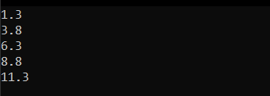

<p align="center"> Министерство образования Республики Беларусь</p>
<p align="center">Учреждение образования</p>
<p align="center">“Брестский Государственный технический университет”</p>
<p align="center">Кафедра ИИТ</p>
<br><br><br><br><br><br><br>
<p align="center">Лабораторная работа №1</p>
<p align="center">По дисциплине “Общая теория интеллектуальных систем”</p>
<p align="center">Тема: “Моделирования температуры объекта”</p>
<br><br><br><br><br>
<p align="right">Выполнил:</p>
<p align="right">Студент 2 курса</p>
<p align="right">Группы ИИ-27</p>
<p align="right">Гридчин А.В.</p>
<p align="right">Проверил:</p>
<p align="right">Дворанинович Д.А.</p>
<br><br><br><br><br>
<p align="center">Брест 2025</p>

# Общее задание #
1. Написать отчет по выполненной лабораторной работе №1 в .md формате (readme.md) и с помощью запроса на внесение изменений (pull request) разместить его в следующем каталоге: trunk\ii0xxyy\task_01\doc (где xx - номер группы, yy - номер студента, например ii02302).
2. Исходный код написанной программы разместить в каталоге: trunk\ii0xxyy\task_01\src.
3. Выполнить рецензирование ([review](https://linearb.io/blog/code-review-on-github), [checklist](https://linearb.io/blog/code-review-checklist)) запросов других студентов (минимум 2-е рецензии).
4. Отразить выполнение работы в файле readme.md в соответствующей строке (например, для студента под порядковым номером 1 - https://github.com/brstu/OTIS-2023/edit/main/readme.md?#L17-L17).

## Task 1. Modeling controlled object ##
Let's get some object to be controlled. We want to control its temperature, which can be described by this differential equation:

$$\Large\frac{dy(\tau)}{d\tau}=\frac{u(\tau)}{C}+\frac{Y_0-y(\tau)}{RC} $$ (1)

where $\tau$ – time; $y(\tau)$ – input temperature; $u(\tau)$ – input warm; $Y_0$ – room temperature; $C,RC$ – some constants.

After transformation we get these linear (2) and nonlinear (3) models:

$$\Large y_{\tau+1}=ay_{\tau}+bu_{\tau}$$ (2)
$$\Large y_{\tau+1}=ay_{\tau}-by_{\tau-1}^2+cu_{\tau}+d\sin(u_{\tau-1})$$ (3)

where $\tau$ – time discrete moments ($1,2,3{\dots}n$); $a,b,c,d$ – some constants.
Task is to write program (С++), which simulates this object temperature.
## Код программы

```

#include <iostream>
#include <vector>

using namespace std;


void input(int& k, vector<double> u, vector<double> y, double& y0, double& a, double& b, double& c, double& d, double& c1, double& rc) {
	cout << "Enter amount of iterations: ";
	cin >> k;
	u.resize(k, 0);
	y.resize(k, 0);
	cout << "\nEnter temperature: ";
	cin >> y.at(0);
	for (auto& warm : u) {
		cout << "\nEnter warm: ";
		cin >> warm;
	}
	u.resize(k + 1, 0);
	y.resize(k + 1, 0);
	cout << "\nEnter room temperature: ";

	cin >> y0;

	cout << "Enter const a: ";

	cin >> a;

	cout << "Enter const b: ";

	cin >> b;

	cout << "Enter const c: ";

	cin >> c;

	cout << "Enter const d: ";

	cin >> d;

	cout << "Enter const c1: ";

	cin >> c1;

	cout << "Enter const rc: ";

	cin >> rc;

}
void linear(const int& place, const int& k, vector<double>& y, const vector<double>& u, const double& b, const double& a) {
	if (place <= k && place >= 0) {
		y.at(place + 1) = a * y.at(place) + b * u.at(place);
	}
	else {
		cout << "\nEntered place out of range";
	}

}
int main()
{
	int k = 4;
	int t = 0;
	vector<double> y;
	vector<double> u;
	u.resize(k + 1, 0);
	y.resize(k + 1, 0);
	double y0 = 25;
	double a = 1;
	double b = 1;
	double c = 1;
	double d = 1;
	double c1 = 1;
	double rc = 1;
	input(k, u, y, y0, a, b, c, d, c1, rc);
	for (int i = 0; i < k; i++) {
		linear(i, k, y, u, b, a);
	}
	for (auto n : y) {
		cout << n << endl;
	}
	return 0;
}

```


## Результат

## Reviews
whytr1ble
<br>

<br>
Glouston
<br>

