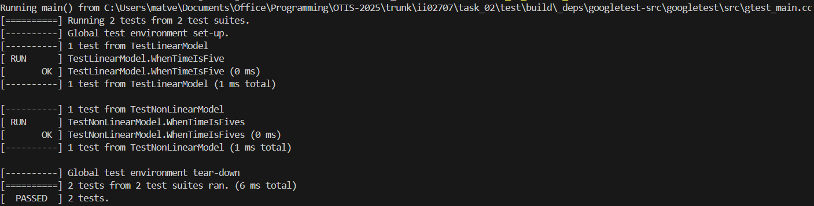
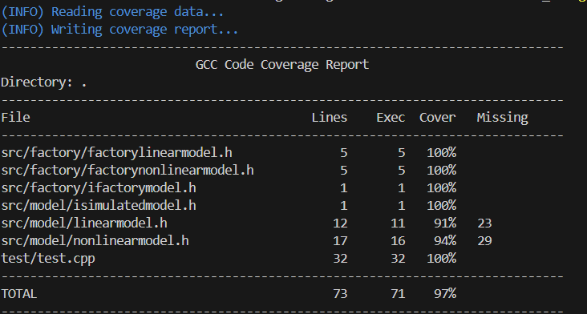
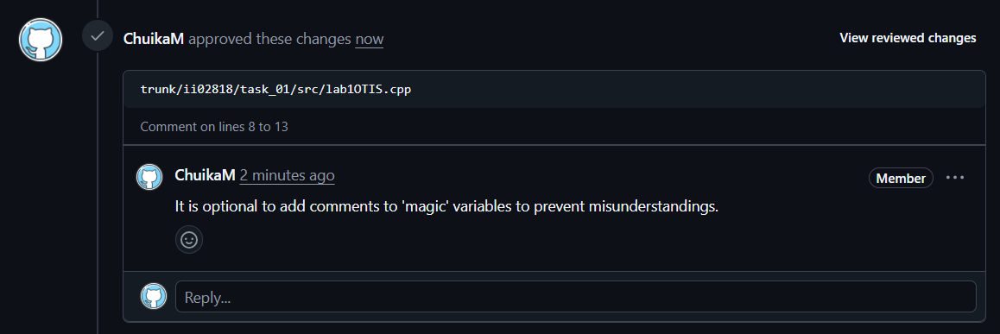
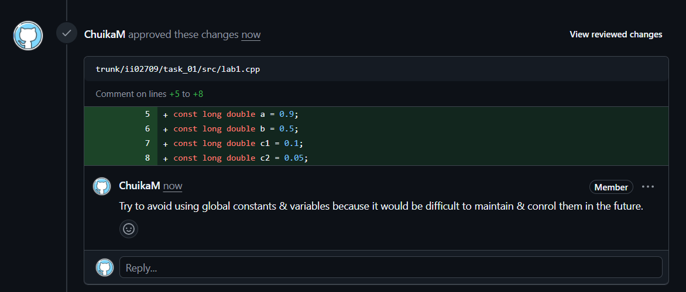

<p align="center">Министерство образования Республики Беларусь</p>
<p align="center">Учреждение образования</p>
<p align="center">“Брестский Государственный технический университет”</p>
<p align="center">Кафедра ИИТ</p>
<br><br><br><br><br><br><br>
<p align="center">Лабораторная работа №2</p>
<p align="center">По дисциплине “Общая теория интеллектуальных систем”</p>
<p align="center">Тема: “Модульное тестирование. Покрытие исходного кода тестами.”</p>
<br><br><br><br><br>
<p align="right">Выполнил:</p>
<p align="right">Студент 2 курса</p>
<p align="right">Группы ИИ-27</p>
<p align="right">Дорошенко М.Д.</p>
<p align="right">Проверил:</p>
<p align="right">Дворанинович Д.А.</p>
<br><br><br><br><br>
<p align="center">Брест 2025</p>

# Общее задание #
Написать модульные тесты для программы, разработанной в лабораторной работе №1.

1. Использовать следующий фреймворк для модульного тестирования - [Google Test](https://google.github.io/googletest/).
2. Написать модульные тесты для основных функций программы. Разместить тесты в каталоге: **trunk\ii0xxyy\task_02\test**.
3. Исходный код модифицированной программы разместить в каталоге: **trunk\ii0xxyy\task_02\src**.
4. В файле `readme.md` отразить количество написанных тестов и процент покрытия кода тестами (использовать любой инструмент для анализа покрытия, например, [gcovr](https://gcovr.com/en/stable/)).
5. Также необходимо отразить выполнение работы в общем файле [`readme.md`](https://github.com/brstu/OTIS-2025/blob/main/README.md) в соответствующей строке (например, для студента под порядковым номером 1 - https://github.com/brstu/OTIS-2025/blob/b2d60c2765b369aed21af76af8fa4461da2c8da6/README.md?plain=1#L13).


## Код юнит-тестов [ test/test.cpp ]
```C++
#include <gtest/gtest.h>
#include <gmock/gmock.h>
#include <memory>

#include "../src/factory/factorylinearmodel.h"
#include "../src/factory/factorynonlinearmodel.h"

TEST(TestLinearModel, WhenTimeIsFive)
{   
    const double y = 0; // Initial output value
    const double u = 1; // Input signal value
    const int t = 5; // Simulation time steps

    auto factory = std::make_unique<FactoryLinearModel>();
    auto model = factory->getModel();
    std::vector<double> calculated_results = model->simulate(y, u, t);
    std::vector<double> accepted_results
    { 0, 0.5, 0.75, 0.875, 0.9375, 0.96875 };

    EXPECT_EQ(calculated_results.size(), accepted_results.size());
    
    for (size_t i = 0; i < calculated_results.size(); i++)
    {
        EXPECT_NEAR(calculated_results[i], accepted_results[i], 1e-5)
            << "Mismatch at index " << i;
    }
}

TEST(TestNonLinearModel, WhenTimeIsFives)
{   
    const double y = 0; // Initial output value
    const double u = 1; // Input signal value
    const int t = 5; // Simulation time steps

    auto factory = std::make_unique<FactoryNonLinearModel>();
    auto model = factory->getModel();
    std::vector<double> calculated_results = model->simulate(y, u, t);
    std::vector<double> accepted_results
    { 0, 0.499999, 0.989713, 1.29059, 1.15428, 0.698974 };

    EXPECT_EQ(calculated_results.size(), accepted_results.size());
    
    for (size_t i = 0; i < calculated_results.size(); i++) 
    {
        EXPECT_NEAR(calculated_results[i], accepted_results[i], 1e-5)
            << "Mismatch at index " << i;
    }
}
```

## Результаты юнит-тестирования (GoogleTest)


## Покрытие тестами (gcovr)


## Reviews
VL-lab-bit
<br>

<br>
RisomUV
<br>
