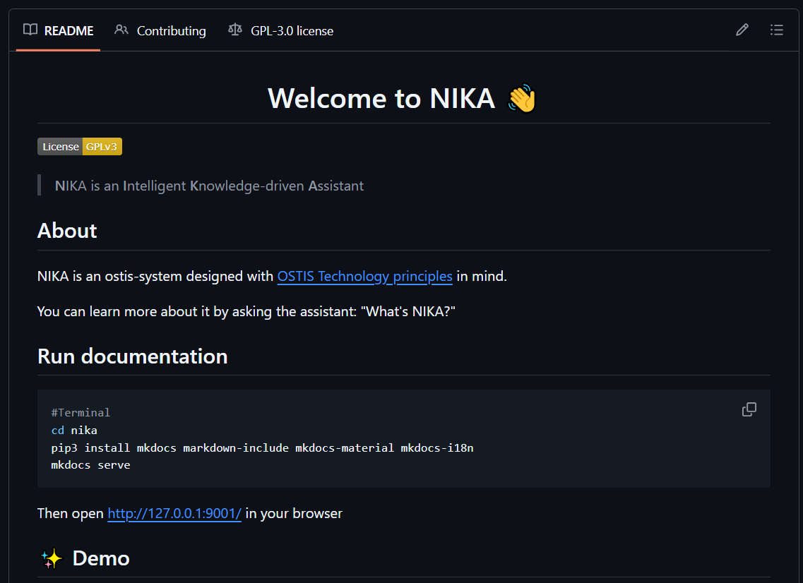
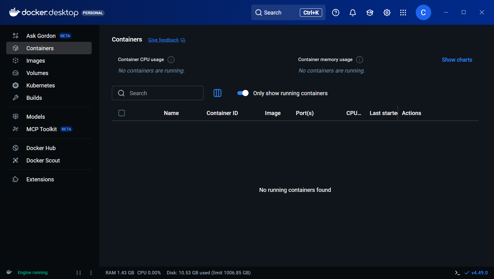
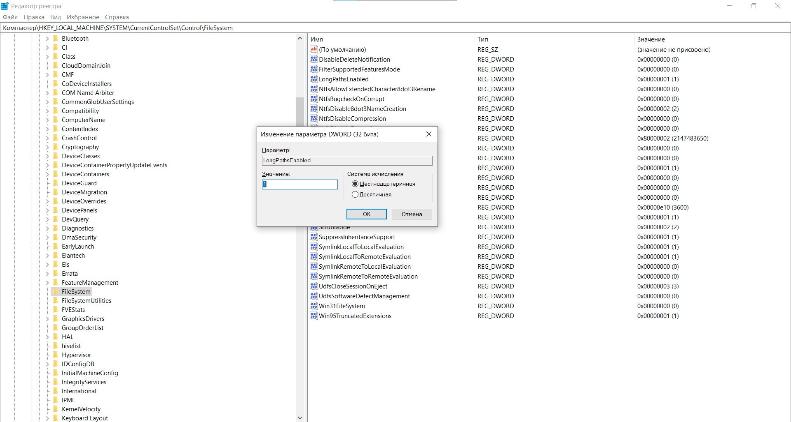
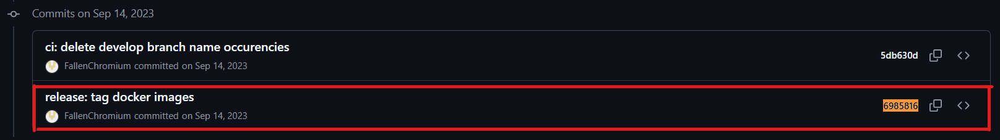
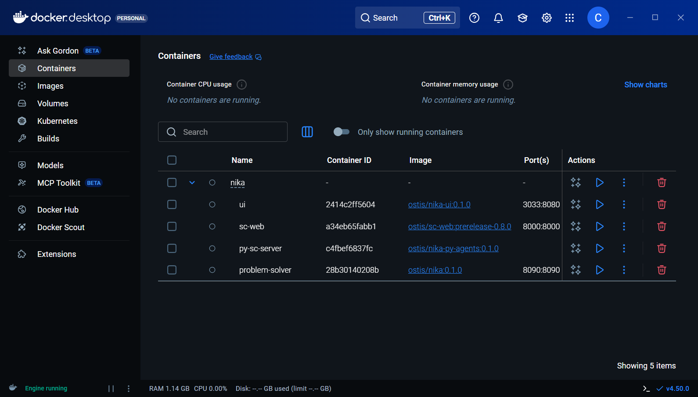
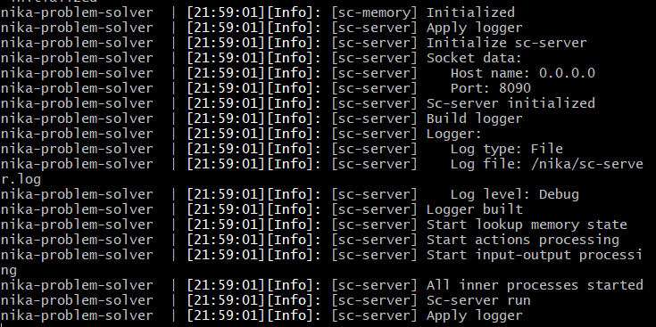
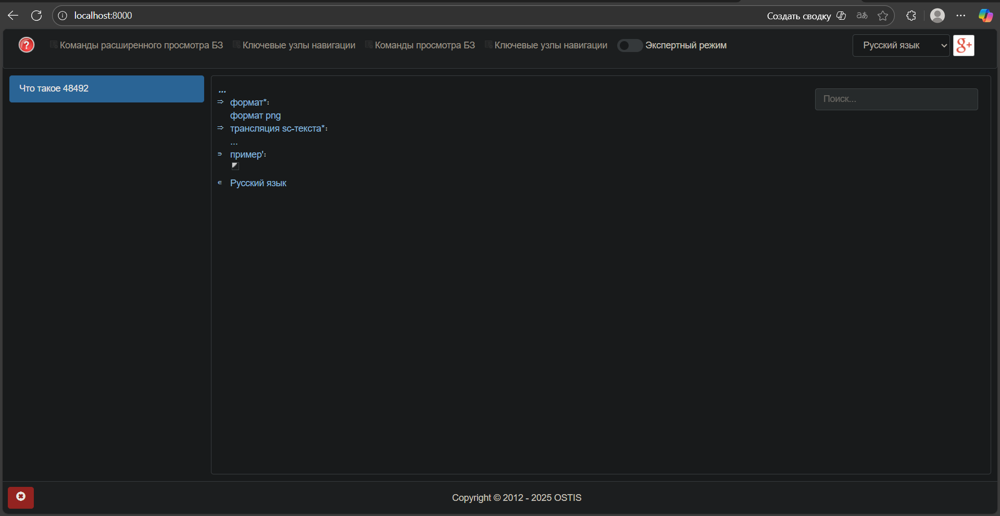

<p align="center">Министерство образования Республики Беларусь</p>
<p align="center">Учреждение образования</p>
<p align="center">“Брестский Государственный технический университет”</p>
<p align="center">Кафедра ИИТ</p>
<br><br><br><br><br><br><br>
<p align="center">Лабораторная работа №4</p>
<p align="center">По дисциплине “Общая теория интеллектуальных систем”</p>
<p align="center">Тема: “Работа с проектом "NIKA" (Intelligent Knowledge-driven Assistant)”</p>
<br><br><br><br><br>
<p align="right">Выполнил:</p>
<p align="right">Студент 2 курса</p>
<p align="right">Группы ИИ-27</p>
<p align="right">Дорошенко М.Д.</p>
<p align="right">Проверил:</p>
<p align="right">Дворанинович Д.А.</p>
<br><br><br><br><br>
<p align="center">Брест 2025</p>

# Работа с проектом **"NIKA"** (Intelligent Knowledge-driven Assistant) #

1. Изучить [руководство](https://github.com/ostis-apps/nika).

2. Запустить данный проект на локальной машине (домашний персональный компьютер, ноутбук, рабочая машина в аудитории и т.п.). Продемонстрировать работу проекта преподавателю.

3. Написать отчет по выполненной работе в .md формате (readme.md) и с помощью pull request разместить его в следующем каталоге: trunk\ii0xxyy\task_04\doc.

# BEFORE READING & INSTALLING
Для запуска проекта NIKA в данной лабораторной работе использую `Windows 10 22H2`.

# Ход работы 

## Введение
Данная лабораторная работа рассчитана на то, чтобы закрепить знания работы с Git, GitHub. Также она позволяет нам 
научиться использовать новые технологии, такую, как Docker, который позволит нам собрать и запустить проект NIKA на нашей
локальной машине, а также уметь применять нестандартные решения.

Данный отчет содержит подробное решение, которое могу предоставить, по запуску проекта NIKA на локальной машине, используя Docker. 

### Этап 1 [ Общая Подготовка ]
В первую очередь перейдем в интересующий нас репозиторий [OSTIS/NIKA](https://github.com/ostis-apps/nika). 
Снизу можно увидеть README.md файл с инструкциями по настройке и запуске проекта NIKA.
<br>

<br>
В данном README.md файле нас интересует, прежде всего, раздел **Requirements**, который говорит нам об первоочередной установке **Docker** на нашу локальную машину. Устанавливаем Docker,
перейдя по предоставленной там ссылке [https://docs.docker.com/](https://docs.docker.com/).
После установки у нас появляется приложение **Docker Desktop**.
При первом запуске данной программы появилось окно, которое требовало установки **WSL**(Windows Subsystem for Linux):
<br>

<br>
Эту проблему решаем вводом в консоль(cmd) командой: `wsl --install`
<br>


Перезагружаемся. После перезагрузки Docker Desktop запустился так, как полагается:


Кажется, что осталось совсем ничего, но... Как и в любой работе будут свои нюансы, куда ж без них.
Перед вводом команд в терминал(командную строку), нужно сделать следующие вещи:
### 1) 'Шаманство' в Реестре
 1)Открыть реестр (`Win + R` и написать `regedit` либо `Win + S` и написать "Редактор реестра") <br>
 2)Перейти по пути `HKEY_LOCAL_MACHINE\SYSTEM\CurrentControlSet\Control\FileSystem` <br>
 3)Найти параметр `LongPathsEnabled` и установить значение на 1.
<br>

  
### 2) 'Шаманство' в Git
  - Запустить cmd
  - Ввести команду: `git config --system core.longpaths true` либо `git config --global core.longpaths true`
### 3) Перезагрузиться
 
Поздравляю, с подготовительными этапами мы закончили, теперь приступим к установке NIKA.

## Этап 2 [ Установка NIKA 0.1.0 с GitHub ]
Вводим наконец первые команды в cmd:
```
git clone -c core.longpaths=true -c core.autocrlf=true https://github.com/ostis-apps/nika
cd nika
git submodule update --init --recursive
```
Хочу обратить внимание, что 'шаманства' в реестре и в Git обязательны.

Есть еще одно НО: в момент выполнения лабораторной (на 14.11.2025) не хватает контейнера ostis/nika:0.2.0 на DockerHub.
Соответственно нам не удасться запустить проект на последней (на момент выполнения) версии. 
Значит нам остается перейти на предыдущую версию (0.1.0).
Для этого введем команду:
```
git checkout 69858165c3b5fb26ca783950c74bfe7bddd64a00
```


Этот hash содержит стабильную версию всех контейнеров для версии проекта 0.1.0.

Отлично, теперь перейдем к заключительному этапу - запуску проекта на локальной машине.
 
## Этап 3 [ Запуск NIKA ]	
Во-первых запустим Docker Desktop:
`docker desktop start`

Получим контейнеры с **DockerHub**: `docker compose pull`<br>
После выполненной команды получились следующие контейнеры:
<br>

<br>
Запустим проект: `docker compose up --no-build`<br>
Ожидаем некоторое время, когда в консоли появиться сообщение/текст в конце:
<br>

<br>
После этого, можно открыть браузер и ввести, в зависимости от того, что Вам хочется просмотреть, URL:

### sc-web - `localhost:8000`


### dialogue web UI - `localhost:3033`

