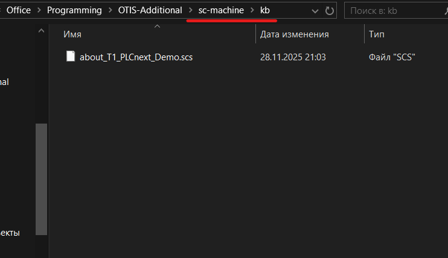
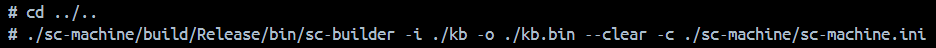
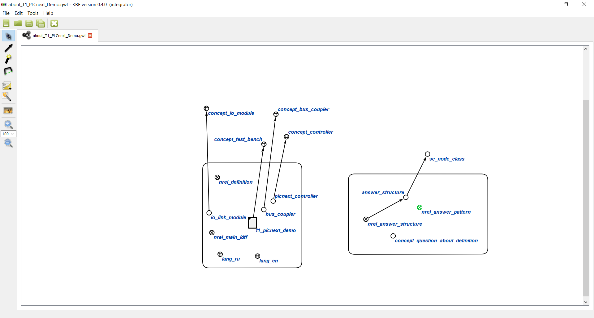

<p align="center">Министерство образования Республики Беларусь</p>
<p align="center">Учреждение образования</p>
<p align="center">“Брестский Государственный технический университет”</p>
<p align="center">Кафедра ИИТ</p>
<br><br><br><br><br><br><br>
<p align="center">Лабораторная работа №6</p>
<p align="center">По дисциплине “Общая теория интеллектуальных систем”</p>
<p align="center">Тема: “Создание базы знаний для проекта "NIKA" (Intelligent Knowledge-driven Assistant)”</p>
<br><br><br><br><br>
<p align="right">Выполнил:</p>
<p align="right">Студент 2 курса</p>
<p align="right">Группы ИИ-27</p>
<p align="right">Дорошенко М.Д.</p>
<p align="right">Проверил:</p>
<p align="right">Дворанинович Д.А.</p>
<br><br><br><br><br>
<p align="center">Брест 2025</p>

# Создание базы знаний для проекта **"NIKA"** (Intelligent Knowledge-driven Assistant) #

1. Изучить [руководство](https://ostis-apps.github.io/nika/).
2. Составить базу знаний для проекта [T1-PLCnext-Demo](https://github.com/savushkin-r-d/T1-PLCnext-Demo).
3. Разработанную базу знаний поместить в виде запроса в [T1-PLCnext-Demo-OSTIS](https://github.com/savushkin-r-d/T1-PLCnext-Demo-OSTIS).
4. Написать отчет по выполненной работе в .md формате (readme.md) и с помощью pull request разместить его в следующем каталоге: ``trunk\ii0xxyy\task_06\doc``.

# Введение

В ходе данной лабораторной работы я сделал базу знаний(далее БЗ) для [T1-PLCnext-Demo](https://github.com/savushkin-r-d/T1-PLCnext-Demo), опираясь на БЗ [ostis-apps/nika](https://ostis-apps.github.io/nika/) и оформил результат в виде pull-request в [T1-PLCnext-Demo-OSTIS](https://github.com/savushkin-r-d/T1-PLCnext-Demo-OSTIS).

# Ход работы

Для начала изучим паттерны оформления БЗ: [https://github.com/ostis-apps/nika/tree/45628acf1af1c408687f54a26e78d8348b6fbe16/knowledge-base/pattern](https://github.com/ostis-apps/nika/tree/45628acf1af1c408687f54a26e78d8348b6fbe16/knowledge-base/pattern).
Как можно заметить, БЗ содержит следующие типы файлов:
- scs - текстовый формат описания знаний в OSTIS (в виде рукописного кода).
- gwf - графический формат описания знаний в OSTIS (в виде дуг, стрелочек, кружочков и т.д.).

Отталкиваясь от данных подсказок, напишем .scs файл в любом текстовом редакторе.
После готового .scs файла нам необходимо проверить, будет ли происходить последующая сборка .scs в соответствующий бинарник (т.е. файл не
будет содержать разного рода синтаксических ошибок).
Для этого есть хороший инструмент, расположенный в следующем репозитории: [https://github.com/ostis-ai/sc-machine](https://github.com/ostis-ai/sc-machine).

Для проверки на работоспособность и отсутствие ошибок в .scs файле, необходимо поместить его в папку `kb`:

Затем написать следующие команды в корне проекта (sc-machine):
```
docker desktop start
docker compose build
docker compose up
```

После выполнения этих команд переходим в терминал контейнера и выполняем следующие команды:

В результате мы <b>НЕ</b> должны получить <b>КРАСНЫЕ</b> сообщения:


Для создания .gwf файла нам поможет следующий SCg‑редактор: [KBE](https://github.com/ostis-ai/kbe).


# Pull-request

Ссылка на мой pull-request в `savushkin-r-d/T1-PLCnext-Demo-OSTIS`: [https://github.com/savushkin-r-d/T1-PLCnext-Demo-OSTIS/pull/5](https://github.com/savushkin-r-d/T1-PLCnext-Demo-OSTIS/pull/5).
