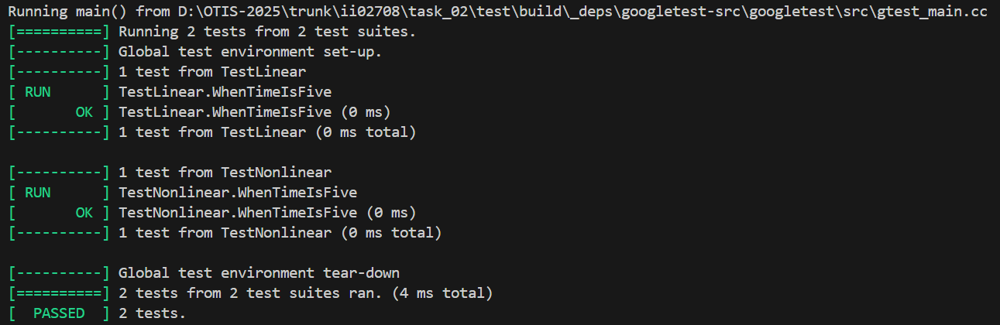

<p align="center"> Министерство образования Республики Беларусь</p>
<p align="center">Учреждение образования</p>
<p align="center">“Брестский Государственный технический университет”</p>
<p align="center">Кафедра ИИТ</p>
<br><br><br><br><br><br><br>
<p align="center">Лабораторная работа №2</p>
<p align="center">По дисциплине “Общая теория интеллектуальных систем”</p>
<p align="center">Тема: “Тестирование исходного кода.”</p>
<br><br><br><br><br>
<p align="right">Выполнил:</p>
<p align="right">Студент 2 курса</p>
<p align="right">Группы ИИ-27</p>
<p align="right">Киричук В.А.</p>
<p align="right">Проверил:</p>
<p align="right">Дворанинович Д.А.</p>
<br><br><br><br><br>
<p align="center">Брест 2025</p>

# Общее задание #
Написать модульные тесты для программы, разработанной в лабораторной работе №1.

1. Использовать следующий фреймворк для модульного тестирования - [Google Test](https://google.github.io/googletest/).
2. Написать модульные тесты для основных функций программы. Разместить тесты в каталоге: **trunk\ii0xxyy\task_02\test**.
3. Исходный код модифицированной программы разместить в каталоге: **trunk\ii0xxyy\task_02\src**.
4. В файле `readme.md` отразить количество написанных тестов и процент покрытия кода тестами (использовать любой инструмент для анализа покрытия, например, [gcovr](https://gcovr.com/en/stable/)).
5. Также необходимо отразить выполнение работы в общем файле [`readme.md`](https://github.com/brstu/OTIS-2025/blob/main/README.md) в соответствующей строке (например, для студента под порядковым номером 1 - https://github.com/brstu/OTIS-2025/blob/b2d60c2765b369aed21af76af8fa4461da2c8da6/README.md?plain=1#L13).

## Покрытие кода с использованием gcovr:


## Исходный код Тестов [test/test.cpp]:
```C++
#include <gtest/gtest.h>
#include <gmock/gmock.h>
#include <cmath>

#include "../src/linear.hpp"
#include "../src/nonlinear.hpp"

TEST(TestLinear, WhenTimeIsFive)
{   
    LinearCoeff coeff;
    coeff.a = 0.5;
    coeff.b = 0.2;
    coeff.u = 1.2;
    
    double y0 = 1.0;
    int n = 5;
    
    std::vector<double> expected = {0.74, 0.61, 0.545, 0.5125, 0.49625};
    std::vector<double> actual = calculateLinear(coeff, y0, n);
    
    ASSERT_EQ(actual.size(), expected.size());
    for (int i = 0; i < expected.size(); i++) 
    {
        EXPECT_NEAR(actual[i], expected[i], 1e-6) << "Mismatch at index " << i;
    }
}

TEST(TestNonlinear, WhenTimeIsFive)
{   
    NonLinearCoeff coeff;
    coeff.a = 0.5;
    coeff.b = 0.2;
    coeff.c = 0.15;
    coeff.d = 0.3;
    coeff.u = 1.2;
    
    double y0 = 1.0;
    int n = 5;  
    std::vector<double> expected = {
        0.759611726,
        0.639417589,
        0.663918567,
        0.709800038,
        0.726354212
    };
    std::vector<double> actual = calculateNonlinear(coeff, y0, n);

    ASSERT_EQ(actual.size(), expected.size());
    for (int i = 0; i < expected.size(); i++) 
    {
        EXPECT_NEAR(actual[i], expected[i], 1e-6) << "Mismatch at index " << i;
    }
}
```

## Результат Тестирования:



