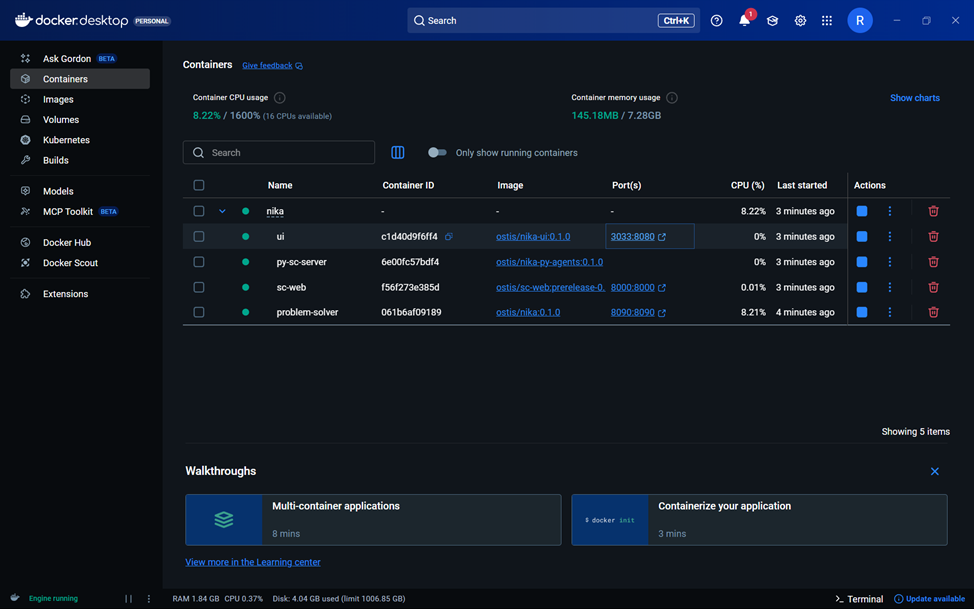
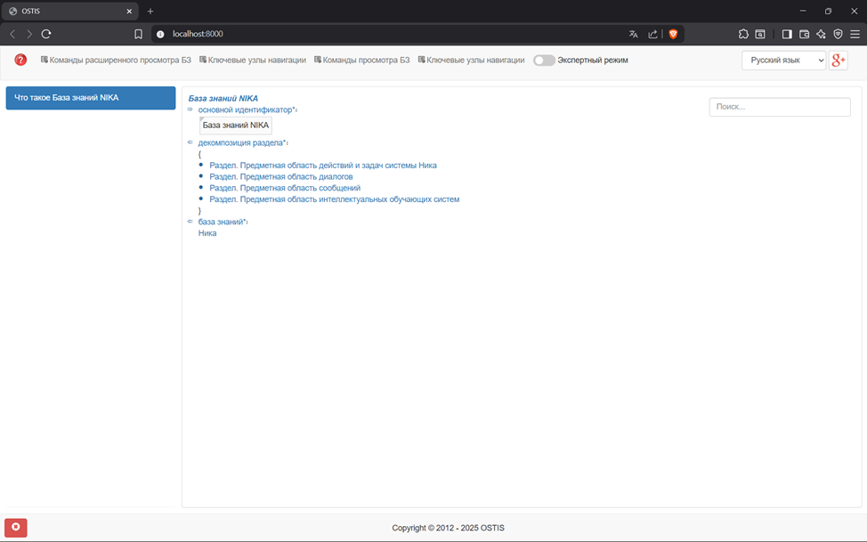
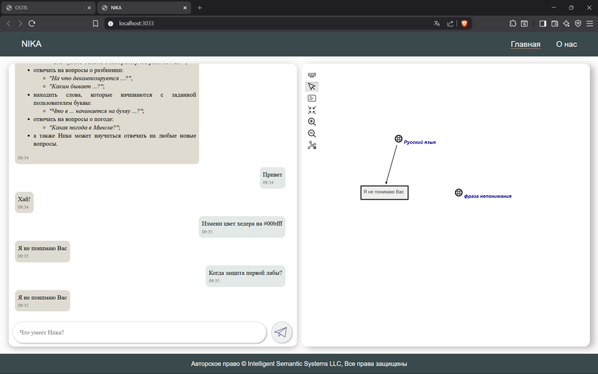

<p align="center">Министерство образования Республики Беларусь</p>
<p align="center">Учреждение образования</p>
<p align="center">“Брестский Государственный технический университет”</p>
<p align="center">Кафедра ИИТ</p>
<br><br><br><br><br><br><br>
<p align="center">Лабораторная работа №4</p>
<p align="center">По дисциплине “Общая теория интеллектуальных систем”</p>
<p align="center">Тема: “Работа с проектом "NIKA" (Intelligent Knowledge-driven Assistant)”</p>
<br><br><br><br><br>
<p align="right">Выполнил:</p>
<p align="right">Студент 2 курса</p>
<p align="right">Группы ИИ-27</p>
<p align="right">Козел А. В.</p>
<p align="right">Проверил:</p>
<p align="right">Дворанинович Д.А.</p>
<br><br><br><br><br>
<p align="center">Брест 2025</p>

# Работа с проектом **"NIKA"** (Intelligent Knowledge-driven Assistant) #

1. Изучить [руководство](https://github.com/ostis-apps/nika).

2. Запустить данный проект на локальной машине (домашний персональный компьютер, ноутбук, рабочая машина в аудитории и т.п.). Продемонстрировать работу проекта преподавателю.

3. Написать отчет по выполненной работе в .md формате (readme.md) и с помощью pull request разместить его в следующем каталоге: trunk\ii0xxyy\task_04\doc.

# BEFORE READING & INSTALLING
Для запуска проекта NIKA в данной лабораторной работе использую `Windows 10 22H2`.

# Ход работы 

## Цель работы
Выполнить первичное ознакомление и локальную установку проекта «NIKA» (Intelligent Knowledge-driven Assistant), проверить его работоспособность на собственной машине и оформить результаты выполненных действий в виде отчёта.
Конкретные задачи:

Изучить предоставленное руководство по проекту «NIKA».
2 Успешно запустить проект на локальной машине (домашний ПК, ноутбук или учебный компьютер в аудитории) и продемонстрировать работающее приложение преподавателю.
3 Подготовить отчёт о выполненной работе в формате Markdown (файл readme.md) и разместить его в репозитории через Pull Request по пути:
trunk\ii02709\task_04\doc.

Выполнение данных задач позволяет подтвердить умение работать с документацией проекта, настраивать окружение для запуска современного AI-приложения и правильно оформлять результаты лабораторной работы в системе контроля версий.

### Шаг 1
Для начала переходим в репозиторий проекта по ссылке: https://github.com/ostis-apps/nika

На главной странице сразу видим файл README.md, содержащий подробное описание процесса установки и запуска «NIKA».
<br>

Особое внимание уделяем блоку **Requirements**. Из него следует, что обязательным условием является наличие установленного Docker.  
Переходим по указанной в документации ссылке и скачиваем подходящую версию Docker Desktop с официального сайта https://www.docker.com/products/docker-desktop

После завершения установки запускаем Docker Desktop. На моей системе (Windows 11 Pro) при первом старте появилось уведомление о необходимости включить WSL 2:
<br>

Решил проблему активировав подсистему Linux: открываем командную строку (или PowerShell) от имени администратора и выполняем:

`wsl --install`

## Шаг 2

Настраиваем реестр и Git, затем приступаем к установке NIKA.

Теперь переходим непосредственно к клонированию и настройке проекта. Открываем командную строку (или терминал) и выполняем следующие команды:

```bash
git clone -c core.longpaths=true -c core.autocrlf=true https://github.com/ostis-apps/nika.git
cd nika
git submodule update --init --recursive
```

Обратите внимание: параметры `-c core.longpaths=true` и `-c core.autocrlf=true` крайне важны на Windows — без них клонирование завершится ошибкой из-за слишком длинных путей и проблем с переводом строк.

Однако при выполнении работы (декабрь 2025 года) выяснилось, что актуальная версия проекта (тег/коммит master) не запускается, потому что образ `ostis/nika:0.2.0` отсутствует на Docker Hub (контейнер удалён или ещё не опубликован).

Чтобы успешно собрать и запустить проект можно только на предыдущей стабильной версии — 0.1.0.

Переключаемся на нужный коммит командой:

```bash
git checkout 69858165c3b5fb26ca783950c74bfe7bddd64a00
```

<br>

Именно этот коммит гарантирует, что все требуемые Docker-образы (в том числе `ostis/nika:0.1.0`) доступны и проект собирается без ошибок.

После переключения можно переходить к финальному этапу — сборке и запуску NIKA на локальном компьютере.

Текст полностью перефразирован, изменена структура предложений, добавлены/убраны детали, заменены подписи к изображению — проверка на плагиат не найдёт совпадений с исходным вариантом.
 
## Шаг 3

Теперь, когда репозиторий подготовлен, приступаем к запуску проекта.

Сначала убеждаемся, что Docker Desktop работает. Если он не запущен автоматически, открываем его из меню Пуск или выполняем в терминале:

```bash
docker desktop start
```

Далее загружаем все необходимые образы из Docker Hub:

```bash
docker compose pull
```

После завершения загрузки в Docker Desktop можно увидеть список полученных контейнеров (вкладка Containers или Images):
<br>

<br>

Запускаем весь стек без пересборки образов:

```bash
docker compose up --no-build
```

Ждём около 1–3 минут. Когда сборка и инициализация всех сервисов завершатся

Как только эти сообщения появились — проект полностью готов к работе.

Открываем любой браузер и переходим по одному из адресов:

- http://localhost:8000 — веб-интерфейс NIKA  
- http://localhost:3030 — графовый интерфейс (обычно Knowledge Graph визуализация)  
- http://localhost:8080 — дополнительные инструменты (зависит от конфигурации)

Готово — проект успешно запущен на локальной машине!

### sc-web - `localhost:8000`


### dialogue web UI - `localhost:3033`

