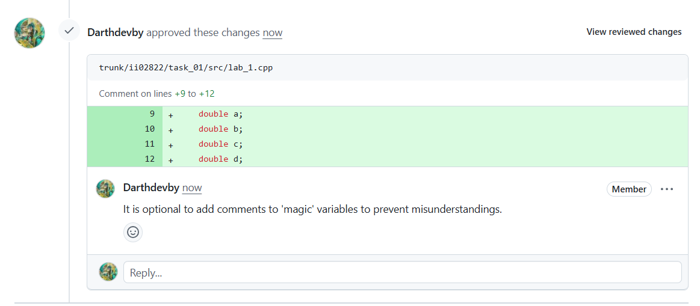
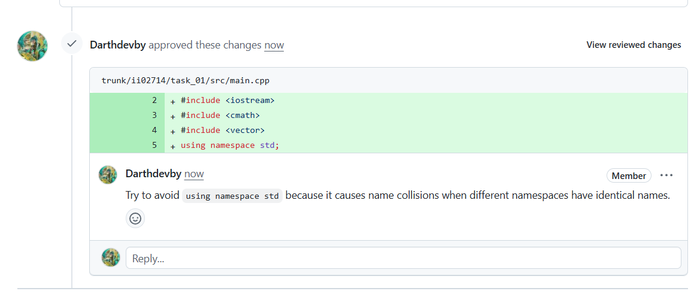

<p align="center"> Министерство образования Республики Беларусь</p>
<p align="center">Учреждение образования</p>
<p align="center">“Брестский Государственный технический университет”</p>
<p align="center">Кафедра ИИТ</p>
<br><br><br><br><br><br><br>
<p align="center">Лабораторная работа №1</p>
<p align="center">По дисциплине “Общая теория интеллектуальных систем”</p>
<p align="center">Тема: “Моделирование температуры объекта”</p>
<br><br><br><br><br>
<p align="right">Выполнил:</p>
<p align="right">Студент 2 курса</p>
<p align="right">Группы ИИ-27</p>
<p align="right">Куцко Р.Р.</p>
<p align="right">Проверил:</p>
<p align="right">Дворанинович Д.А.</p>
<br><br><br><br><br>
<p align="center">Брест 2025</p>

# Общее задание #
1. Написать отчет по выполненной лабораторной работе №1 в .md формате (readme.md) и с помощью запроса на внесение изменений (**pull request**) разместить его в следующем каталоге: **trunk\ii0xxyy\task_01\doc** (где **xx** - номер группы, **yy** - номер студента, например **ii02302**).
2. Исходный код написанной программы разместить в каталоге: **trunk\ii0xxyy\task_01\src**.
3. Выполнить рецензирование ([review](https://linearb.io/blog/code-review-on-github), [checklist](https://linearb.io/blog/code-review-checklist)) запросов других студентов (минимум 2-е рецензии).
4. Отразить выполнение работы в файле readme.md в соответствующей строке (например, для студента под порядковым номером 1 - https://github.com/brstu/OTIS-2023/edit/main/readme.md?#L17-L17).

## Task 1. Modeling controlled object ##
Let's get some object to be controlled. We want to control its temperature, which can be described by this differential equation:

$$\Large\frac{dy(\tau)}{d\tau}=\frac{u(\tau)}{C}+\frac{Y_0-y(\tau)}{RC} $$ (1)

where $\tau$ – time; $y(\tau)$ – object (output) temperature; $u(\tau)$ – input heat/power; $Y_0$ – room temperature; $C,RC$ – some constants.

After transformation we get these linear (2) and nonlinear (3) models:

$$\Large y_{\tau+1}=ay_{\tau}+bu_{\tau}$$ (2)
$$\Large y_{\tau+1}=ay_{\tau}-by_{\tau-1}^2+cu_{\tau}+d\sin(u_{\tau-1})$$ (3)

where $\tau$ – time discrete moments ($1,2,3{\dots}n$); $a,b,c,d$ – some constants.

Task is to write program (**С++**), which simulates this object temperature.


## Код программы:
```C++
#include <iostream>
#include <cmath>

int main() {
    std::cout << "First system - Linear" << std::endl;
    const double a = 0.4; // Coefficient for previous output (y)
    const double b = 0.3; // Coefficient for input (u)
    const int n = 15; // Simulation time steps
    double u = 0.5; // Constant input (step) u
    double y_current = 0; // Initialize y_current value
    
    for (int tau = 0; tau < n; tau++) {
        y_current = a * y_current + b * u;
        std::cout << "y[" << tau + 1 << "] = " << y_current << std::endl;
    }
    std::cout << std::endl;

    std::cout << "\nSecond system - Nonlinear" << std::endl;
    const double a2 = 0.5; // Coefficient for input (u)
    const double b2 = 0.2; // Nonlinear coefficient for squared previous output (prevY²)
    const double c2 = 0.1; // Linear coefficient for input (u)
    const double d2 = 0.3; // Nonlinear coefficient for sinusoidal input term
    
    double u_prev = 1.0; // Step size for input signal previous increment ( u[tau-1] )
    double u_curr = 2.0; // Step size for input signal current increment ( u[tau] )
    
    double y_prev = 25.0; // y[tau-1]
    double y_curr = 26.0; // y[tau]
    double y_next;        // y[tau+1]

    const double u_offset = 0.3;
    
    for (int tau = 1; tau < n; tau++) {
        y_next = a2 * y_curr - b2 * (y_prev * y_prev) + c2 * u_curr + d2 * std::sin(u_prev);
        
        std::cout << "y[" << tau + 1 << "] = " << y_next << std::endl;
        
        // Update for next iteration
        y_prev = y_curr;
        y_curr = y_next;
        
        // Update u values (using example sequence)
        u_prev = u_curr;
        u_curr += u_offset;
    }

    return 0;
}
```

## Результат программы:
First system - Linear
y[1] = 0.15
y[2] = 0.21
y[3] = 0.234
y[4] = 0.2436
y[5] = 0.24744
y[6] = 0.248976
y[7] = 0.24959
y[8] = 0.249836
y[9] = 0.249934
y[10] = 0.249974
y[11] = 0.24999
y[12] = 0.249996
y[13] = 0.249998
y[14] = 0.249999
y[15] = 0.25


Second system - Nonlinear
y[2] = -111.548
y[3] = -190.471
y[4] = -2583.32
y[5] = -8547.06
y[6] = -1.33899e+06
y[7] = -1.52799e+07
y[8] = -3.58584e+11
y[9] = -4.68745e+13
y[10] = -2.57165e+22
y[11] = -4.39457e+26
y[12] = -1.32267e+44
y[13] = -3.86245e+52
y[14] = -3.49893e+87
y[15] = -2.98371e+104

## Reviews
OleksyukIlya
<br>

<br>
JohnyDepp228
<br>



