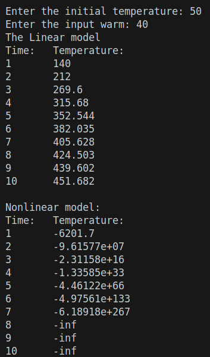
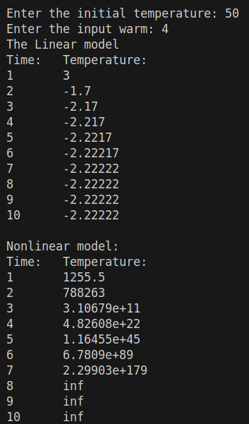

 Министерство образования Республики Беларусь

Учреждение образования

“Брестский Государственный технический университет”

Кафедра ИИТ

       

Лабораторная работа №1

По дисциплине “Общая теория интеллектуальных систем”

Тема: “Моделирования температуры объекта”

     

Выполнил:

Студент 2 курса

Группы ИИ-27

Литовкин Н.А.

Проверил:

Дворанинович Д.А.

     

Брест 2025

# Общее задание #
1. Написать отчет по выполненной лабораторной работе №1 в .md формате (readme.md) и с помощью запроса на внесение изменений (**pull request**) разместить его в следующем каталоге: **trunk\ii0xxyy\task_01\doc** (где **xx** - номер группы, **yy** - номер студента, например **ii02302**).
2. Исходный код написанной программы разместить в каталоге: **trunk\ii0xxyy\task_01\src**.
3. Выполнить рецензирование ([review](https://linearb.io/blog/code-review-on-github), [checklist](https://linearb.io/blog/code-review-checklist)) запросов других студентов (минимум 2-е рецензии).
4. Отразить выполнение работы в файле readme.md в соответствующей строке (например, для студента под порядковым номером 1 - https://github.com/brstu/OTIS-2023/edit/main/readme.md?#L17-L17).

'''C++
#include <iostream>
#include <cmath>

const double a = 0.1;
const double b = 0.5;
const double c = 0.2;
const double d = 0.4;

double linearModel(double y, double u) {
    return a * y + b * u;
}

double nonlinearModel(double y, double u, double y_pred, double u_pred) {
    return a * y - b * pow(y_pred, 2) + c * u + d * sin(u_pred);
}

int main() {
    double y;
    std::cout << "Enter the initial temperature: ";
    std::cin >> y;
    double y_next = y;
    double y_pred;   
    double u ;
    std::cout << "Enter the input warm: ";
    std::cin >> u;
    double u_pred ;    

    const int steps = 10;

    std::cout << "The Linear model" << std::endl;
    std::cout << "Time:\tTemperature:" << std::endl;
    for (int i = 0; i < steps; ++i) {
        y_next = linearModel(y_next, u);
        std::cout << i + 1 << "\t" << y_next << std::endl;
    }
    std::cout << std::endl;
    y_next = y;
    std::cout << "Nonlinear model:" << std::endl;
    std::cout << "Time:\tTemperature:" << std::endl;
    for (int i = 0; i < steps; ++i) {
        y_pred = y_next;
        u_pred = u;
        y_next = nonlinearModel(y_next, u, y_pred, u_pred);
        std::cout << i + 1 << "\t" << y_next << std::endl;
    }
    return 0;
}
'''

## Linear

## NonLinear

