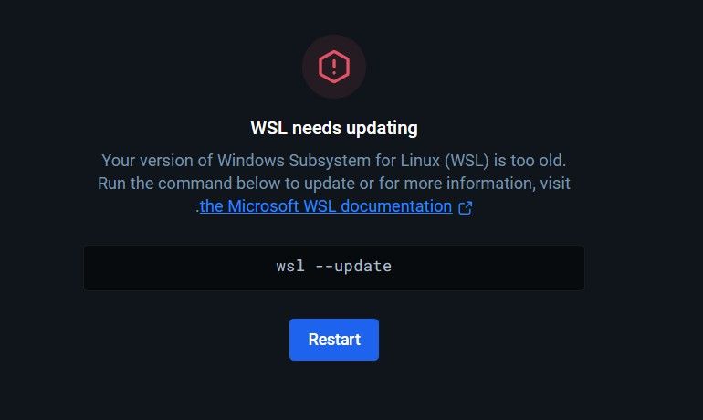
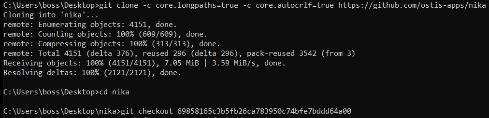
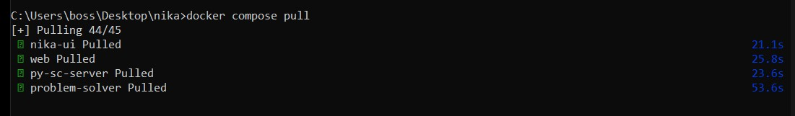
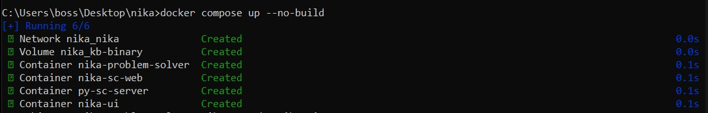
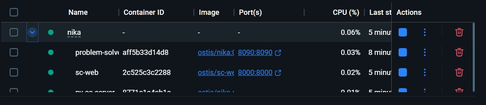
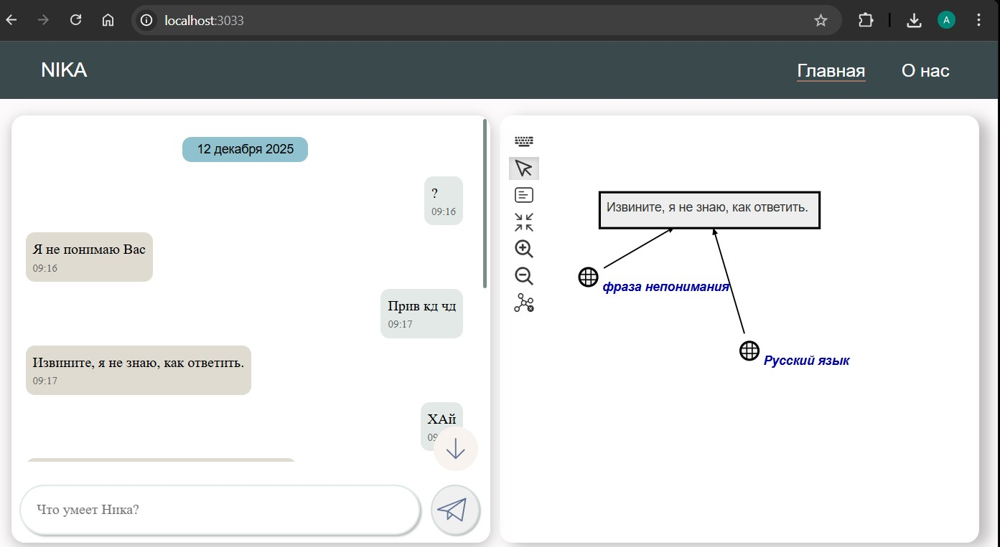

<p align="center">Министерство образования Республики Беларусь</p>
<p align="center">Учреждение образования</p>
<p align="center">“Брестский Государственный технический университет”</p>
<p align="center">Кафедра ИИТ</p>
<br><br><br><br><br><br><br>
<p align="center">Лабораторная работа №4</p>
<p align="center">По дисциплине “Общая теория интеллектуальных систем”</p>
<p align="center">Тема: “Работа с проектом "NIKA" (Intelligent Knowledge-driven Assistant)”</p>
<br><br><br><br><br>
<p align="right">Выполнил:</p>
<p align="right">Студент 2 курса</p>
<p align="right">Группы ИИ-27</p>
<p align="right">Масюк А.Д.</p>
<p align="right">Проверил:</p>
<p align="right">Дворанинович Д.А.</p>
<br><br><br><br><br>
<p align="center">Брест 2025</p>

# Работа с проектом **"NIKA"** (Intelligent Knowledge-driven Assistant) #

1. Изучить [руководство](https://github.com/ostis-apps/nika).

2. Запустить данный проект на локальной машине (домашний персональный компьютер, ноутбук, рабочая машина в аудитории и т.п.). Продемонстрировать работу проекта преподавателю.

3. Написать отчет по выполненной работе в .md формате (readme.md) и с помощью pull request разместить его в следующем каталоге: trunk\ii0xxyy\task_04\doc.

# Ход работы 

## Введение
Данная лабораторная работа рассчитана на то, чтобы закрепить знания работы с Git, GitHub. Также она позволяет нам 
научиться использовать новые технологии, такую, как Docker, который позволит нам собрать и запустить проект NIKA на нашей
локальной машине, а также уметь применять нестандартные решения.

Данный отчет содержит подробное решение, которое могу предоставить, по запуску проекта NIKA на локальной машине, используя Docker. 

### Этап 1 [ Общая Подготовка ]
В первую очередь перейдем в интересующий нас репозиторий [OSTIS/NIKA](https://github.com/ostis-apps/nika). 
В данном README.md файле нас интересует, прежде всего, раздел **Requirements**, который говорит нам об первоочередной установке **Docker** на нашу локальную машину. Устанавливаем Docker,
перейдя по предоставленной там ссылке [https://docs.docker.com/](https://docs.docker.com/).
После установки у нас появляется приложение **Docker Desktop**.

## Этап 2 [ Установка NIKA 0.2.2 с GitHub ]
# Решение проблемы с Docker


Вводим команды в cmd для решение и перезапускаем Docker:
```
wsl –update
```


# Скачиваем репозиторий

Вводим команды в cmd:
```
git clone -c core.longpaths=true -c core.autocrlf=true https://github.com/ostis-apps/nika
cd nika
```
После чего в связи с отсуттвием нужного файла на версии 0.2.2 переходим на версию ниже
```
git checkout 69858165c3b5fb26ca783950c74bfe7bddd64a00
```

После чего докачиваем необходимые для запуска файлы

```
git submodule update --init --recursive
```

## Этап 3 [ Запуск NIKA ]	
Во-первых запустим Docker Desktop:
`docker desktop start`
Далее скачиваем с DockerHub файл Docker compose.Для этого введем команду 
```
docker compose pull
```

Запустим проект: `docker compose up --no-build`<br>
Ожидаем некоторое время, когда в консоли появиться сообщение/текст в конце:
<br>

<br>
Также в приложении Docker будут следующие контейнеры:
<br>

<br>
После этого, можно открыть браузер и ввести, в зависимости от того, что хочется просмотреть, URL:


### dialogue web UI - `localhost:3033`

