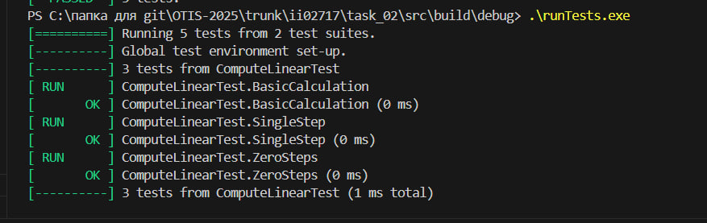
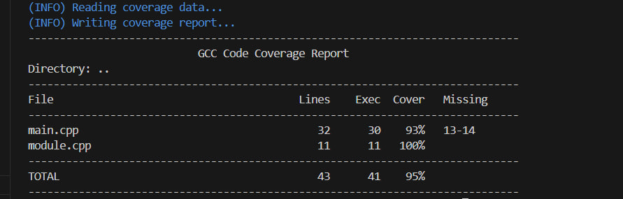

Министерство образования Республики Беларусь

Учреждение образования

“Брестский Государственный технический университет”

Кафедра ИИТ

       

Лабораторная работа №2

По дисциплине “Общая теория интеллектуальных систем”

Тема: “Модульное тестирование. Покрытие исходного кода тестами.”

     

Выполнил:

Студент 2 курса

Группы ИИ-27

Соловчук И.Г.

Проверил:

Дворанинович Д.А.

     

Брест 2025

# Общее задание #
Написать модульные тесты для программы, разработанной в лабораторной работе №1.

1. Использовать следующий фреймворк для модульного тестирования - [Google Test](https://google.github.io/googletest/).
2. Написать модульные тесты для основных функций программы. Разместить тесты в каталоге: **trunk\ii0xxyy\task_02\test**.
3. Исходный код модифицированной программы разместить в каталоге: **trunk\ii0xxyy\task_02\src**.
4. В файле `readme.md` отразить количество написанных тестов и процент покрытия кода тестами (использовать любой инструмент для анализа покрытия, например, [gcovr](https://gcovr.com/en/stable/)).
5. Также необходимо отразить выполнение работы в общем файле [`readme.md`](https://github.com/brstu/OTIS-2025/blob/main/README.md) в соответствующей строке (например, для студента под порядковым номером 1 - https://github.com/brstu/OTIS-2025/blob/b2d60c2765b369aed21af76af8fa4461da2c8da6/README.md?plain=1#L13).

## Код юнит-тестов [ test/test.cpp ]
#include <gtest/gtest.h>
#include <vector>
#include <cmath>
#include "../src/module.h"

// Тесты для функции compute_linear
TEST(ComputeLinearTest, BasicCalculation) {
    int N = 3;
    double a = 0.5;
    double b = 1.0;
    std::vector<double> u = {1.0, 2.0, 3.0};
    std::vector<double> y_lin(N + 1, 0.0);
    y_lin[0] = 1.0;

    compute_linear(N, a, b, u, y_lin);

    // Проверяем вычисления: y[t+1] = a * y[t] + b * u[t]
    EXPECT_NEAR(y_lin[1], 1.5, 1e-10);   // 0.5*1.0 + 1.0*1.0
    EXPECT_NEAR(y_lin[2], 2.75, 1e-10);  // 0.5*1.5 + 1.0*2.0
    EXPECT_NEAR(y_lin[3], 4.375, 1e-10); // 0.5*2.75 + 1.0*3.0
}

TEST(ComputeLinearTest, SingleStep) {
    int N = 1;
    double a = 1.0;
    double b = 2.0;
    std::vector<double> u = {5.0};
    std::vector<double> y_lin(N + 1, 0.0);
    y_lin[0] = 10.0;

    compute_linear(N, a, b, u, y_lin);

    EXPECT_NEAR(y_lin[1], 20.0, 1e-10); // 1.0*10.0 + 2.0*5.0
}

int main(int argc, char **argv) {
    ::testing::InitGoogleTest(&argc, argv);
    return RUN_ALL_TESTS();
}
// *НОВЫЙ ТЕСТ*
TEST(ComputeLinearTest, ZeroSteps) {
    int N = 0; // Проверяем случай, когда цикл не выполняется
    double a = 1.0;
    double b = 1.0;
    std::vector<double> u = {};
    std::vector<double> y_lin(1, 10.0); // y[0] = 10.0

    compute_linear(N, a, b, u, y_lin);
    
    // y_lin[0] не должно измениться, других элементов нет
    EXPECT_NEAR(y_lin[0], 10.0, 1e-10);
    EXPECT_EQ(y_lin.size(), 1); // Размер остался N+1=1
}

TEST(ComputeNonLinearTest, SingleStepN2) {
    int N = 2; 
    double a = 1.0;
    double b = 1.0;
    double c = 1.0;
    double d = 1.0;
    std::vector<double> u = {1.0, 2.0}; 
    std::vector<double> y_nl(N + 1, 0.0);
    y_nl[0] = 5.0; 
    y_nl[1] = 10.0; 

    compute_nonlinear(N, a, b, c, d, u, y_nl);

    EXPECT_NEAR(y_nl[2], -12.15852902, 1e-8);
}

TEST(ComputeNonLinearTest, ZeroOrOneSteps) {

    int N = 1; 
    double a = 1.0;
    double b = 1.0;
    double c = 1.0;
    double d = 1.0;
    std::vector<double> u = {1.0};
    std::vector<double> y_nl(N + 1, 0.0);
    y_nl[0] = 5.0; 
    y_nl[1] = 10.0; 

    compute_nonlinear(N, a, b, c, d, u, y_nl);

    EXPECT_NEAR(y_nl[0], 5.0, 1e-10);
    EXPECT_NEAR(y_nl[1], 10.0, 1e-10);
}
## Результаты юнит-тестирования (GoogleTest)

## Покрытие тестами (gcovr)
