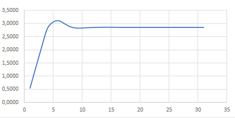

Министерство образования Республики Беларусь

Учреждение образования

“Брестский Государственный технический университет”

Кафедра ИИТ

       

Лабораторная работа №3

По дисциплине “Общая теория интеллектуальных систем”

Тема: “ПИД-регуляторы”

     

Выполнил:

Студент 2 курса

Группы ИИ-27

Соловчук И.Г.

Проверил:

Дворанинович Д.А.

     

Брест 2025

## Цели работы
1.  Исследовать принцип работы дискретного ПИД-регулятора.
2.  Разработать программу, моделирующую систему управления температурой нелинейного объекта с использованием ПИД-регулятора.
3.  Провести тестирование и документирование разработанного программного обеспечения.

## Ход работы

### 1. Теоретические сведения
Пропорционально-интегрально-дифференциальный (ПИД) регулятор — один из наиболее распространенных алгоритмов управления в технике. Его работа основана на формировании управляющего сигнала `u(t)` как суммы трех составляющих, пропорциональных:
*   **P (Пропорциональная)**: текущему значению ошибки `e(t)` (разнице между заданным и текущим состоянием).
*   **I (Интегральная)**: интегралу от ошибки за время работы, что позволяет устранить статическую ошибку.
*   **D (Дифференциальная)**: скорости изменения ошибки, что улучшает быстродействие и стабильность системы.

В дискретной реализации для программной обработки используется разностное уравнение, аппроксимирующее непрерывный закон регулирования. Управляющее воздействие на k-м шаге рассчитывается по формуле:
`u[k] = u[k-1] + q0*e[k] + q1*e[k-1] + q2*e[k-2]`,
где `q0, q1, q2` — коэффициенты, вычисляемые на основе настроечных параметров регулятора (`K`, `T`, `Td`) и времени дискретизации (`T0`).

Объект управления в данной работе описывается нелинейной моделью, что усложняет задачу регулирования:
`y[k] = a*y[k-1] - b*(y[k-2])^2 + c*u[k-1] + d*sin(u[k-2])`.

### 2. Реализация программы
Программа состоит из нескольких модулей:
*   **`main.cpp`**: Содержит логику взаимодействия с пользователем (ввод параметров) и основной цикл моделирования системы на 50 шагов.
*   **`module.h` / `module.cpp`**: Включают функции для расчета коэффициентов ПИД, вычисления управляющего сигнала, моделирования нелинейного объекта, а также вспомогательные функции (расчет ошибки, применение ограничений, обновление переменных состояния).

Код был полностью документирован в стиле **Doxygen**, что позволяет автоматически генерировать документацию в формате HTML. Для этого были использованы специальные комментарии, описывающие назначение функций, параметры и возвращаемые значения.

### 3. Тестирование
Для проверки корректности работы основных алгоритмов были разработаны модульные тесты с использованием фреймворка **Google Test** (`test_3.cpp`). Тестирование покрывает ключевые функции:
1.  **Расчет коэффициентов ПИД-регулятора**: Проверяется правильность вычисления коэффициентов `q0`, `q1`, `q2` по заданным параметрам.
2.  **Ограничение управляющего сигнала**: Убеждаемся, что функция `applyControlLimits` корректно ограничивает значение сигнала диапазоном [0, 100].
3.  **Расчет управляющего воздействия**: Проверяется правильность работы алгоритма ПИД на основе коэффициентов и истории ошибок.
4.  **Нелинейная модель объекта**: Проверяется, что функция расчета новой температуры возвращает физически осмысленные значения.

Все тесты были успешно пройдены, о чем свидетельствует вывод тестовой среды: `[  PASSED  ] 4 tests.`.

### 4. Демонстрация работы
Было проведено моделирование системы со следующими входными данными:
*   **Параметры модели:** a=0.8, b=0.005, c=1.0, d=0.1
*   **Начальные условия:** y[0]=20.0, y[1]=20.1
*   **Параметры ПИД:** K=0.8, T=10.0, Td=0.3
*   **Уставка (желаемая температура):** 25.0

Результаты моделирования, выводимые в консоль каждые 10 шагов, показали, что система под управлением ПИД-регулятора успешно стремится к заданному значению температуры. Начальная ошибка уменьшается, а управляющее воздействие изменяется в соответствии с логикой регулятора.

Полная документация к проекту, сгенерированная Doxygen, опубликована с помощью GitHub Pages и доступна по ссылке: [https://igor7123.github.io/try-githubpages/](https://igor7123.github.io/try-githubpages/).

## Выводы
В ходе выполнения лабораторной работы:
1.  Была разработана программа, реализующая дискретный ПИД-регулятор для управления нелинейным объектом (температурой).
2.  Программа была структурирована, тщательно документирована и покрыта модульными тестами, что подтверждает корректность реализации алгоритмов.
3.  Моделирование показало работоспособность системы: ПИД-регулятор эффективно снижает ошибку регулирования, демонстрируя основные свойства пропорциональной, интегральной и дифференциальной составляющих.
4.  Применение подхода, включающего документацию (Doxygen) и автоматическое тестирование (Google Test), соответствует современным практикам разработки программного обеспечения.