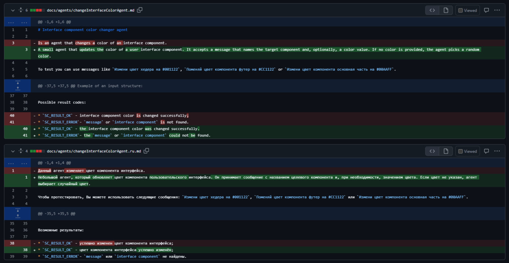
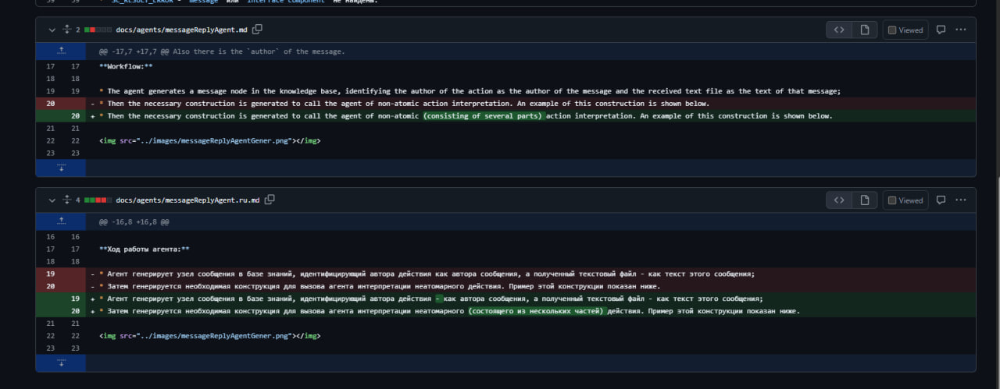

Министерство образования Республики Беларусь

Учреждение образования

“Брестский Государственный технический университет”

Кафедра ИИТ

       

Лабораторная работа №5

По дисциплине “Общая теория интеллектуальных систем”

Тема: “Внесение своего вклада в The OSTIS или в The OSTIS Applications”

     

Выполнил:

Студент 2 курса

Группы ИИ-27

Соловчук И.Г.

Проверил:

Дворанинович Д.А.

     

Брест 2025

# Задание: Работа с проектами #
1. Изучить следующие открытые проекты:
    1.1. The [OSTIS](https://github.com/ostis-ai) Technology project;
    1.2. The OSTIS [Applications](https://github.com/ostis-apps);
2. Внести свой вклад в проект (в виде оформления запроса на внесение изменений
(`pull request`) по одному из следующих направлений:
- предложить исправления ошибок в документации (синтаксические, орфографические и т.п.);
- предложить исправления в исходном коде;
- предложить новую функциональность.
3. Написать отчет по выполненной работе в .md формате (readme.md) и с помощью
`pull request` разместить его в следующем каталоге: trunk\ii0xxyy\task_05\doc.

## Ход работы
В ходе данной лабораторной работы я внес вклад в репозиторий [ostis-apps/nika](https://github.com/ostis-apps/nika) проекта `The OSTIS Applications`.

## Внесенный вклад

Исправлены опечатки и улучшено форматирование в документации на русском языке для некоторых агентов: changeInterfaceColorAgent.md, changeInterfaceColorAgent.ru.md , messageReplyAgent.md и messageReplyAgent.ru.md

## Pull-request

Ссылка на мой pull-request в `ostis-apps/nika`: [https://github.com/ostis-apps/nika/pull/382/files](https://github.com/ostis-apps/nika/pull/382/files).