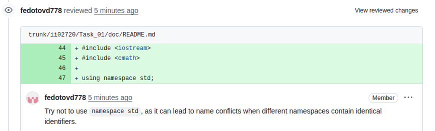
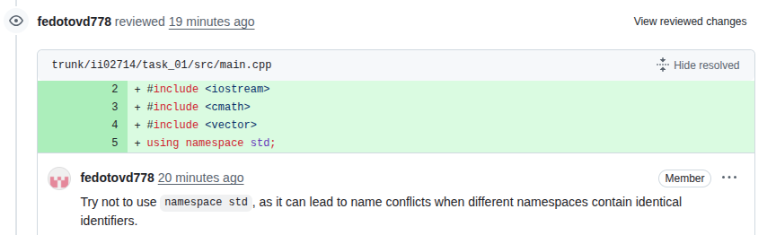

<p align="center"> Министерство образования Республики Беларусь</p>
<p align="center">Учреждение образования</p>
<p align="center">“Брестский Государственный технический университет”</p>
<p align="center">Кафедра ИИТ</p>
<br><br><br><br><br><br><br>
<p align="center">Лабораторная работа №1</p>
<p align="center">По дисциплине “Общая теория интеллектуальных систем”</p>
<p align="center">Тема: “Моделирование температуры объекта”</p>
<br><br><br><br><br>
<p align="right">Выполнил:</p>
<p align="right">Студент 2 курса</p>
<p align="right">Группы ИИ-27</p>
<p align="right">Федотов Д. А.</p>
<p align="right">Проверил:</p>
<p align="right">Дворанович Д. А.</p>
<br><br><br><br><br>
<p align="center">Брест 2025</p>

# Общее задание #
1. Написать отчет по выполненной лабораторной работе №1 в .md формате (readme.md) и с помощью запроса на внесение изменений (**pull request**) разместить его в следующем каталоге: **trunk\ii0xxyy\task_01\doc** (где **xx** - номер группы, **yy** - номер студента, например **ii02702**).
2. Исходный код написанной программы разместить в каталоге: **trunk\ii0xxyy\task_01\src**.
3. Выполнить рецензирование ([review](https://linearb.io/blog/code-review-on-github), [checklist](https://linearb.io/blog/code-review-checklist)) запросов других студентов (минимум 2-е рецензии).
4. Отразить выполнение работы в файле readme.md в соответствующей строке (например, для студента под порядковым номером 1 - https://github.com/brstu/OTIS-2023/edit/main/readme.md?#L17-L17).

## Task 1. Modeling controlled object ##
Let's get some object to be controlled. We want to control its temperature, which can be described by this differential equation:

$$\Large\frac{dy(\tau)}{d\tau}=\frac{u(\tau)}{C}+\frac{Y_0-y(\tau)}{RC} $$ (1)

where $\tau$ – time; $y(\tau)$ – input temperature; $u(\tau)$ – input warmth; $Y_0$ – room temperature; $C,RC$ – some constants.

After transformation we get these linear (2) and nonlinear (3) models:


$$\Large y_{\tau+1}=ay_{\tau}+bu_{\tau}$$ (2)
$$\Large y_{\tau+1}=ay_{\tau}-by_{\tau-1}^2+cu_{\tau}+d\sin(u_{\tau-1})$$ (3)

where $\tau$ – time discrete moments ($1,2,3{\dots}n$); $a,b,c,d$ – some constants.

Task is to write program (**С++**), which simulates this object temperature.


## Код программы:
```C++
#include <iostream>
#include <cmath>

int main() {
    double temp_now;
    double temp_prev;
    double temp_next;
    double heat_now;
    double heat_prev;
    double A, B, C, D;
    int steps;

    std::cout << "Введите начальную температуру (y) и подачу тепла (u): ";
    std::cin >> temp_now >> heat_now;

    std::cout << "Введите коэффициенты A, B, C, D: ";
    std::cin >> A >> B >> C >> D;

    std::cout << "Введите количество шагов моделирования: ";
    std::cin >> steps;

    temp_prev = temp_now;

    std::cout << "\nЛинейная модель\n";
    for (int k = 1; k <= steps; ++k) {
        temp_now = A * temp_prev + B * heat_now;
        std::cout << "Шаг " << k << " температура = " << temp_now << " C\n";
        temp_prev = temp_now;
    }

    std::cout << "\nНелинейная модель\n";
    temp_now = temp_prev;
    temp_prev = 0.0;
    heat_prev = heat_now;

    for (int k = 1; k <= steps; ++k) {
        temp_next = A * temp_now - B * std::pow(temp_prev, 2) + C * heat_now + D * std::sin(heat_prev);
        temp_prev = temp_now;
        temp_now = temp_next;
        heat_prev = heat_now;
        std::cout << "Шаг " << k << "температура = " << temp_now << " C\n";
        
        if (k != steps) {
            std::cout << "Введите новое значение подачи тепла (u): ";
            std::cin >> heat_now;
        }
    }

    std::cout << "\nМоделирование завершено.\n";
    std::cout << "Итоговая температура: " << temp_now << " C\n";

    return 0;
}


```

## Результат программы:

Введите начальную температуру (y) и подачу тепла (u): 5  
8
Введите коэффициенты A, B, C, D: 2
3
4
5
Введите количество шагов моделирования: 5

Линейная модель
Шаг 1: температура = 34 °C
Шаг 2: температура = 92 °C
Шаг 3: температура = 208 °C
Шаг 4: температура = 440 °C
Шаг 5: температура = 904 °C

Нелинейная модель
Шаг 1: температура = 46.9468 °C
Введите новое значение подачи тепла (u): 3
Шаг 2: температура = 35.8404 °C
Введите новое значение подачи тепла (u): 5
Шаг 3: температура = -6519.62 °C
Введите новое значение подачи тепла (u): 6
Шаг 4: температура = -16873.6 °C
Введите новое значение подачи тепла (u): 2
Шаг 5: температура = -1.2755e+08 °C
Введите новое значение подачи тепла (u): 1

Моделирование завершено.
Итоговая температура: -1.2755e+08 °C

## Reviews
JohnyDepp228
<br>

<br>
IlyaStepanuk
<br>

