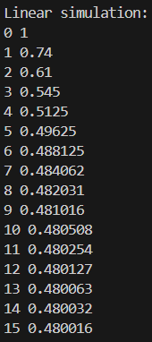
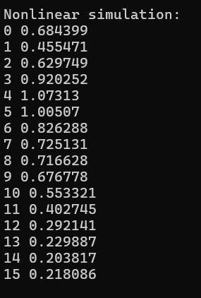
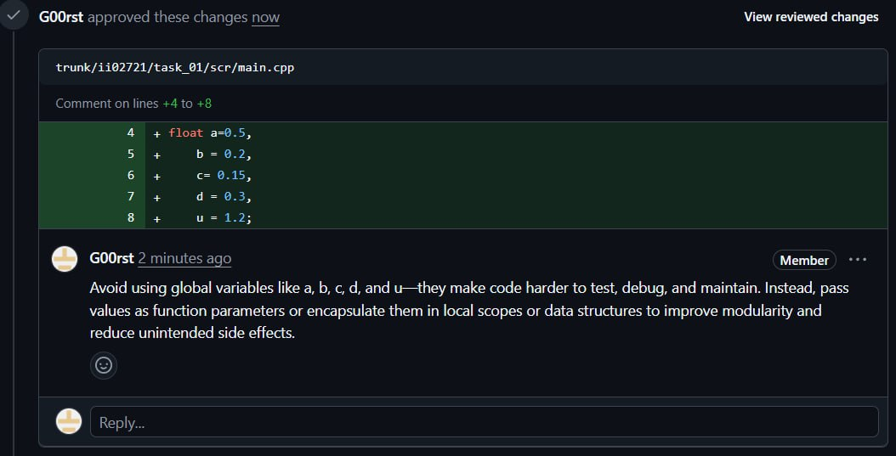
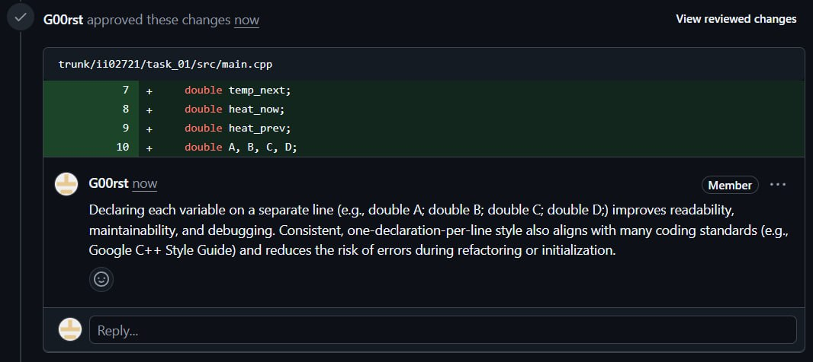

<p align="center"> Министерство образования Республики Беларусь</p>
<p align="center">Учреждение образования</p>
<p align="center">“Брестский Государственный технический университет”</p>
<p align="center">Кафедра ИИТ</p>
<br><br><br><br><br><br><br>
<p align="center">Лабораторная работа №1</p>
<p align="center">По дисциплине “Общая теория интеллектуальных систем”</p>
<p align="center">Тема: “Моделирования температуры объекта”</p>
<br><br><br><br><br>
<p align="right">Выполнил:</p>
<p align="right">Студент 2 курса</p>
<p align="right">Группы ИИ-27</p>
<p align="right">Хотенко В.В.</p>
<p align="right">Проверил:</p>
<p align="right">Дворанинович Д.А.</p>
<br><br><br><br><br>
<p align="center">Брест 2025</p>

# Общее задание #
1. Написать отчет по выполненной лабораторной работе №1 в .md формате (readme.md) и с помощью запроса на внесение изменений (**pull request**) разместить его в следующем каталоге: **trunk\ii0xxyy\task_01\doc** (где **xx** - номер группы, **yy** - номер студента, например **ii02302**).
2. Исходный код написанной программы разместить в каталоге: **trunk\ii0xxyy\task_01\src**.
3. Выполнить рецензирование ([review](https://linearb.io/blog/code-review-on-github), [checklist](https://linearb.io/blog/code-review-checklist)) запросов других студентов (минимум 2-е рецензии).
4. Отразить выполнение работы в файле readme.md в соответствующей строке (например, для студента под порядковым номером 1 - https://github.com/brstu/OTIS-2023/edit/main/readme.md?#L17-L17).

## Task 1. Modeling controlled object ##
Let's get some object to be controlled. We want to control its temperature, which can be described by this differential equation:

$$\Large\frac{dy(\tau)}{d\tau}=\frac{u(\tau)}{C}+\frac{Y_0-y(\tau)}{RC} $$ (1)

where $\tau$ – time; $y(\tau)$ – input temperature; $u(\tau)$ – input warm; $Y_0$ – room temperature; $C,RC$ – some constants.

After transformation we get these linear (2) and nonlinear (3) models:

$$\Large y_{\tau+1}=ay_{\tau}+bu_{\tau}$$ (2)
$$\Large y_{\tau+1}=ay_{\tau}-by_{\tau-1}^2+cu_{\tau}+d\sin(u_{\tau-1})$$ (3)

where $\tau$ – time discrete moments ($1,2,3{\dots}n$); $a,b,c,d$ – some constants.

Task is to write program (**С++**), which simulates this object temperature.


## Код программы:
```C++
#include <iostream>
#include <cmath>

struct LinearModelParams 
{
    double a; // Coefficient for previous output (y)
    double b; // Coefficient for input (u)
};
struct NonLinearModelParams 
{
	double yOffset;      // Initial offset for previous output value (prevY = y - yOffset)
	double uOffset;      // Initial offset for previous input value (prevU = u - uOffset)
    double a;            // Linear coefficient for current output (y)
    double b;            // Nonlinear coefficient for squared previous output (prevY²)
    double c;            // Linear coefficient for input (u)
    double d;            // Nonlinear coefficient for sinusoidal input term
    double u_step;       // Step size for input signal increment
};

void simulateLinear(double y, double u, int t, const LinearModelParams& params) 
{
    for (int i = 0; i <= t; i++) 
	{
        std::cout << i << ' ' << y << '\n';
        y = params.a * y + params.b * u;
    }
}
void simulateNonLinear(double y, double u, int t, const NonLinearModelParams& params) 
{
    double prevY = y - params.yOffset; // calculate prevY to differentiate it from the initial y
    double prevU = u - params.uOffset; // calculate prevU to differentiate it from the initial u
    for (int i = 0; i <= t; i++) 
	{
        std::cout << i << ' ' << y << '\n';
        double nextY = params.a * y - params.b * prevY * prevY + params.c * u + params.d * std::sin(prevU);
        prevU += params.u_step;
        prevY = y;
        y = nextY;
    }
}

LinearModelParams createLinearModel()
{
	LinearModelParams params;
	params.a = 0.5;
	params.b = 0.3;
    return params;
}
NonLinearModelParams createNonLinearModel() 
{
	NonLinearModelParams params;
	params.yOffset = 0.2;  
    params.uOffset = 1;      
	params.a = 0.6;
	params.b = 0.4;
	params.c = 0.5;
	params.d = 0.3;
	params.u_step = 0.35;
    return params;
}

int main() 
{
    const double y = 1.0; // Initial output value
    const double u = 0.8; // Input signal value
    const int t = 15;     // Simulation time steps

    std::cout << "Linear simulation:\n";
    LinearModelParams linearParams = createLinearModel();
    simulateLinear(y, u, t, linearParams);
    std::cout << '\n';

    std::cout << "Nonlinear simulation:\n";
    NonLinearModelParams nonLinearParams = createNonLinearModel();
    simulateNonLinear(y, u, t, nonLinearParams);
    std::cout << '\n';

    return 0;
}
```

## Результат программы:
Вывод линейной симуляции:
<br>

<br>
Вывод нелинейной симуляции:
<br>


## Reviews
zprtall
<br>

<br>
fedotovd778
<br>



