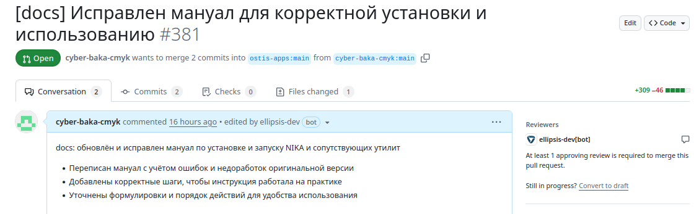

Министерство образования Республики Беларусь

Учреждение образования

“Брестский Государственный технический университет”

Кафедра ИИТ

Лабораторная работа №6

По дисциплине “Общая теория интеллектуальных систем”

Тема: “Создание базы знаний для проекта **"NIKA"** ”

Выполнил:

Студент 2 курса

Группы ИИ-27

Юшкевич А.Ю.

Проверил:

Иванюк Д. С.

Брест 2025

---

# Создание базы знаний для проекта **"NIKA"** (Intelligent Knowledge-driven Assistant) #

1. Изучить [руководство](https://ostis-apps.github.io/nika/).
2. Составить базу знаний для проекта [T1-PLCnext-Demo](https://github.com/savushkin-r-d/T1-PLCnext-Demo).
3. Разработанную базу знаний поместить в виде запроса в [T1-PLCnext-Demo-OSTIS](https://github.com/savushkin-r-d/T1-PLCnext-Demo-OSTIS).
4. Написать отчет по выполненной работе в .md формате (readme.md) и с помощью pull request разместить его в следующем каталоге: ``trunk\ii0xxyy\task_06\doc``.

---

Updated README.md with detailed installation instructions, usage steps, and troubleshooting tips for NIKA.

    Documentation:
        Updated README.md with corrected and detailed installation steps for NIKA.
        Added sections for installing Git and Docker on Windows, macOS, and Linux.
        Included troubleshooting tips for common issues like Docker image loading and port access.
    Usage:
        Detailed steps for cloning the NIKA repository and launching the application.
        Instructions for checking service status and useful Docker commands.
    Misc:
        Clarified requirements and prerequisites for installation.
        Improved formatting and structure for better readability.

    