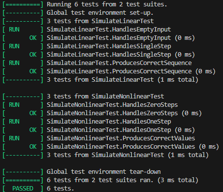
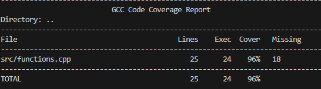

<p align="center">Министерство образования Республики Беларусь</p>
<p align="center">Учреждение образования</p>
<p align="center">“Брестский Государственный технический университет”</p>
<p align="center">Кафедра ИИТ</p>
<br><br><br><br><br><br><br>
<p align="center">Лабораторная работа №2</p>
<p align="center">По дисциплине “Общая теория интеллектуальных систем”</p>
<p align="center">Тема: “Модульное тестирование. Покрытие исходного кода тестами.”</p>
<br><br><br><br><br>
<p align="right">Выполнил:</p>
<p align="right">Студент 2 курса</p>
<p align="right">Группы ИИ-28</p>
<p align="right">Артыш Е.А.</p>
<p align="right">Проверил:</p>
<p align="right">Дворанинович Д.А.</p>
<br><br><br><br><br>
<p align="center">Брест 2025</p>

---

# Общее задание
Написать модульные тесты для программы, разработанной в лабораторной работе №1.

1. Использовать фреймворк для модульного тестирования — [Google Test](https://google.github.io/googletest/).  
2. Написать модульные тесты для основных функций программы. Разместить тесты в каталоге: **trunk/ii02801/task_02/test**.  
3. Исходный код модифицированной программы разместить в каталоге: **trunk/ii02801/task_02/src**.  
4. В файле `readme.md` отразить количество написанных тестов и процент покрытия кода тестами (например, с помощью [gcovr](https://gcovr.com/en/stable/)).  
5. Также необходимо отразить выполнение работы в общем [`readme.md`](https://github.com/brstu/OTIS-2025/blob/main/README.md) в соответствующей строке.

---

# Код юнит-тестов [ test/test.cpp ]

```cpp

#include <gtest/gtest.h>
#include <cmath>
#include <vector>
#include "functions.h"

// ------------------------------
// Тесты для simulateLinear()
// ------------------------------

TEST(SimulateLinearTest, HandlesEmptyInput) {
    std::vector<double> u;
    auto result = simulateLinear(5, 10.0, u);
    EXPECT_TRUE(result.empty());
}

TEST(SimulateLinearTest, HandlesSingleStep) {
    std::vector<double> u = {1.0};
    auto result = simulateLinear(1, 10.0, u);
    ASSERT_EQ(result.size(), 1);
    EXPECT_DOUBLE_EQ(result[0], 10.0);
}

TEST(SimulateLinearTest, ProducesCorrectSequence) {
    std::vector<double> u = {5.0, 5.0, 5.0, 5.0};
    auto result = simulateLinear(5, 10.0, u);

    ASSERT_EQ(result.size(), 5);
    EXPECT_NEAR(result[1], 0.9 * 10.0 + 0.1 * 5.0, 1e-6);
    EXPECT_NEAR(result[2], 0.9 * result[1] + 0.1 * 5.0, 1e-6);
}

// ------------------------------
// Тесты для simulateNonlinear()
// ------------------------------

TEST(SimulateNonlinearTest, HandlesZeroSteps) {
    std::vector<double> u = {5.0, 5.0};
    auto result = simulateNonlinear(0, 10.0, u);
    EXPECT_TRUE(result.empty());
}

TEST(SimulateNonlinearTest, HandlesOneStep) {
    std::vector<double> u = {5.0, 5.0};
    auto result = simulateNonlinear(1, 10.0, u);
    ASSERT_EQ(result.size(), 1);
    EXPECT_DOUBLE_EQ(result[0], 10.0);
}

TEST(SimulateNonlinearTest, ProducesCorrectValues) {
    std::vector<double> u = {5.0, 5.0, 5.0};
    auto result = simulateNonlinear(3, 10.0, u);

    ASSERT_EQ(result.size(), 3);
    EXPECT_NEAR(result[1], 0.9 * 10.0 + 0.1 * 5.0, 1e-6);
    double expected2 = 0.9 * result[1] - 0.1 * std::pow(10.0, 2) + 0.05 * 5.0 + 0.02 * std::sin(5.0);
    EXPECT_NEAR(result[2], expected2, 1e-6);
}

```
## Результаты юнит-тестирования (GoogleTest)



## Покрытие тестами (gcovr)

