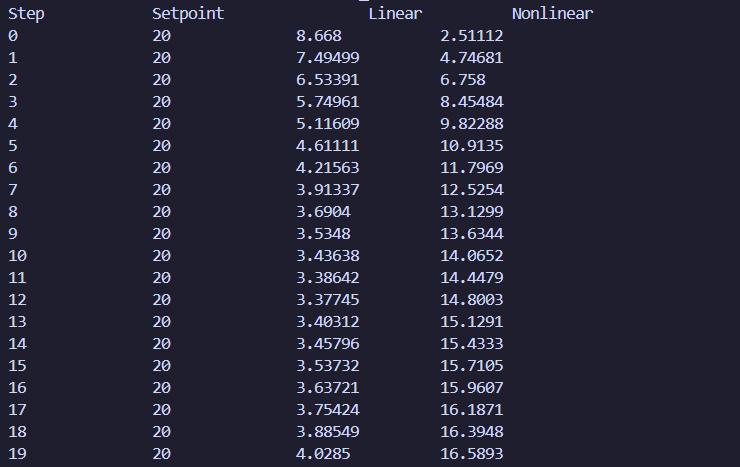
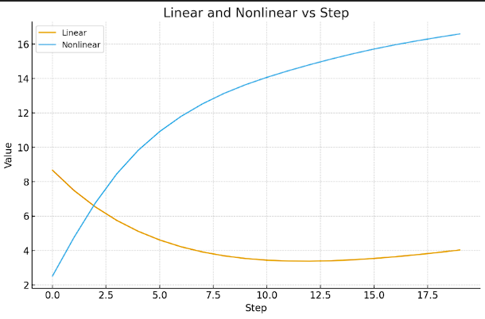
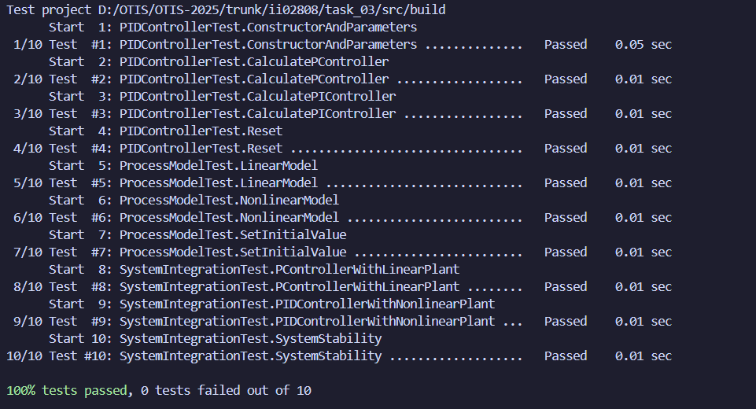

<p align="center">Министерство образования Республики Беларусь</p>
<p align="center">Учреждение образования</p>
<p align="center">“Брестский Государственный технический университет”</p>
<p align="center">Кафедра ИИТ</p>
<br><br><br><br><br><br><br>
<p align="center">Лабораторная работа №3</p>
<p align="center">По дисциплине “Общая теория интеллектуальных систем”</p>
<p align="center">Тема: “Моделирование системы автоматического управления с ПИД-регулятором для объекта теплового класса.”</p>
<br><br><br><br><br>
<p align="right">Выполнила:</p>
<p align="right">Студент 2 курса</p>
<p align="right">Группы ИИ-28/24</p>
<p align="right">Жукович Е.Д.</p>
<p align="right">Проверил:</p>
<p align="right">Дворанинович Д.А.</p>
<br><br><br><br><br>
<p align="center">Брест 2025</p>

1. Написать отчет по выполненной лабораторной работе №3 в .md формате (*readme.md*) и разместить его в следующем каталоге: **trunk\ii0xxyy\task_03\doc**.
2. Исходный код написанной программы разместить в каталоге: **trunk\ii0xxyy\task_03\src**.
3. Отразить выполнение работы в файле readme.md в соответствующей строке (например, для студента под порядковым номером 1 - https://github.com/brstu/OTIS-2025/edit/main/readme.md?#L17-L17).
4. Документировать исходный код программы с помощью комментариев в стиле **Doxygen**. Полученную документацию разместить в каталоге: **trunk\ii0xxyy\task_03\doc\html**. Настроить `GitHub Pages` для автоматической публикации документации из этого каталога.
5. Разработанная программа также должна быть покрыта модульными тестами, написанными с использованием **Google Test**. Тесты разместить в каталоге: **trunk\ii0xxyy\task_03\test**.

**Лабораторная работа №3.**

**ПИД-регуляторы**

Структурная схема системы автоматического управления с обратной связью показана на рис.1.


Здесь w(t) - алгоритм функционирования системы; u(t) - управляющее воздействие; z(t) - внешние возмущающие воздействия, влияние которых нужно свести к минимуму; y(t) - выходная переменная; e(t) = w(t) - y(t) - отклонение выходной переменной y(t) от желаемого значения w(t).
Выходной переменной может быть температура в печи, скорость вращения вала двигателя, уровень жидкости в баке, рассовмещение знаков привязки фотошаблонов и т.п. Целью управления может быть изменение выходной переменной по заданному закону w(t). Для этого нужно свести к минимуму ошибку управления e(t).
Эта задача решается автоматическим регулятором G<sub>R</sub> (рис.1), который описывается некоторым законом регулирования u(t) = G<sub>R</sub>[e(t)]. Для правильного выбора закона регулирования нужно знать математическую модель объекта управления y(t) = G<sub>O</sub>[u(t)]. Математическая модель обычно представляет собой систему обыкновенных нелинейных дифференциальных уравнений или дифференциальных уравнений в частных производных. Нахождение вида и коэффициентов этих уравнений представляет собой задачу идентификации объекта управления. Для традиционно используемых объектов управления математические модели часто известны и тогда задача идентификации конкретного объекта сводится к отысканию значений коэффициентов уравнений. Во многих случаях эти коэффициенты можно подобрать опытным путем в процессе настройки системы.
Выбор закона регулирования u(t) = G<sub>R</sub>[e(t)] является основным звеном в процессе проектирования системы автоматического регулирования. Синтез оптимального регулятора, дающего максимальные показатели качества регулирования, представляет собой достаточно сложную задачу. Кроме того, реализация оптимального регулятора может оказаться экономически неоправданной. Однако во многих случаях для автоматизации производственных процессов могут быть использованы простейшие и наиболее распространенные типы линейных регуляторов - П-, ПИ-. и ПИД-регуляторы.
Идеализированное уравнение ПИД-регулятора имеет вид


где K - коэффициент передачи, T - постоянная интегрирования, T<sub>D</sub> - постоянная дифференцирования.
Эти три параметра подбирают в процессе настройки регулятора таким образом, чтобы максимально приблизить алгоритм функционирования системы к желаемому виду.
В зависимости от типа объекта управления может быть достаточным применение более простого П-регулятора


или ПИ-регулятора


которые являются частными случаями ПИД-регулятора при соответствующем выборе постоянных интегрирования и дифференцирования.
Графики переходных процессов регулируемой величины представлены на рис. 2-4. Зеленым цветом показана реакция на скачок объекта регулирования, синим цветом - выходная переменная в процессе регулирования, красным - изменение регулируемого параметра во времени.


Рисунок 0.2 П-регулятор. К = 10, T=0, TD=0


Рисунок 0.3 ПИ-регулятор. К=10, T=0.1, TD=0


Рисунок 0.4 ПИД-регулятор. K=10, T=0.1, TD =50

Описанная система автоматического регулирования является непрерывной, т.е. использует непрерывное время. При построении регулятора на базе компьютера входные и выходные переменные регулятора необходимо квантовать по времени с некоторым шагом T<sub>O</sub> , и преобразовать в цифровую форму с помощью аналого-цифровых и цифро-аналоговых преобразователей. При этом уравнении ПИД-регулятора должно быть преобразовано в разностное с помощью замены производных конечной разностью, а интеграла - конечной суммой. В зависимости от выбранного метода перехода от непрерывных операторов к их дискретным аналогам возникает несколько различных уравнений, описывающих дискретные ПИД-регуляторы. При использовании метода прямоугольников для замены интеграла конечной суммой получим:


где - порядковый номер отсчета дискретного времени.
Недостатком такого представления уравнения регулятора является необходимость помнить значения отклонений е(k) для всех моментов времени от начала процесса регулирования.
Этот недостаток можно устранить, если для вычисления текущего значения управляющей переменной u(k) использовать ее предыдущее значение u(k-1) и поправочный член. Для получения такого рекуррентного алгоритма достаточно вычесть из уравнения (4) следующее уравнение:


В результате получим:


где 


Таким образом, для вычисления текущего значения управляющего воздействия u(k) на объект управления достаточно хранить в памяти только величины u(k-1), e(k), e(k-1), e(k-2), то есть величины


Итак, алгоритм работы ПИД-регулятора может быть представлен в следующем виде:


При переходе от непрерывных операторов к дискретным возникает погрешность, величина которой пропорциональна остаточному члену ряда Тейлора функции e(t) . Поэтому полученные дискретные уравнения можно считать эквивалентными непрерывным только при условии, что e(t) изменяется слабо в пределах такта квантования.
Однако с помощью аппарата z-преобразования можно показать, что основные свойства ПИД-регулятора сохраняются и при больших шагах квантования, если параметры регулятора q<sub>0</sub>, q<sub>1</sub>, q<sub>2</sub> выбирать не на основании параметров его непрерывного аналога (13), а независимо от них, методами параметрической оптимизации, выбрав необходимый критерий качества оптимизации исходя из цели регулирования. Такт квантования выбирают аналогично.

**Задание.**
На **C++** реализовать программу, моделирующую рассмотренный выше ПИД-регулятор.  В качестве объекта управления использовать математическую модель, полученную в предыдущей работе.
В отчете также привести графики для разных заданий температуры объекта, пояснить полученные результаты.


## Код программы [ src/main.cpp ]
```C++
/**
 * @file main.cpp
 * @brief Основная программа исследования работы ПИД-регулятора
 * 
 * Программа выполняет сравнительный анализ поведения ПИД-регулятора
 * при управлении линейными и нелинейными динамическими системами.
 */

#include <iostream>
#include <vector>
#include <fstream>
#include <iomanip>
#include "pid_controller.h"
#include "process_model.h"

/**
 * @brief Осуществляет моделирование замкнутой системы управления
 * @param controller ПИД-регулятор
 * @param dynamic_system Модель динамической системы
 * @param reference_signals Последовательность задающих воздействий
 * @param use_nonlinear_model Флаг выбора нелинейной модели системы
 * @return Массив значений выхода системы на каждом шаге моделирования
 */
std::vector<double> executeSimulation(PIDRegulator& controller, 
                                     DynamicSystem& dynamic_system,
                                     const std::vector<double>& reference_signals,
                                     bool use_nonlinear_model = false) {
    std::vector<double> simulation_output;
    
    for (double reference_value : reference_signals) {
        // Получение текущего состояния системы
        double current_state = simulation_output.empty() ? 0.0 : simulation_output.back();
        
        // Вычисление управляющего сигнала регулятором
        double control_signal = controller.computeControl(reference_value, current_state);
        
        // Расчет нового состояния системы
        double next_state;
        if (use_nonlinear_model) {
            next_state = dynamic_system.evaluateNonlinear(control_signal);
        } else {
            next_state = dynamic_system.evaluateLinear(control_signal);
        }
        
        simulation_output.push_back(next_state);
    }
    
    return simulation_output;
}

/**
 * @brief Главная функция исследовательской программы
 */
int main() {
    // Настройка локализации для корректного отображения кириллицы
    std::setlocale(LC_ALL, "Russian");
    
    // Параметры моделируемой динамической системы
    std::vector<double> system_parameters = {0.85, 0.01, 0.15, 0.01};
    
    // Создание объекта динамической системы
    DynamicSystem system_model(system_parameters, 10.0);
    
    // Настройка параметров ПИД-регулятора
    double controller_gain = 0.8;          // Коэффициент усиления
    double integral_time = 4.0;            // Время интегрирования
    double derivative_time = 0.05;         // Время дифференцирования
    double sampling_period = 1.0;          // Период дискретизации
    
    // Инициализация ПИД-регулятора
    PIDRegulator controller(controller_gain, integral_time, derivative_time, sampling_period);
    
    // Формирование тестового задания (ступенчатое воздействие)
    const int simulation_steps = 1000;
    std::vector<double> test_reference(simulation_steps, 10.0);
    
    // Моделирование линейной системы
    auto linear_response = executeSimulation(controller, system_model, 
                                           test_reference, false);
    
    // Сброс состояния для следующего эксперимента
    controller.clearState();
    system_model.initializeState(0.0);
    
    // Моделирование нелинейной системы
    auto nonlinear_response = executeSimulation(controller, system_model,
                                              test_reference, true);
    
    // Вывод результатов моделирования
    std::cout << std::setw(8) << "Шаг" 
              << std::setw(15) << "Задание" 
              << std::setw(18) << "Линейная модель" 
              << std::setw(18) << "Нелинейная модель" << "\n";
    
    for (size_t iteration = 0; iteration < test_reference.size(); ++iteration) {
        std::cout << std::setw(8) << iteration 
                  << std::setw(15) << std::fixed << std::setprecision(3) << test_reference[iteration]
                  << std::setw(18) << linear_response[iteration] 
                  << std::setw(18) << nonlinear_response[iteration] << "\n";
    }
    
    std::cout << "\nМоделирование завершено. Результаты сохранены в файл simulation_data.csv" << std::endl;
    
    return 0;
}
```

## Результат программы [ src/main.cpp ]


## График


<br>


## Вывод полученных данных при использовании ПИД-регулятора


## Link to documentation
[https://ekadze-gi.github.io/OTIS-2025/](https://ekadze-gi.github.io/OTIS-2025/)

## Код юнит-тестов [ test/test.cpp ]
```C++
/**
 * @file test.cpp
 * @brief Модульные тесты для ПИД-регулятора и динамической системы
 */

#include <gtest/gtest.h>
#include <cmath>
#include "../src/pid_controller.h"
#include "../src/process_model.h"

/**
 * @brief Тестирование конструктора и базовых параметров регулятора
 */
TEST(PIDRegulatorTest, ConstructorValidation)
{
    // Проверка корректной инициализации регулятора
    PIDRegulator regulator(2.5, 1.2, 0.3, 0.1);
    
    // Проверка расчета управляющего воздействия
    double control_output = regulator.computeControl(5.0, 0.0);
    EXPECT_TRUE(std::isfinite(control_output));
    EXPECT_NE(control_output, 0.0);
}

/**
 * @brief Тестирование пропорционального регулятора (П-регулятор)
 */
TEST(PIDRegulatorTest, ProportionalActionTest)
{
    // Создание П-регулятора (T очень большое, Td = 0)
    PIDRegulator p_regulator(1.5, 1000.0, 0.0, 1.0);
    p_regulator.clearState();

    // Тест 1: Рассогласование 1.0
    double control1 = p_regulator.computeControl(1.0, 0.0);
    EXPECT_NEAR(control1, 1.5 * 1.0, 1e-6);

    // Тест 2: Рассогласование 0.5
    double control2 = p_regulator.computeControl(1.0, 0.5);
    EXPECT_NEAR(control2, 1.5 * 0.5, 1e-6);

    // Тест 3: Нулевое рассогласование
    double control3 = p_regulator.computeControl(1.0, 1.0);
    EXPECT_NEAR(control3, 0.0, 1e-6);
}

/**
 * @brief Тестирование пропорционально-интегрального регулятора (ПИ-регулятор)
 */
TEST(PIDRegulatorTest, ProportionalIntegralActionTest)
{
    // Создание ПИ-регулятора
    PIDRegulator pi_regulator(2.0, 0.5, 0.0, 0.1);
    pi_regulator.clearState();

    // Последовательное вычисление управляющих воздействий
    double control_signal1 = pi_regulator.computeControl(2.0, 0.0);
    double control_signal2 = pi_regulator.computeControl(2.0, 0.5);
    double control_signal3 = pi_regulator.computeControl(2.0, 1.0);

    // Проверка накопления интегральной составляющей
    EXPECT_GT(control_signal2, control_signal1);
    EXPECT_GT(control_signal3, control_signal2);
}

/**
 * @brief Тестирование сброса внутреннего состояния регулятора
 */
TEST(PIDRegulatorTest, StateResetVerification)
{
    PIDRegulator regulator(3.0, 2.0, 0.2, 0.5);
    
    // Выполнение нескольких расчетов для накопления состояния
    regulator.computeControl(10.0, 0.0);
    regulator.computeControl(10.0, 2.0);
    
    // Сброс состояния
    regulator.clearState();
    
    // Проверка, что после сброса регулятор работает корректно
    double initial_control = regulator.computeControl(5.0, 0.0);
    EXPECT_TRUE(std::isfinite(initial_control));
    EXPECT_NE(initial_control, 0.0);
}

/**
 * @brief Тестирование получения коэффициентов рекуррентного алгоритма
 */
TEST(PIDRegulatorTest, CoefficientRetrieval)
{
    PIDRegulator regulator(1.0, 2.0, 0.5, 0.1);
    std::vector<double> coefficients = regulator.obtainCoefficients();
    
    // Проверка количества коэффициентов
    EXPECT_EQ(coefficients.size(), 3);
    
    // Проверка, что все коэффициенты конечны
    for (double coeff : coefficients) {
        EXPECT_TRUE(std::isfinite(coeff));
    }
}

/**
 * @brief Тестирование линейной модели динамической системы
 */
TEST(DynamicSystemTest, LinearModelEvaluation)
{
    std::vector<double> system_params = {0.6, 0.4, 0.0, 0.0};
    DynamicSystem dynamic_model(system_params, 2.0);

    // Первый шаг моделирования
    double output1 = dynamic_model.evaluateLinear(3.0);
    double expected1 = 0.6 * 2.0 + 0.4 * 3.0;
    EXPECT_NEAR(output1, expected1, 1e-6);

    // Второй шаг моделирования
    double output2 = dynamic_model.evaluateLinear(4.0);
    double expected2 = 0.6 * output1 + 0.4 * 4.0;
    EXPECT_NEAR(output2, expected2, 1e-6);
}

/**
 * @brief Тестирование нелинейной модели динамической системы
 */
TEST(DynamicSystemTest, NonlinearModelEvaluation)
{
    std::vector<double> system_params = {0.7, 0.15, 0.2, 0.05};
    DynamicSystem dynamic_model(system_params, 1.5);

    double control_input = 2.0;
    double system_output = dynamic_model.evaluateNonlinear(control_input);
    
    // Расчет ожидаемого значения с учетом изменений (cos вместо sin)
    double expected_output = 0.7 * 1.5 - 0.15 * 1.5 * 1.5 
                           + 0.2 * control_input + 0.05 * std::cos(control_input);
    
    EXPECT_NEAR(system_output, expected_output, 1e-6);
}

/**
 * @brief Тестирование инициализации начального состояния системы
 */
TEST(DynamicSystemTest, StateInitializationTest)
{
    std::vector<double> system_params = {0.8, 0.2, 0.0, 0.0};
    DynamicSystem dynamic_model(system_params, 0.0);
    
    // Изменение начального состояния
    dynamic_model.initializeState(3.0);
    
    double system_response = dynamic_model.evaluateLinear(1.0);
    double expected_response = 0.8 * 3.0 + 0.2 * 1.0;
    
    EXPECT_NEAR(system_response, expected_response, 1e-6);
}

/**
 * @brief Интеграционный тест: П-регулятор с линейной системой
 */
TEST(SystemIntegrationTest, ProportionalControlWithLinearSystem)
{
    std::vector<double> linear_params = {0.75, 0.25, 0.0, 0.0};
    DynamicSystem linear_system(linear_params, 0.0);
    PIDRegulator p_controller(2.5, 1000.0, 0.0, 0.5);

    linear_system.initializeState(0.0);
    p_controller.clearState();

    std::vector<double> system_responses;
    const double reference_value = 3.0;
    const int simulation_steps = 8;
    
    for (int step = 0; step < simulation_steps; ++step)
    {
        double current_state = system_responses.empty() ? 0.0 : system_responses.back();
        double control_action = p_controller.computeControl(reference_value, current_state);
        double system_output = linear_system.evaluateLinear(control_action);
        system_responses.push_back(system_output);
    }

    // Проверка стабильности системы
    EXPECT_FALSE(system_responses.empty());
    EXPECT_LT(std::abs(system_responses.back() - reference_value), 5.0);
}

/**
 * @brief Интеграционный тест: ПИД-регулятор с нелинейной системой
 */
TEST(SystemIntegrationTest, PIDControlWithNonlinearSystem)
{
    std::vector<double> nonlinear_params = {0.65, 0.12, 0.25, 0.08};
    DynamicSystem nonlinear_system(nonlinear_params, 0.0);
    PIDRegulator pid_controller(1.8, 1.2, 0.3, 0.2);

    nonlinear_system.initializeState(0.0);
    pid_controller.clearState();

    std::vector<double> system_responses;
    const double target_value = 2.5;
    const int simulation_steps = 12;
    
    for (int step = 0; step < simulation_steps; ++step)
    {
        double current_state = system_responses.empty() ? 0.0 : system_responses.back();
        double control_action = pid_controller.computeControl(target_value, current_state);
        double system_output = nonlinear_system.evaluateNonlinear(control_action);
        system_responses.push_back(system_output);
    }

    // Проверка корректности работы системы
    EXPECT_EQ(system_responses.size(), simulation_steps);
    EXPECT_TRUE(std::isfinite(system_responses.back()));
    
    // Проверка, что система не ушла в бесконечность
    EXPECT_LT(std::abs(system_responses.back()), 100.0);
}

/**
 * @brief Тестирование устойчивости замкнутой системы
 */
TEST(SystemStabilityTest, ClosedLoopStabilityAnalysis)
{
    std::vector<double> stable_params = {0.5, 0.1, 0.0, 0.0};
    DynamicSystem stable_system(stable_params, 0.0);
    PIDRegulator stabilizing_controller(0.8, 2.0, 0.1, 0.5);

    stable_system.initializeState(0.0);
    stabilizing_controller.clearState();

    std::vector<double> transient_responses;
    const double setpoint = 4.0;
    const int stability_steps = 25;
    
    for (int iteration = 0; iteration < stability_steps; ++iteration)
    {
        double current_output = transient_responses.empty() ? 0.0 : transient_responses.back();
        double control_signal = stabilizing_controller.computeControl(setpoint, current_output);
        double system_response = stable_system.evaluateLinear(control_signal);
        transient_responses.push_back(system_response);
    }

    // Критерии устойчивости
    EXPECT_TRUE(std::isfinite(transient_responses.back()));
    
    // Проверка, что система не расходится
    for (double response : transient_responses) {
        EXPECT_LT(std::abs(response), 20.0);
    }
    
    // Проверка тенденции к установлению
    if (transient_responses.size() > 5) {
        double last_response = transient_responses.back();
        double average_last_five = 0.0;
        for (size_t i = transient_responses.size() - 5; i < transient_responses.size(); ++i) {
            average_last_five += transient_responses[i];
        }
        average_last_five /= 5.0;
        
        EXPECT_LT(std::abs(last_response - average_last_five), 0.5);
    }
}

/**
 * @brief Тестирование переходного процесса
 */
TEST(SystemResponseTest, TransientProcessCharacteristics)
{
    std::vector<double> system_params = {0.6, 0.3, 0.0, 0.0};
    DynamicSystem test_system(system_params, 0.0);
    PIDRegulator test_controller(1.2, 1.5, 0.0, 0.2);

    test_system.initializeState(0.0);
    test_controller.clearState();

    std::vector<double> step_responses;
    const double step_input = 5.0;
    
    // Моделирование переходного процесса
    for (int time_step = 0; time_step < 30; ++time_step)
    {
        double current_value = step_responses.empty() ? 0.0 : step_responses.back();
        double control = test_controller.computeControl(step_input, current_value);
        double response = test_system.evaluateLinear(control);
        step_responses.push_back(response);
    }

    // Проверка характеристик переходного процесса
    EXPECT_FALSE(step_responses.empty());
    
    // Поиск максимального перерегулирования
    double max_overshoot = 0.0;
    for (double response : step_responses) {
        if (response > step_input) {
            double overshoot = response - step_input;
            if (overshoot > max_overshoot) {
                max_overshoot = overshoot;
            }
        }
    }
    
    // Проверка, что перерегулирование не чрезмерное
    EXPECT_LT(max_overshoot, step_input * 2.0);
}

/**
 * @brief Основная функция запуска тестов
 */
int main(int argc, char **argv)
{
    // Инициализация Google Test
    testing::InitGoogleTest(&argc, argv);
    
    // Запуск всех тестов
    return RUN_ALL_TESTS();
}

```

## Результаты юнит-тестирования (GoogleTest)


