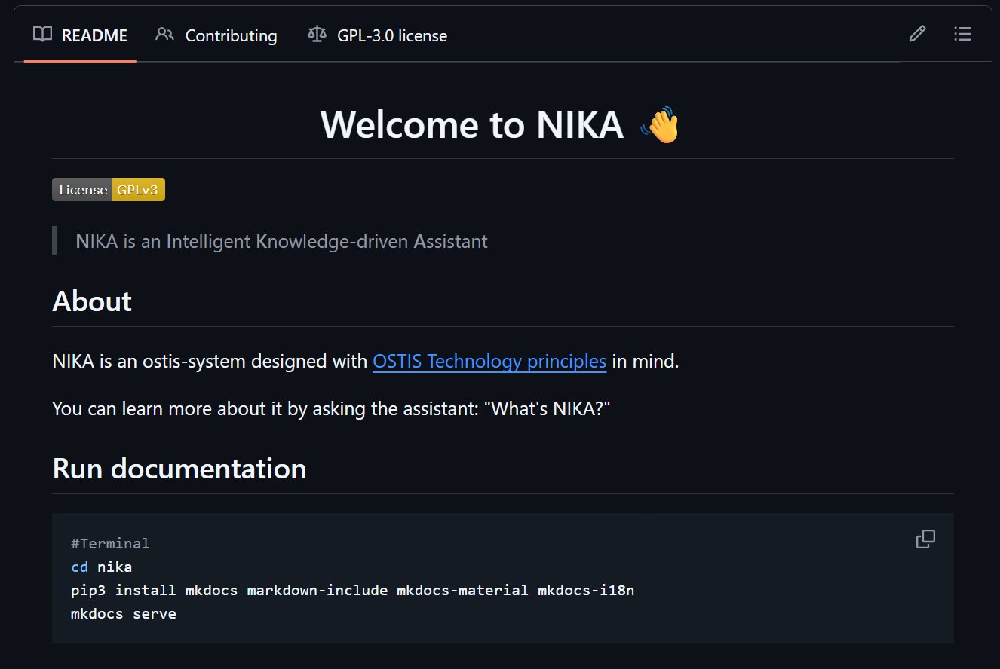
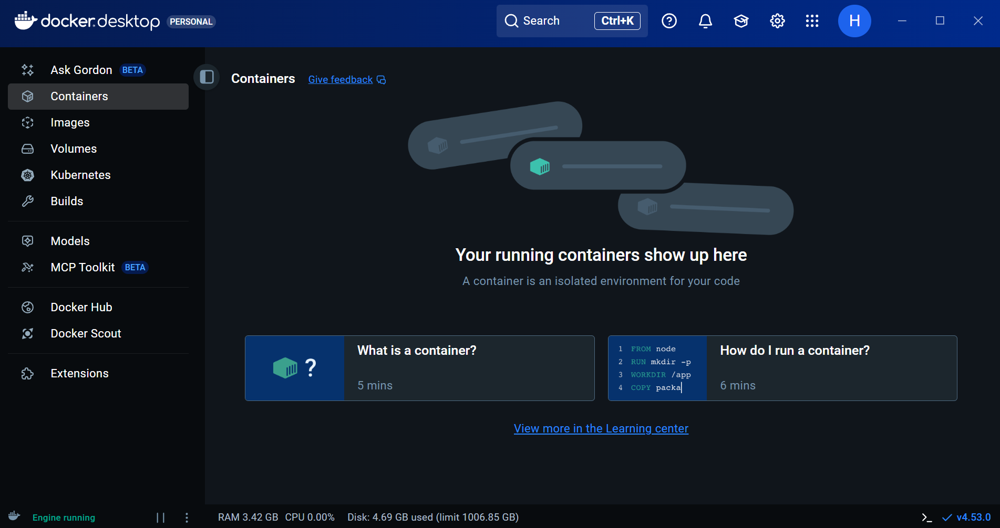
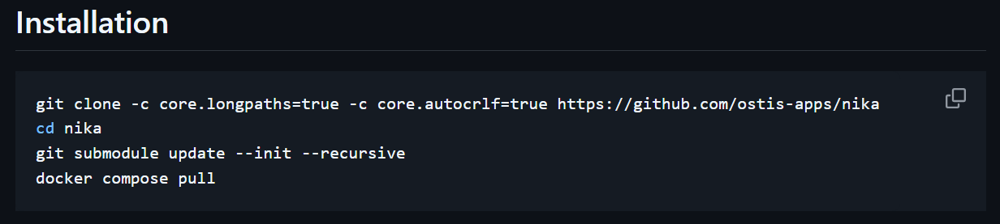
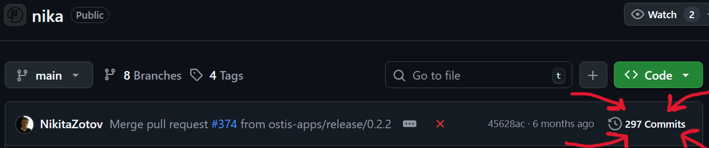
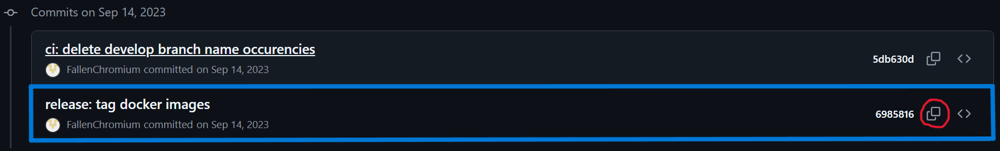
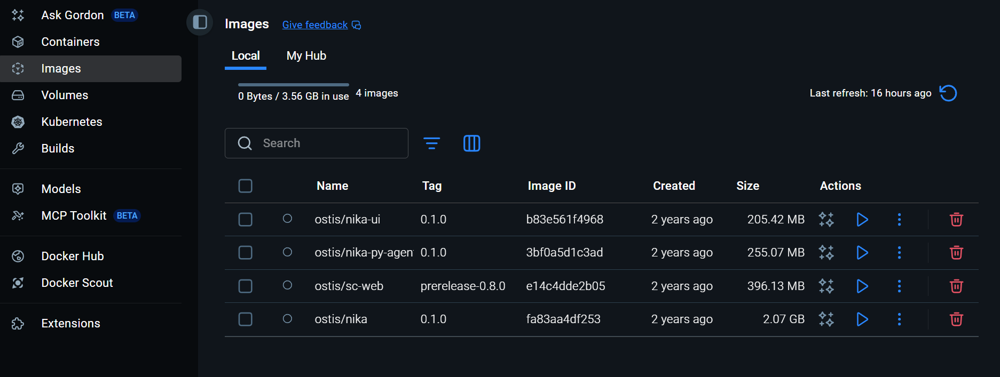
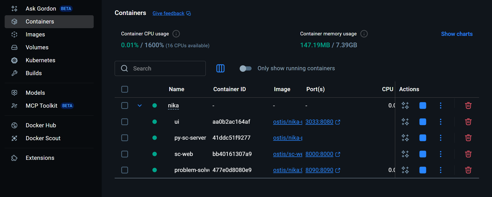
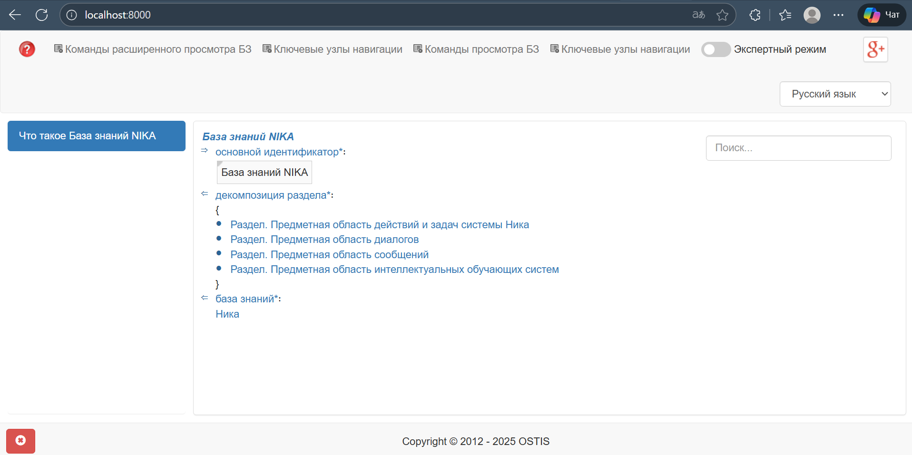
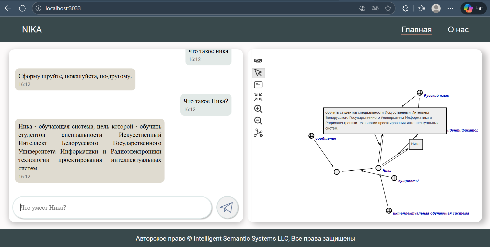

Министерство образования Республики Беларусь

Учреждение образования

“Брестский Государственный технический университет”

Кафедра ИИТ

       

Лабораторная работа №4

По дисциплине “Общая теория интеллектуальных систем”

Тема: “Работа с проектом "NIKA" (Intelligent Knowledge-driven Assistant)”

     

Выполнил:

Студент 2 курса

Группы ИИ-28

Клименко М.С.

Проверил:

Дворанинович Д.А.

     

Брест 2025

# Работа с проектом **"NIKA"** (Intelligent Knowledge-driven Assistant) #

1. Изучить [руководство](https://github.com/ostis-apps/nika).

2. Запустить данный проект на локальной машине (домашний персональный компьютер, ноутбук, рабочая машина в аудитории и т.п.). Продемонстрировать работу проекта преподавателю.

3. Написать отчет по выполненной работе в .md формате (readme.md) и с помощью pull request разместить его в следующем каталоге: trunk\ii0xxyy\task_04\doc.

# Ход работы 

## Введение
В данной лабораторной работе мы познакомимся с таким проектом как **NIKA** , а также с приложением **Docker Dekstop**, которое позволит нам работать с **NIKA**.

### Установка NIKA 0.1.0
 Перейдя в репозиторий [OSTIS/NIKA](https://github.com/ostis-apps/nika), снизу можно увидеть README.md файл с инструкциями по установке, настройке и запуске проекта **NIKA**.

В разделе **Requirements** можно узнать о требуемых утилитах, таких как **Dockers**, для работы NIKA.
Перейдя по гиперссылке [Dockers](https://docs.docker.com/), мы попадаем на официальный сайт, с которого можно установить **Docker Dekstop**
Для работы данного приложения уже требуется установка **WSL** (Windows Subsystem for Linux), устанавливаем, используя данную комманду:

`wsl --install`

Перезагружаемся. Теперь **Docker Dekstop** запустился без ошибок:

Теперь берём список команд с README репозитория NIKA и выполняем их в командной строке (перед этим перейдите в свой локальный репозиторий!):
`git clone -c core.longpaths=true -c core.autocrlf=true https://github.com/ostis-apps/nika`
`cd nika`
`git submodule update --init --recursive`
`docker compose pull`

### Ошибки
В простом деле сто процентов будет какой-нибудь подвох и в этот раз без исключений.

#### Как решить банальные ошибки при установке NIKA:

##### Ошибка №1 : "Filename too long"
Для устранения данной ошибки:
###### 1) Переходим в редактор реестра (WIN+R - regedit) по пути Компьютер\HKEY_LOCAL_MACHINE\SYSTEM\CurrentControlSet\Control\FileSystem

Кликаем на файл LongPathsEnabled и пишем в поле "значение" 1.
###### 2) Заходим в коммандную строку и пишем:
`git config --local core.longpaths true`
После чего ошибка чудесным образом исчезнет.

##### Ошибка №2 : "01.12.2025 Когда обновление?"
После попытки выполнить комманду `docker compose pull` у вас выскочит ошибка, о нехватке контейнера ostis/nika:0.2.2 на DockerHub.
Поэтому придётся пользоваться старой версией **NIKA** и вот как на неё переключится:
###### 1) В главном репозитории NIKA перейти во вкладку коммитов.

###### 2) Долистать до данного коммита и скопировать его SHA.

###### 3) Откатится до версии 0.1.0.
Выполните команду:
`git checkout 69858165c3b5fb26ca783950c74bfe7bddd64a00`
Вы могли просто выполнить этот шаг, зато теперь знаете как найти и откатится до нужной версии с помощью github :).

###### И ТОЛЬКО ПОСЛЕ этого выполните:
`git submodule update --init --recursive`
Если вы этого не сделали, то всё сносим и заново вписываем установочные команды.

Всё. Теперь ошибка не должна появлятся.

## Запуск NIKA
Запустив утилиту **Docker Dekstop** и перейдя в папку с проектом **NIKA** в командной строке, там же пишем:
`docker compose pull`
После чего в **Docker Dekstop** во вкладке **Images** должны появится следующие файлы:

Теперь в командной строке выполняем:
`docker compose up --no-build`

Вот так должна выглядеть вкладка **Containers** в **Docker Dekstop** после этой команды.

Теперь при вводе в браузер **localhost:8000** нам будет доступна база знаний **NIKA**.

А при вводе **localhost:3033** — веб-интерфейс проекта.
