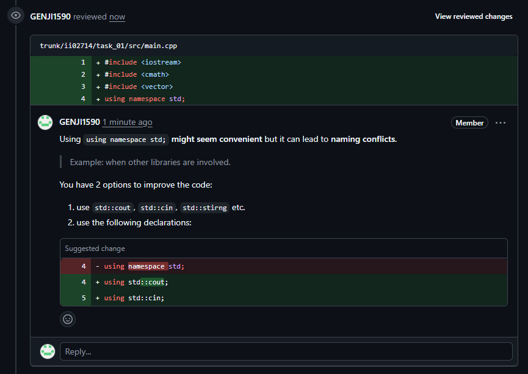

<p align="center"> Министерство образования Республики Беларусь</p>
<p align="center">Учреждение образования</p>
<p align="center">“Брестский Государственный технический университет”</p>
<p align="center">Кафедра ИИТ</p>
<br><br><br><br><br><br><br>
<p align="center">Лабораторная работа №1</p>
<p align="center">По дисциплине “Общая теория интеллектуальных систем”</p>
<p align="center">Тема: “Моделирования температуры объекта”</p>
<br><br><br><br><br>
<p align="right">Выполнил:</p>
<p align="right">Студент 2 курса</p>
<p align="right">Группы ИИ-28</p>
<p align="right">Козловский Е. Ю.</p>
<p align="right">Проверил:</p>
<p align="right">Иванюк Д.С.</p>
<br><br><br><br><br>
<p align="center">Брест 2025</p>

# Общее задание #
1. Написать отчет по выполненной лабораторной работе №1 в .md формате (readme.md) и с помощью запроса на внесение изменений (**pull request**) разместить его в следующем каталоге: **trunk\ii0xxyy\task_01\doc** (где **xx** - номер группы, **yy** - номер студента, например **ii02302**).
2. Исходный код написанной программы разместить в каталоге: **trunk\ii0xxyy\task_01\src**.
3. Выполнить рецензирование ([review](https://linearb.io/blog/code-review-on-github), [checklist](https://linearb.io/blog/code-review-checklist)) запросов других студентов (минимум 2-е рецензии).
4. Отразить выполнение работы в файле readme.md в соответствующей строке (например, для студента под порядковым номером 1 - https://github.com/brstu/OTIS-2023/edit/main/readme.md?#L17-L17).

## Task 1. Modeling controlled object ##
Let's get some object to be controlled. We want to control its temperature, which can be described by this differential equation:

$$\Large\frac{dy(\tau)}{d\tau}=\frac{u(\tau)}{C}+\frac{Y_0-y(\tau)}{RC} $$ (1)

where $\tau$ – time; $y(\tau)$ – input temperature; $u(\tau)$ – input warm; $Y_0$ – room temperature; $C,RC$ – some constants.

After transformation we get these linear (2) and nonlinear (3) models:

$$\Large y_{\tau+1}=ay_{\tau}+bu_{\tau}$$ (2)
$$\Large y_{\tau+1}=ay_{\tau}-by_{\tau-1}^2+cu_{\tau}+d\sin(u_{\tau-1})$$ (3)

where $\tau$ – time discrete moments ($1,2,3{\dots}n$); $a,b,c,d$ – some constants.

Task is to write program (**С++**), which simulates this object temperature.


## Код программы:
```C++
#include <iostream>
#include <cmath>

enum ModelType {
    LINEAR,
    NONLINEAR
};

struct LinearModelParams {
    double a;
    double b;
};

struct NonLinearModelParams {
    double yOffset;
    double uOffset;
    double a;
    double b;
    double c;
    double d;
    double u_step;
};

struct SimulationParams {
    double y;
    double u;
    int t;
};

SimulationParams getDefaultSimulationParams();

void simulateLinearModel(const SimulationParams& simParams);
LinearModelParams getDefaultLinearParams();

void simulateNonLinearModel(const SimulationParams& simParams);
NonLinearModelParams getDefaultNonLinearParams();

void simulateModel(ModelType type, const SimulationParams& simParams);

int main()
{
    SimulationParams simParams = getDefaultSimulationParams();

    std::cout << "Linear simulation:" << std::endl;
    simulateModel(LINEAR, simParams);
    std::cout << std::endl;

    std::cout << "Nonlinear simulation:" << std::endl;
    simulateModel(NONLINEAR, simParams);
    std::cout << std::endl;

    return 0;
}

SimulationParams getDefaultSimulationParams()
{
    SimulationParams params;
    params.y = 0.6; // Initial output value
    params.u = 60;  // Input signal value
    params.t = 10;  // Simulation time steps
    return params;
}

void simulateLinearModel(const SimulationParams& simParams)
{
    LinearModelParams params = getDefaultLinearParams();
    double y = simParams.y;
    double u = simParams.u;
    int t = simParams.t;

    for (int i = 0; i <= t; i++)
    {
        std::cout << i << ' ' << y << std::endl;
        y = params.a * y + params.b * u;
    }
}

LinearModelParams getDefaultLinearParams()
{
    LinearModelParams params;
    params.a = 0.1; // Coefficient for previous output (y)
    params.b = 0.8; // Coefficient for input (u)
    return params;
}

void simulateNonLinearModel(const SimulationParams& simParams)
{
    NonLinearModelParams params = getDefaultNonLinearParams();
    double y = simParams.y;
    double u = simParams.u;
    int t = simParams.t;

    double prevY = y - params.yOffset;
    double prevU = u - params.uOffset;

    for (int i = 0; i <= t; i++)
    {
        std::cout << i << ' ' << y << std::endl;
        double nextY = params.a * y - params.b * prevY * prevY + params.c * u + params.d * sin(prevU);
        prevU = u;
        u += params.u_step;
        prevY = y;
        y = nextY;
    }
}

NonLinearModelParams getDefaultNonLinearParams()
{
    NonLinearModelParams params;
    params.yOffset = 0.001;  // Initial offset for previous output value (prevY = y - yOffset)
    params.uOffset = 1;      // Initial offset for previous input value (prevU = u - uOffset)
    params.a = 1;            // Linear coefficient for current output (y)
    params.b = 0.5;          // Nonlinear coefficient for squared previous output (prevY²)
    params.c = 0.9;          // Linear coefficient for input (u)
    params.d = 2.5;          // Nonlinear coefficient for sinusoidal input term
    params.u_step = 0.01;    // Step size for input signal increment
    return params;
}

void simulateModel(ModelType type, const SimulationParams& simParams)
{
    switch (type)
    {
    case LINEAR:
        simulateLinearModel(simParams);
        break;
    case NONLINEAR:
        simulateNonLinearModel(simParams);
        break;
    default:
        std::cerr << "Error: Invalid ModelType value passed to simulateModel." << std::endl;
        break;
    }
}
```

## Результат программы:
```
Linear simulation:
0 0.6
1 48.06
2 52.806
3 53.2806
4 53.3281
5 53.3328
6 53.3333
7 53.3333
8 53.3333
9 53.3333
10 53.3333

Nonlinear simulation:
0 0.6
1 56.0124
2 109.079
3 -1406.39
4 -7302.33
5 -996209
6 -2.76581e+07
7 -4.96244e+11
8 -3.82983e+14
9 -1.23129e+23
10 -7.33381e+28
```
## Reviews
JohnyDepp228
<br>

<br>
RisomUV
<br>
