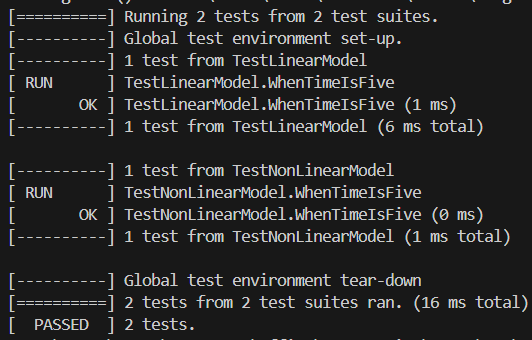
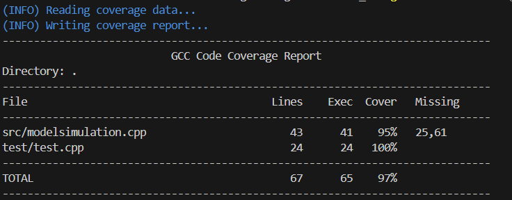
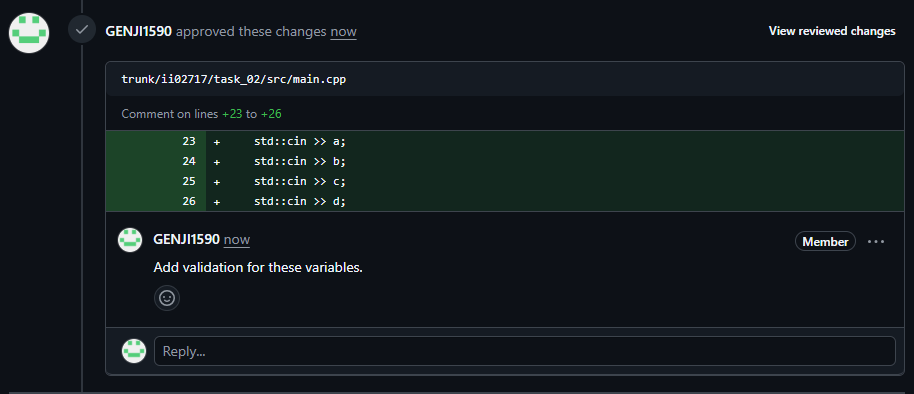
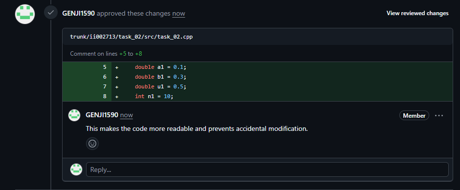

<p align="center">Министерство образования Республики Беларусь</p>
<p align="center">Учреждение образования</p>
<p align="center">“Брестский Государственный технический университет”</p>
<p align="center">Кафедра ИИТ</p>
<br><br><br><br><br><br><br>
<p align="center">Лабораторная работа №2</p>
<p align="center">По дисциплине “Общая теория интеллектуальных систем”</p>
<p align="center">Тема: “Модульное тестирование. Покрытие исходного кода тестами.”</p>
<br><br><br><br><br>
<p align="right">Выполнил:</p>
<p align="right">Студент 2 курса</p>
<p align="right">Группы ИИ-27</p>
<p align="right">Козловский Е.Ю.</p>
<p align="right">Проверил:</p>
<p align="right">Дворанинович Д.А.</p>
<br><br><br><br><br>
<p align="center">Брест 2025</p>


# Общее задание #
Написать модульные тесты для программы, разработанной в лабораторной работе №1.

1. Использовать следующий фреймворк для модульного тестирования - [Google Test](https://google.github.io/googletest/).
2. Написать модульные тесты для основных функций программы. Разместить тесты в каталоге: **trunk\ii0xxyy\task_02\test**.
3. Исходный код модифицированной программы разместить в каталоге: **trunk\ii0xxyy\task_02\src**.
4. В файле `readme.md` отразить количество написанных тестов и процент покрытия кода тестами (использовать любой инструмент для анализа покрытия, например, [gcovr](https://gcovr.com/en/stable/)).
5. Также необходимо отразить выполнение работы в общем файле [`readme.md`](https://github.com/brstu/OTIS-2025/blob/main/README.md) в соответствующей строке (например, для студента под порядковым номером 1 - https://github.com/brstu/OTIS-2025/blob/b2d60c2765b369aed21af76af8fa4461da2c8da6/README.md?plain=1#L13).


## Код тестов
```C++
#include <gtest/gtest.h>
#include <gmock/gmock.h>

#include "../src/modelsimulation.h"

TEST(TestLinearModel, WhenTimeIsFive)
{   
    SimulationParams simParams = getDefaultSimulationParams();
    std::vector<double> results = simulateLinearModel(simParams);

    std::vector<double> accepted_results
    { 0.6, 48.06, 52.806, 53.2806, 53.3281, 53.3328 };
    EXPECT_EQ(results.size(), accepted_results.size());
    for (size_t i = 0; i < results.size(); i++)
    {
        EXPECT_NEAR(results[i], accepted_results[i], 1e-2)
            << "Mismatch at index " << i;
    }
}

TEST(TestNonLinearModel, WhenTimeIsFive)
{   
    SimulationParams simParams = getDefaultSimulationParams();
    std::vector<double> results = simulateNonLinearModel(simParams);

    std::vector<double> accepted_results
    { 0.6, 56.0124, 109.079, -1406.39, -7302.33, -996209 };

    EXPECT_EQ(results.size(), accepted_results.size());
    
    for (size_t i = 0; i < results.size(); i++) 
    {
        EXPECT_NEAR(results[i], accepted_results[i], 1e-2)
            << "Mismatch at index " << i;
    }
}
```

## Результаты тестирования


## Покрытие кода тестами


## Reviews
igor7123

topg1616
