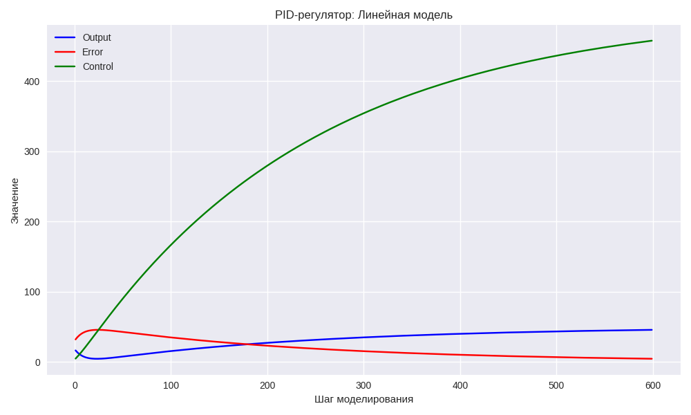
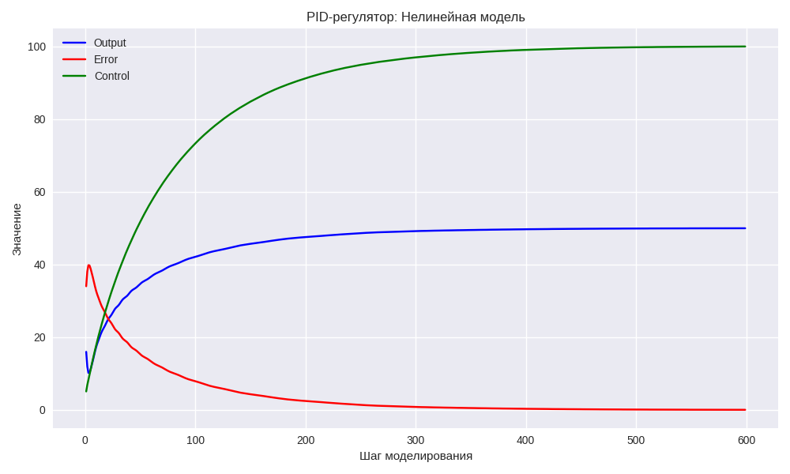
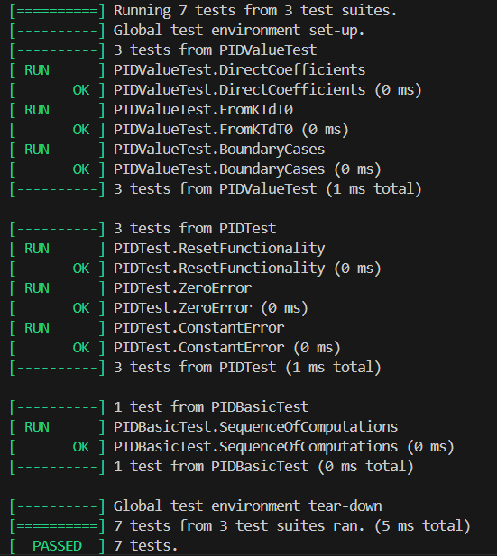

<p align="center">Министерство образования Республики Беларусь</p>
<p align="center">Учреждение образования</p>
<p align="center">“Брестский Государственный технический университет”</p>
<p align="center">Кафедра ИИТ</p>
<br><br><br><br><br><br><br>
<p align="center">Лабораторная работа №3</p>
<p align="center">По дисциплине “Общая теория интеллектуальных систем”</p>
<p align="center">Тема: “Моделирование системы автоматического управления с ПИД-регулятором для объекта теплового класса.”</p>
<br><br><br><br><br>
<p align="right">Выполнил:</p>
<p align="right">Студент 2 курса</p>
<p align="right">Группы ИИ-28</p>
<p align="right">Корнелюк Я. М.</p>
<p align="right">Проверил:</p>
<p align="right">Дворанинович Д.А.</p>
<br><br><br><br><br>
<p align="center">Брест 2025</p>

1. Написать отчет по выполненной лабораторной работе №3 в .md формате (*readme.md*) и разместить его в следующем каталоге: **trunk\ii0xxyy\task_03\doc**.
2. Исходный код написанной программы разместить в каталоге: **trunk\ii0xxyy\task_03\src**.
3. Отразить выполнение работы в файле readme.md в соответствующей строке (например, для студента под порядковым номером 1 - https://github.com/brstu/OTIS-2025/edit/main/readme.md?#L17-L17).
4. Документировать исходный код программы с помощью комментариев в стиле **Doxygen**. Полученную документацию разместить в каталоге: **trunk\ii0xxyy\task_03\doc\html**. Настроить `GitHub Pages` для автоматической публикации документации из этого каталога.
5. Разработанная программа также должна быть покрыта модульными тестами, написанными с использованием **Google Test**. Тесты разместить в каталоге: **trunk\ii0xxyy\task_03\test**.

**Лабораторная работа №3.**

**ПИД-регуляторы**

ПИД-регулятор — это алгоритм управления, который вычисляет управляющее воздействие как сумму трёх компонент: пропорциональной, интегральной и дифференциальной. Пропорциональная компонента реагирует на текущую ошибку, интегральная учитывает накопленную ошибку за время, а дифференциальная предсказывает будущее поведение системы. В работе был реализован цифровой ПИД-регулятор для управления тепловым объектом, проведено тестирование на линейной и нелинейной моделях.

**Задание.**
На **C++** реализовать программу, моделирующую рассмотренный выше ПИД-регулятор.  В качестве объекта управления использовать математическую модель, полученную в предыдущей работе.
В отчете также привести графики для разных заданий температуры объекта, пояснить полученные результаты.


## Код программы [ src/main3.cpp ]
```C++
#include <iostream>
#include "pid_contr.h"
#include "model.h"

using namespace std;

int main() {
    ModelParameters params;  /**< Параметры математических моделей */
    double y0;               /**< Начальная температура объекта */
    double w;                /**< Целевая температура */
    int steps;               /**< Количество шагов моделирования */

    cout << "Enter initial temperature y: ";
    cin >> y0;

    cout << "Enter model parameters a, b, c, d: ";
    cin >> params.a >> params.b >> params.c >> params.d;

    cout << "Enter target temperature w: ";
    cin >> w;

    cout << "Enter number of simulation steps: ";
    cin >> steps;

    // Параметры PID-регулятора
    double K  = 0.08;  /**< Усиление */
    double T  = 4.0;  /**< Время интегрирования */
    double Td = 1.5;  /**< Время дифференцирования */
    double T0 = 1.0;  /**< Шаг дискретизации */

    cout << "\n=== LINEAR MODEL SIMULATION ===" << endl;
    PID pid_linear(K, T, Td, T0);
    double y_linear = y0;

    cout << "Step\tError\tControl\tOutput" << endl;
    cout << "----\t-----\t-------\t------" << endl;

    for (int k = 0; k < steps; k++) {
        double e = w - y_linear;
        double u = pid_linear.compute(e);
        y_linear = linearModel(y_linear, u, params);

        cout << k << "\t" << e << "\t" << u << "\t" << y_linear << endl;
    }

    cout << "\n=== NONLINEAR MODEL SIMULATION ===" << endl;
    PID pid_nonlinear(K, T, Td, T0);
    double y_nonlinear = y0;
    double y_prev = y0;
    double u_prev = 0.0;

    cout << "Step\tError\tControl\tOutput" << endl;
    cout << "----\t-----\t-------\t------" << endl;

    for (int k = 0; k < steps; k++) {
        double e = w - y_nonlinear;
        double u = pid_nonlinear.compute(e);
        double y_next = nonlinearModel(y_nonlinear, y_prev, u, u_prev, params);

        cout << k << "\t" << e << "\t" << u << "\t" << y_nonlinear << endl;

        y_prev = y_nonlinear;
        y_nonlinear = y_next;
        u_prev = u;
    }

    return 0;
}
```

## Результат программы [ src/main3.cpp ]
```
Enter initial temperature y: 20
Enter model parameters a, b, c, d: 0.9 0.01 0.3 0.05
Enter target temperature w: 50
Enter number of simulation steps: 600

=== LINEAR MODEL SIMULATION ===
Step    Error   Control Output
----    -----   ------- ------
0       30.00   6.60    18.07
1       31.93   4.63    16.31
2       33.69   6.06    14.74
3       35.26   7.54    13.34
4       36.66   9.07    12.09
5       37.91   10.64   10.99
6       39.01   12.25   10.01
7       39.99   13.89   9.15
8       40.85   15.57   8.39
9       41.61   17.26   7.73
10      42.27   18.98   7.14
11      42.86   20.72   6.64
...
590     4.58    456.12  45.44
591     4.56    456.30  45.46
592     4.54    456.48  45.48
593     4.52    456.66  45.50
594     4.50    456.84  45.52
595     4.48    457.02  45.54
596     4.46    457.20  45.55
597     4.45    457.38  45.57
598     4.43    457.55  45.59
599     4.41    457.73  45.61

=== NONLINEAR MODEL SIMULATION ===
Step    Error   Control Output
----    -----   ------- ------
0       30.00   6.60    20.00
1       34.02   5.08    15.98
2       38.08   6.86    11.92
3       39.81   8.27    10.19
4       39.74   9.64    10.26
5       38.87   11.05   11.13
6       37.73   12.46   12.27
7       36.51   13.83   13.49
8       35.22   15.16   14.78
9       33.92   16.44   16.08
10      32.76   17.69   17.24
...
590     0.03    99.97   49.97
591     0.03    99.97   49.97
592     0.03    99.97   49.97
593     0.03    99.97   49.97
594     0.03    99.97   49.97
595     0.03    99.98   49.97
596     0.03    99.98   49.97
597     0.03    99.98   49.97
598     0.03    99.98   49.97
599     0.03    99.98   49.97
```

## Графики
### При `K = 0.08, T = 4.0, T0 = 1.0, TD = 1.5, a = 0.9, b = 0.01, c = 0.3, d = 0.05, y0 = 20, w = 50`




<br>

## Link to documentation
[https://furiall.github.io/OTIS-2025/](https://furiall.github.io/OTIS-2025/)

## Код тестов [ test/test_pid.cpp ]
```C++
#include <gtest/gtest.h>
#include <cmath>
#include <array>
#include "../src/pid_contr.h"

TEST(PIDValueTest, DirectCoefficients) {
    PID pid(1.0, -0.5, 0.2);

    pid.reset();

    double u1 = pid.compute(2.0);
    EXPECT_NEAR(u1, 2.0, 1e-10);

    double u2 = pid.compute(1.0);
    EXPECT_NEAR(u2, 2.0, 1e-10);

    double u3 = pid.compute(0.5);
    EXPECT_NEAR(u3, 2.4, 1e-10);
}

TEST(PIDValueTest, FromKTdT0) {
    double K = 0.5;
    double Ti = 4.0;
    double Td = 0.3;
    double T0 = 1.4;

    PID pid(K, Ti, Td, T0);
    pid.reset();

    double u1 = pid.compute(1.0);
    EXPECT_TRUE(std::isfinite(u1));

    double u2 = pid.compute(1.0);
    EXPECT_TRUE(std::isfinite(u2));
}

TEST(PIDTest, ResetFunctionality) {
    PID pid(1.0, 1.0, 0.1, 0.1);

    pid.compute(1.0);
    pid.compute(1.0);

    pid.reset();

    PID pid_new(1.0, 1.0, 0.1, 0.1);

    double u_reset = pid.compute(1.0);
    double u_new = pid_new.compute(1.0);

    EXPECT_DOUBLE_EQ(u_reset, u_new);
}

TEST(PIDTest, ZeroError) {
    PID pid(1.0, 1.0, 0.0, 0.1);
    pid.reset();

    double u = pid.compute(0.0);

    EXPECT_DOUBLE_EQ(u, 0.0);
}

TEST(PIDTest, ConstantError) {
    PID pid(2.0, 0.5, 0.1, 0.1);

    double u1 = pid.compute(1.0);
    double u2 = pid.compute(1.0);
    double u3 = pid.compute(1.0);

    EXPECT_NE(u1, u2);
    EXPECT_NE(u2, u3);
}

TEST(PIDBasicTest, SequenceOfComputations) {
    PID pid(1.0, 0.1, 0.01, 0.1);

    std::array<double, 3> results;
    for (auto& result : results) {
        result = pid.compute(1.0);
    }

    EXPECT_NE(results[0], results[1]);
    EXPECT_NE(results[1], results[2]);
    EXPECT_NE(results[0], results[2]);
}

TEST(PIDValueTest, BoundaryCases) {
    PID pid_large(1000.0, 1000.0, 1000.0, 0.01);
    pid_large.reset();
    double u_large = pid_large.compute(0.1);
    EXPECT_TRUE(std::isfinite(u_large));

    PID pid_small_dt(1.0, 1.0, 1.0, 1e-10);
    pid_small_dt.reset();
    double u_small = pid_small_dt.compute(1.0);
    EXPECT_TRUE(std::isfinite(u_small));
}

int main(int argc, char** argv) {
    ::testing::InitGoogleTest(&argc, argv);
    return RUN_ALL_TESTS();
}
```

## Результаты тестирования (GoogleTest)
