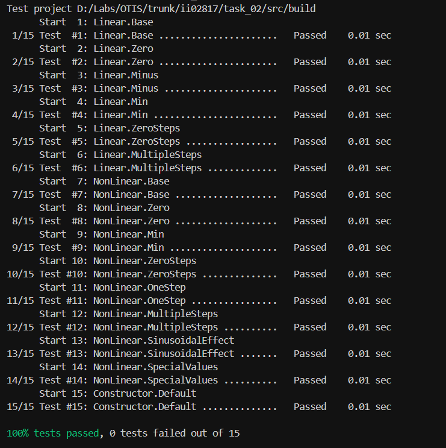

<p align="center">Министерство образования Республики Беларусь</p>
<p align="center">Учреждение образования</p>
<p align="center">“Брестский Государственный технический университет”</p>
<p align="center">Кафедра ИИТ</p>
<br><br><br><br><br><br><br>
<p align="center">Лабораторная работа №2</p>
<p align="center">По дисциплине “Общая теория интеллектуальных систем”</p>
<p align="center">Тема: “Модульное тестирование. Покрытие исходного кода тестами.”</p>
<br><br><br><br><br>
<p align="right">Выполнил:</p>
<p align="right">Студент 2 курса</p>
<p align="right">Группы ИИ-28</p>
<p align="right">Любовицкий Н.Н.</p>
<p align="right">Проверил:</p>
<p align="right">Дворанинович Д.А.</p>
<br><br><br><br><br>
<p align="center">Брест 2025</p>

# Общее задание

Написать модульные тесты для программы, разработанной в лабораторной работе №1.

1. Использовать следующий фреймворк для модульного тестирования - [Google Test](https://google.github.io/googletest/).
2. Написать модульные тесты для основных функций программы. Разместить тесты в каталоге: **trunk\ii0xxyy\task_02\test**.
3. Исходный код модифицированной программы разместить в каталоге: **trunk\ii0xxyy\task_02\src**.
4. В файле `readme.md` отразить количество написанных тестов и процент покрытия кода тестами (использовать любой инструмент для анализа покрытия, например, [gcovr](https://gcovr.com/en/stable/)).
5. Также необходимо отразить выполнение работы в общем файле [`readme.md`](https://github.com/brstu/OTIS-2025/blob/main/README.md) в соответствующей строке (например, для студента под порядковым номером 1 - https://github.com/brstu/OTIS-2025/blob/b2d60c2765b369aed21af76af8fa4461da2c8da6/README.md?plain=1#L13).

## Код юнит-тестов [ test/test.cpp ]

```C++
#define _USE_MATH_DEFINES
#include <gtest/gtest.h>
#include <cmath>
#include <vector>

#include "../src/main.cpp"

TEST(Linear, Base)
{
    func f(1.5, -0.5, 0.0, 0.0);
    f.value_set(2.0, 0.0, 3.0, 0.0);

    std::vector<double> result = f.linear(2);
    ASSERT_GE(result.size(), 2);
    double expected = 1.5 * 2.0 + (-0.5) * 3.0;
    EXPECT_DOUBLE_EQ(result[1], expected);
}

TEST(Linear, Zero)
{
    func f(0.0, 0.0, 0.0, 0.0);
    f.value_set(5.0, 0.0, 4.0, 0.0);

    std::vector<double> result = f.linear(2);
    ASSERT_GE(result.size(), 2);
    EXPECT_DOUBLE_EQ(result[1], 0.0);
}

TEST(Linear, Minus)
{
    func f(1.0, 2.0, 0.0, 0.0);
    f.value_set(-2.0, 0.0, -3.0, 0.0);

    std::vector<double> result = f.linear(2);
    ASSERT_GE(result.size(), 2);
    double expected = 1.0 * (-2.0) + 2.0 * (-3.0);
    EXPECT_DOUBLE_EQ(result[1], expected);
}

TEST(NonLinear, Base)
{
    func f(2.0, 1.0, 0.5, 1.0);
    f.value_set(1.0, 0.0, 0.5, 0.5);

    std::vector<double> result = f.nonlinear(3);
    ASSERT_GE(result.size(), 3);
    double expected = 2.0 * 1.0 - 1.0 * std::pow(0.0, 2) + 0.5 * 0.5 + 1.0 * std::sin(0.5);
    EXPECT_DOUBLE_EQ(result[2], expected);
}

TEST(NonLinear, Zero)
{
    func f(0.0, 0.0, 0.0, 0.0);
    f.value_set(2.0, 1.0, 1.0, 1.0);

    std::vector<double> result = f.nonlinear(3);
    ASSERT_GE(result.size(), 3);
    EXPECT_DOUBLE_EQ(result[2], 0.0);
}

TEST(Linear, Min)
{
    func f(1.0, 1.0, 0.0, 0.0);
    f.value_set(1.0, 0.0, 1.0, 0.0);

    std::vector<double> result = f.linear(1);
    ASSERT_EQ(result.size(), 1);
    EXPECT_DOUBLE_EQ(result[0], 1.0);
}

TEST(NonLinear, Min)
{
    func f(1.0, 1.0, 1.0, 1.0);
    f.value_set(1.0, 0.5, 1.0, 0.5);

    std::vector<double> result = f.nonlinear(2);
    ASSERT_EQ(result.size(), 2);
    EXPECT_DOUBLE_EQ(result[0], 0.5);
    EXPECT_DOUBLE_EQ(result[1], 1.0);
}

TEST(Constructor, Default)
{
    func f;

    std::vector<double> result_linear = f.linear(1);
    std::vector<double> result_nonlinear = f.nonlinear(2);

    ASSERT_EQ(result_linear.size(), 1);
    ASSERT_EQ(result_nonlinear.size(), 2);
}

TEST(Linear, ZeroSteps)
{
    func f(1.0, 1.0, 0.0, 0.0);
    f.value_set(1.0, 0.0, 1.0, 0.0);

    std::vector<double> result = f.linear(0);
    EXPECT_TRUE(result.empty());

    result = f.linear(-1);
    EXPECT_TRUE(result.empty());
}

TEST(NonLinear, ZeroSteps)
{
    func f(1.0, 1.0, 1.0, 1.0);
    f.value_set(1.0, 0.5, 1.0, 0.5);

    std::vector<double> result = f.nonlinear(0);
    EXPECT_TRUE(result.empty());

    result = f.nonlinear(-1);
    EXPECT_TRUE(result.empty());
}

TEST(NonLinear, OneStep)
{
    func f(1.0, 1.0, 1.0, 1.0);
    f.value_set(1.0, 0.5, 1.0, 0.5);

    std::vector<double> result = f.nonlinear(1);
    ASSERT_EQ(result.size(), 1);
    EXPECT_DOUBLE_EQ(result[0], 0.5);
}

TEST(Linear, MultipleSteps)
{
    func f(2.0, 1.0, 0.0, 0.0);
    f.value_set(1.0, 0.0, 2.0, 0.0);

    std::vector<double> result = f.linear(5);
    ASSERT_EQ(result.size(), 5);

    EXPECT_DOUBLE_EQ(result[0], 1.0);
    EXPECT_DOUBLE_EQ(result[1], 2.0 * 1.0 + 1.0 * 2.0);  // 4.0
    EXPECT_DOUBLE_EQ(result[2], 2.0 * 4.0 + 1.0 * 2.0);  // 10.0
    EXPECT_DOUBLE_EQ(result[3], 2.0 * 10.0 + 1.0 * 2.0); // 22.0
    EXPECT_DOUBLE_EQ(result[4], 2.0 * 22.0 + 1.0 * 2.0); // 46.0
}

TEST(NonLinear, MultipleSteps)
{
    func f(2.0, 1.0, 1.0, 1.0);
    f.value_set(2.0, 1.0, 3.0, 2.0);

    std::vector<double> result = f.nonlinear(5);
    ASSERT_EQ(result.size(), 5);

    EXPECT_DOUBLE_EQ(result[0], 1.0);
    EXPECT_DOUBLE_EQ(result[1], 2.0);

    double expected_step2 = 2.0 * 2.0 - 1.0 * std::pow(1.0, 2) + 1.0 * 3.0 + 1.0 * std::sin(2.0);
    EXPECT_DOUBLE_EQ(result[2], expected_step2);
}

TEST(NonLinear, SinusoidalEffect)
{
    func f(0.0, 0.0, 0.0, 2.0);
    f.value_set(0.0, 0.0, 0.0, M_PI / 2);

    std::vector<double> result = f.nonlinear(3);
    ASSERT_GE(result.size(), 3);

    EXPECT_DOUBLE_EQ(result[2], 2.0);
}

TEST(NonLinear, SpecialValues)
{
    func f(0.0, 0.0, 0.0, 0.0);
    f.value_set(1.0, 2.0, 3.0, 4.0);

    std::vector<double> result = f.nonlinear(4);
    ASSERT_EQ(result.size(), 4);

    EXPECT_DOUBLE_EQ(result[0], 2.0);
    EXPECT_DOUBLE_EQ(result[1], 1.0);
    EXPECT_DOUBLE_EQ(result[2], 0.0);
    EXPECT_DOUBLE_EQ(result[3], 0.0);
}
```

## Результаты юнит-тестирования (GoogleTest)



## Покрытие тестами (gcovr)


