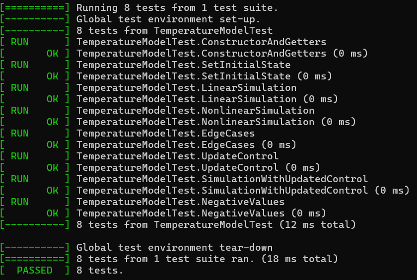

<p align="center">Министерство образования Республики Беларусь</p>
<p align="center">Учреждение образования</p>
<p align="center">“Брестский Государственный технический университет”</p>
<p align="center">Кафедра ИИТ</p>
<br><br><br><br><br><br><br>
<p align="center">Лабораторная работа №2</p>
<p align="center">По дисциплине “Общая теория интеллектуальных систем”</p>
<p align="center">Тема: “Модульное тестирование. Покрытие исходного кода тестами.”</p>
<br><br><br><br><br>
<p align="right">Выполнил:</p>
<p align="right">Студент 2 курса</p>
<p align="right">Группы ИИ-28</p>
<p align="right">Люкевич В.Д.</p>
<p align="right">Проверил:</p>
<p align="right">Дворанинович Д.А.</p>
<br><br><br><br><br>
<p align="center">Брест 2025</p>

# Общее задание #
Написать модульные тесты для программы, разработанной в лабораторной работе №1.

1. Использовать следующий фреймворк для модульного тестирования - [Google Test](https://google.github.io/googletest/).
2. Написать модульные тесты для основных функций программы. Разместить тесты в каталоге: **trunk/ii0xxyy/task_02/test**.
3. Исходный код модифицированной программы разместить в каталоге: **trunk/ii0xxyy/task_02/src**.
4. В файле `readme.md` отразить количество написанных тестов и процент покрытия кода тестами (использовать любой инструмент для анализа покрытия, например, [gcovr](https://gcovr.com/en/stable/)).
5. Также необходимо отразить выполнение работы в общем файле [`readme.md`](https://github.com/brstu/OTIS-2025/blob/main/README.md) в соответствующей строке (например, для студента под порядковым номером 1 - https://github.com/brstu/OTIS-2025/blob/b2d60c2765b369aed21af76af8fa4461da2c8da6/README.md?plain=1#L13).


Количество тестов:
Всего написано: 8 модульных тестов
## Код модульных тестов ##
```
#include <gtest/gtest.h>
#include <iostream>
#include <cmath>
#include "../src/lab2otis.h"

TEST(TemperatureModelTest, ConstructorAndGetters) {
    TemperatureModel model(0.1, 0.2, 0.3, 0.4);

    EXPECT_DOUBLE_EQ(model.getA(), 0.1);
    EXPECT_DOUBLE_EQ(model.getB(), 0.2);
    EXPECT_DOUBLE_EQ(model.getC(), 0.3);
    EXPECT_DOUBLE_EQ(model.getD(), 0.4);
}

TEST(TemperatureModelTest, SetInitialState) {
    TemperatureModel model(0.1, 0.2, 0.3, 0.4);
    model.setInitialState(10.0, 11.0, 5.0, 6.0);

    EXPECT_DOUBLE_EQ(model.getPrevY(), 10.0);
    EXPECT_DOUBLE_EQ(model.getCurrentY(), 11.0);
    EXPECT_DOUBLE_EQ(model.getPrevU(), 5.0);
    EXPECT_DOUBLE_EQ(model.getCurrentU(), 6.0);
}

TEST(TemperatureModelTest, LinearSimulation) {
    TemperatureModel model(0.5, 0.3, 0.0, 0.0);
    model.setInitialState(20.0, 21.0, 1.0, 1.0);

    auto results = model.simulateLinear(5);

    EXPECT_EQ(results.size(), 5);

    EXPECT_DOUBLE_EQ(results[0], 20.0);
    EXPECT_DOUBLE_EQ(results[1], 21.0);

    double expected_step2 = 0.5 * 21.0 + 0.3 * 1.0;
    EXPECT_DOUBLE_EQ(results[2], expected_step2);

    double expected_step3 = 0.5 * expected_step2 + 0.3 * 1.0;
    EXPECT_DOUBLE_EQ(results[3], expected_step3);
}

TEST(TemperatureModelTest, NonlinearSimulation) {
    TemperatureModel model(0.5, 0.1, 0.2, 0.3);
    model.setInitialState(2.0, 3.0, 1.0, 1.0);

    auto results = model.simulateNonlinear(5);

    EXPECT_EQ(results.size(), 5);

    EXPECT_DOUBLE_EQ(results[0], 2.0);
    EXPECT_DOUBLE_EQ(results[1], 3.0);


    double expected = 0.5 * 3.0 - 0.1 * std::pow(2.0, 2) + 0.2 * 1.0 + 0.3 * std::sin(1.0);
    EXPECT_NEAR(results[2], expected, 1e-10);

    double expected_step3 = 0.5 * expected - 0.1 * std::pow(3.0, 2) + 0.2 * 1.0 + 0.3 * std::sin(1.0);
    EXPECT_NEAR(results[3], expected_step3, 1e-10);
}

TEST(TemperatureModelTest, EdgeCases) {
    TemperatureModel model(0.0, 0.0, 0.0, 0.0);
    model.setInitialState(0.0, 0.0, 0.0, 0.0);

    auto results1 = model.simulateLinear(1);
    EXPECT_EQ(results1.size(), 1);
    EXPECT_DOUBLE_EQ(results1[0], 0.0);

    auto results2 = model.simulateLinear(2);
    EXPECT_EQ(results2.size(), 2);
    EXPECT_DOUBLE_EQ(results2[0], 0.0);
    EXPECT_DOUBLE_EQ(results2[1], 0.0);

    auto results3 = model.simulateNonlinear(1);
    EXPECT_EQ(results3.size(), 1);
    EXPECT_DOUBLE_EQ(results3[0], 0.0);
}

TEST(TemperatureModelTest, UpdateControl) {
    TemperatureModel model(0.1, 0.2, 0.3, 0.4);
    model.setInitialState(10.0, 11.0, 5.0, 6.0);

    EXPECT_DOUBLE_EQ(model.getPrevU(), 5.0);
    EXPECT_DOUBLE_EQ(model.getCurrentU(), 6.0);

    model.updateControl(7.0);

    EXPECT_DOUBLE_EQ(model.getPrevU(), 6.0);
    EXPECT_DOUBLE_EQ(model.getCurrentU(), 7.0);
}

TEST(TemperatureModelTest, SimulationWithUpdatedControl) {
    TemperatureModel model(0.5, 0.3, 0.0, 0.0);
    model.setInitialState(10.0, 11.0, 1.0, 1.0);

    auto results1 = model.simulateLinear(3);

    model.updateControl(2.0);

    auto results2 = model.simulateLinear(3);

    EXPECT_EQ(results1.size(), 3);
    EXPECT_EQ(results2.size(), 3);
}

TEST(TemperatureModelTest, NegativeValues) {
    TemperatureModel model(-0.1, -0.2, -0.3, -0.4);
    model.setInitialState(-10.0, -11.0, -5.0, -6.0);

    EXPECT_DOUBLE_EQ(model.getA(), -0.1);
    EXPECT_DOUBLE_EQ(model.getB(), -0.2);
    EXPECT_DOUBLE_EQ(model.getC(), -0.3);
    EXPECT_DOUBLE_EQ(model.getD(), -0.4);
    EXPECT_DOUBLE_EQ(model.getPrevY(), -10.0);
    EXPECT_DOUBLE_EQ(model.getCurrentY(), -11.0);

    auto results = model.simulateLinear(3);
    EXPECT_EQ(results.size(), 3);
}
```
Покрытие кода
Для анализа покрытия использовался инструмент OpenCppCoverage.

