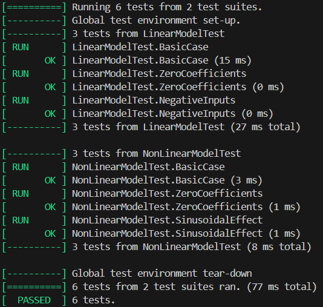

<p align="center"> Министерство образования Республики Беларусь</p>
<p align="center">Учреждение образования</p>
<p align="center">“Брестский Государственный технический университет”</p>
<p align="center">Кафедра ИИТ</p>
<br><br><br><br><br><br><br>
<p align="center">Лабораторная работа №2</p>
<p align="center">по дисциплине “Общая теория интеллектуальных систем”</p>
<p align="center">Тема: “Модульное тестирование. Покрытие исходного кода тестами”</p>
<br><br><br><br><br>
<p align="right">Выполнил:</p>
<p align="right">Студент 2 курса</p>
<p align="right">Группы ИИ-28</p>
<p align="right">Степанюк А.С.</p>
<p align="right">Проверил:</p>
<p align="right">Дворанинович Д.А.</p>
<br><br><br><br><br>
<p align="center">Брест 2025</p>

<hr>


# Общее задание #
Написать модульные тесты для программы, разработанной в лабораторной работе №1.

1. Использовать следующий фреймворк для модульного тестирования - [Google Test](https://google.github.io/googletest/).
2. Написать модульные тесты для основных функций программы. Разместить тесты в каталоге: **trunk\ii0xxyy\task_02\test**.
3. Исходный код модифицированной программы разместить в каталоге: **trunk\ii0xxyy\task_02\src**.
4. В файле `readme.md` отразить количество написанных тестов и процент покрытия кода тестами (использовать любой инструмент для анализа покрытия, например, [gcovr](https://gcovr.com/en/stable/)).
5. Также необходимо отразить выполнение работы в общем файле [`readme.md`](https://github.com/brstu/OTIS-2025/blob/main/README.md) в соответствующей строке (например, для студента под порядковым номером 1 - https://github.com/brstu/OTIS-2025/blob/b2d60c2765b369aed21af76af8fa4461da2c8da6/README.md?plain=1#L13).
## Код модульных тестов ##
```
#define  _USE_MATH_DEFINES
#include  <gtest/gtest.h>
#include  "../src/task_01.h"
#include  <cmath>

TEST(LinearModelTest, BasicCase)
{
double  y  =  2.0;
double  u  =  3.0;
double  a  =  1.5;
double  b  =  -0.5;
double  expected  =  a  *  y  +  b  *  u;
EXPECT_DOUBLE_EQ(linear(y, u, a, b), expected);
}

TEST(LinearModelTest, ZeroCoefficients)
{
EXPECT_DOUBLE_EQ(linear(5.0, 4.0, 0.0, 0.0), 0.0);
}

TEST(LinearModelTest, NegativeInputs)
{
EXPECT_DOUBLE_EQ(linear(-2.0, -3.0, 1.0, 2.0), -2.0  + (-3.0  *  2.0));
} 

TEST(NonLinearModelTest, BasicCase)
{
double  y  =  1.0;
double  y_p  =  0.0;
double  u  =  0.5;
double  a  =  2.0;
double  b  =  1.0;
double  c  =  0.5;
double  d  =  1.0;

double  expected  =  a  *  y  -  b  *  y  *  y  +  c  *  u  +  d  *  std::sin(u);
double  result  =  non_linear(y, y_p, u, a, b, c, d);

EXPECT_DOUBLE_EQ(result, expected);
EXPECT_DOUBLE_EQ(y_p, y);
}

  

TEST(NonLinearModelTest, ZeroCoefficients)
{
double  y  =  2.0;
double  y_p  =  0.0;
double  u  =  1.0;
double  result  =  non_linear(y, y_p, u, 0.0, 0.0, 0.0, 0.0);
EXPECT_DOUBLE_EQ(result, 0.0);
}

TEST(NonLinearModelTest, SinusoidalEffect)
{
double  y  =  0.0;
double  y_p  =  0.0;
double  u  =  M_PI  /  2;
double  result  =  non_linear(y, y_p, u, 0.0, 0.0, 0.0, 2.0);
EXPECT_DOUBLE_EQ(result, 2.0);
}
```
## Результаты тестирования ##

## Покрытие тестами (OpenCppCoverage) ##

