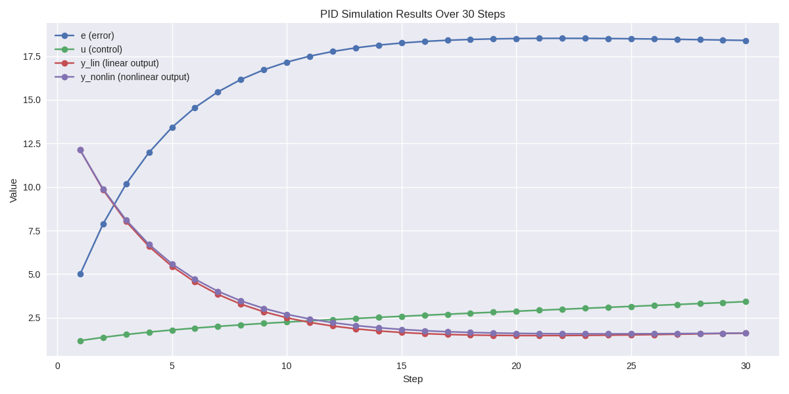
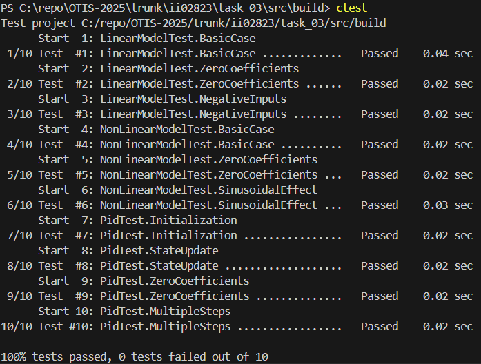

<p align="center">Министерство образования Республики Беларусь</p>
<p align="center">Учреждение образования</p>
<p align="center">“Брестский Государственный технический университет”</p>
<p align="center">Кафедра ИИТ</p>
<br><br><br><br><br><br><br>
<p align="center">Лабораторная работа №3</p>
<p align="center">По дисциплине “Общая теория интеллектуальных систем”</p>
<p align="center">Тема: “Моделирование системы автоматического управления с ПИД-регулятором для объекта теплового класса.”</p>
<br><br><br><br><br>
<p align="right">Выполнил:</p>
<p align="right">Студент 2 курса</p>
<p align="right">Группы ИИ-28/24</p>
<p align="right">Степанюк А.C.</p>
<p align="right">Проверил:</p>
<p align="right">Дворанинович Д.А.</p>
<br><br><br><br><br>
<p align="center">Брест 2025</p>

**Задание.**
1. Написать отчет по выполненной лабораторной работе №3 в .md формате (*readme.md*) и разместить его в следующем каталоге: **trunk\ii0xxyy\task_03\doc**.
2. Исходный код написанной программы разместить в каталоге: **trunk\ii0xxyy\task_03\src**.
3. Отразить выполнение работы в файле readme.md в соответствующей строке (например, для студента под порядковым номером 1 - https://github.com/brstu/OTIS-2025/edit/main/readme.md?#L17-L17).
4. Документировать исходный код программы с помощью комментариев в стиле **Doxygen**. Полученную документацию разместить в каталоге: **trunk\ii0xxyy\task_03\doc\html**. Настроить `GitHub Pages` для автоматической публикации документации из этого каталога.
5. Разработанная программа также должна быть покрыта модульными тестами, написанными с использованием **Google Test**. Тесты разместить в каталоге: **trunk\ii0xxyy\task_03\test**.

На **C++** реализовать программу, моделирующую рассмотренный выше ПИД-регулятор.  В качестве объекта управления использовать математическую модель, полученную в предыдущей работе.
В отчете также привести графики для разных заданий температуры объекта, пояснить полученные результаты.


## Код программы
```C++
#include <iostream>
#include "models.h"
#include "pid.h"

int main()
{
    const double K  = 0.06;
    const double T  = 20.0;
    const double Td = 0.0;
    const double T0 = 1.0;
    
    pid_coeffs coeffs(K, T, Td, T0);
    pid PID(coeffs, 1, 2, 3);

    const double a_lin = 0.8;
    const double b_lin = 0.1;

    NonLinearCoeffs coeffs_nl;
    coeffs_nl.a = 0.8;
    coeffs_nl.b = 0.0;
    coeffs_nl.c = 0.1;
    coeffs_nl.d = 0.05;

    double y;
    double w;
    int n;

    std::cout << "Enter initial temperature -> ";
    std::cin >> y;
    std::cout << "Enter target temperature -> ";
    std::cin >> w;
    std::cout << "Enter number of steps -> ";
    std::cin >> n;

    double e;
    double u;

    double y_nl = y;
    double y_prev = 0;
    double u_prev = 0;

    for (int i = 0; i < n; i++)
    {
        e = w - y;
        u = PID.process(e);

        y = linear(y, u, a_lin, b_lin);

        y_nl = non_linear(y_nl, y_prev, u, u_prev, coeffs_nl);
        y_prev = y_nl;
        u_prev = u;

        std::cout << "Step " << i + 1 
                  << " - e = " << e 
                  << ", u = " << u 
                  << ", y_lin = " << y 
                  << ", y_nonlin = " << y_nl 
                  << ";\n";
    }

    return 0;
}
```

## График работы программы


## Ссылка на документацию
[https://tstepannovikov.github.io/OTIS-2025](https://tstepannovikov.github.io/OTIS-2025/)

## Код тестов
```C++
#define _USE_MATH_DEFINES
#include <gtest/gtest.h>
#include "../src/models.h"
#include "../src/pid.h"
#include <cmath>

TEST(LinearModelTest, BasicCase) {
    double y = 2.0;
    double u = 3.0;
    double a = 1.5;
    double b = -0.5;
    double expected = a * y + b * u;

    EXPECT_DOUBLE_EQ(linear(y, u, a, b), expected);
}

TEST(LinearModelTest, ZeroCoefficients) {
    EXPECT_DOUBLE_EQ(linear(5.0, 4.0, 0.0, 0.0), 0.0);
}

TEST(LinearModelTest, NegativeInputs) {
    EXPECT_DOUBLE_EQ(linear(-2.0, -3.0, 1.0, 2.0), -2.0 + (-3.0 * 2.0));
}

TEST(NonLinearModelTest, BasicCase) {
    double y   = 1.0;
    double y_p = 0.0;
    double u   = 0.5;
    double u_p = 0.2;
    NonLinearCoeffs coeffs{2.0, 1.0, 0.5, 1.0};
    double expected = coeffs.a * y - coeffs.b * y_p * y_p + coeffs.c * u + coeffs.d * std::sin(u_p);

    EXPECT_DOUBLE_EQ(non_linear(y, y_p, u, u_p, coeffs), expected);
}

TEST(NonLinearModelTest, ZeroCoefficients) {
    double y   = 2.0;
    double y_p = 1.0;
    double u   = 1.0;
    double u_p = 0.5;
    NonLinearCoeffs coeffs{0.0, 0.0, 0.0, 0.0};

    EXPECT_DOUBLE_EQ(non_linear(y, y_p, u, u_p, coeffs), 0.0);
}

TEST(NonLinearModelTest, SinusoidalEffect) {
    double y   = 0.0;
    double y_p = 0.0;
    double u   = 0.0;
    double u_p = M_PI / 2;
    NonLinearCoeffs coeffs{0.0, 0.0, 0.0, 2.0};

    EXPECT_DOUBLE_EQ(non_linear(y, y_p, u, u_p, coeffs), 2.0);
}

TEST(PidTest, Initialization) {
    pid_coeffs coeffs(2.0, 1.0, 0.5, 0.1);
    pid PID(coeffs, 0.0, 0.0, 0.0);
    double e = 1.0;
    double expected = PID.process(e);

    EXPECT_DOUBLE_EQ(expected, 12.0);
}

TEST(PidTest, StateUpdate) {
    pid_coeffs coeffs(1.0, 1.0, 1.0, 1.0);
    pid PID(coeffs, 0.0, 0.0, 0.0);
    double u1 = PID.process(1.0);
    double u2 = PID.process(2.0);

    EXPECT_NE(u1, u2);
}

TEST(PidTest, ZeroCoefficients) {
    pid_coeffs coeffs(0.0, 1.0, 1.0, 1.0);
    pid PID(coeffs, 0.0, 0.0, 0.0);
    double result = PID.process(5.0);

    EXPECT_DOUBLE_EQ(result, 0.0);
}

TEST(PidTest, MultipleSteps) {
    pid_coeffs coeffs(1.0, 2.0, 0.5, 0.1);
    pid PID(coeffs, 0.0, 0.0, 0.0);
    double u1 = PID.process(1.0);
    double u2 = PID.process(1.0);
    double u3 = PID.process(1.0);

    EXPECT_NE(u1, u2);
    EXPECT_NE(u2, u3);
}

```

## Результаты тестирования (GoogleTest)


