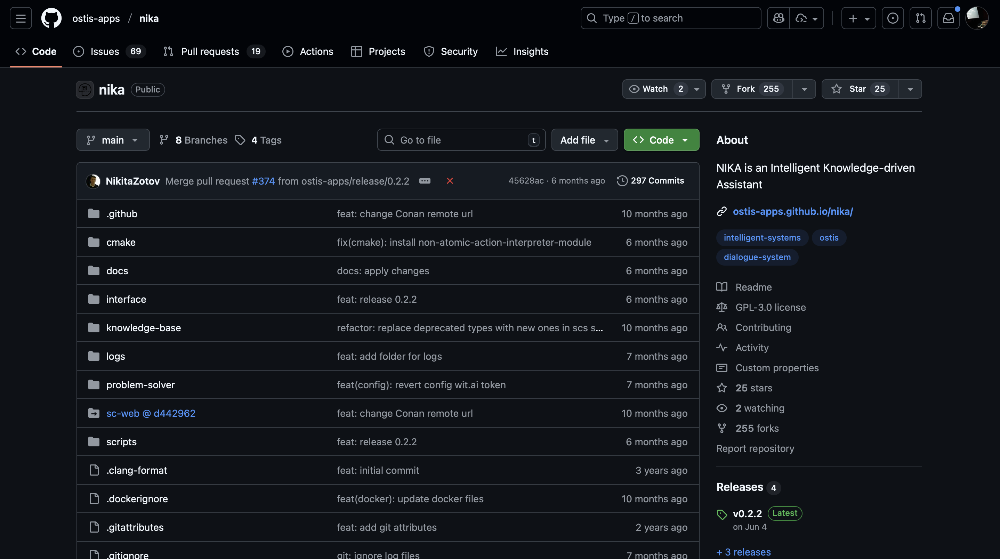
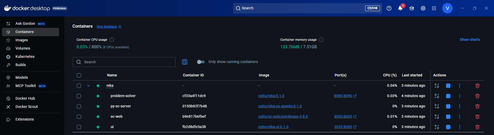
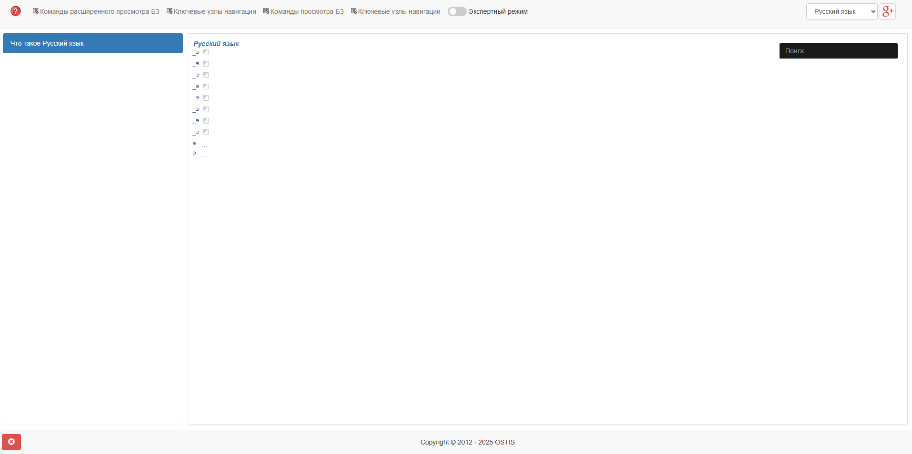
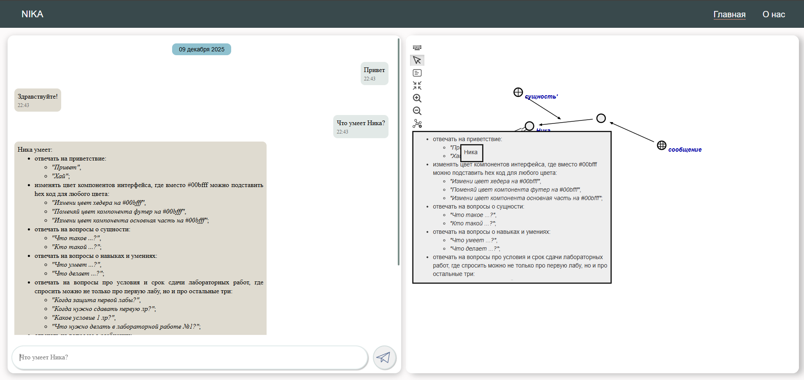

<p align="center">Министерство образования Республики Беларусь</p>
<p align="center">Учреждение образования</p>
<p align="center">“Брестский Государственный технический университет”</p>
<p align="center">Кафедра ИИТ</p>
<br><br><br><br><br><br><br>
<p align="center">Лабораторная работа №4</p>
<p align="center">По дисциплине “Общая теория интеллектуальных систем”</p>
<p align="center">Тема: “Работа с проектом "NIKA" (Intelligent Knowledge-driven Assistant)”</p>
<br><br><br><br><br>
<p align="right">Выполнил:</p>
<p align="right">Студент 2 курса</p>
<p align="right">Группы ИИ-28</p>
<p align="right">Цибульскас В.С.</p>
<p align="right">Проверил:</p>
<p align="right">Дворанинович Д.А.</p>
<br><br><br><br><br>
<p align="center">Брест 2025</p>

# Работа с проектом **"NIKA"** (Intelligent Knowledge-driven Assistant) #

1. Изучить [руководство](https://github.com/ostis-apps/nika).

2. Запустить данный проект на локальной машине (домашний персональный компьютер, ноутбук, рабочая машина в аудитории и т.п.). Продемонстрировать работу проекта преподавателю.

3. Написать отчет по выполненной работе в .md формате (readme.md) и с помощью pull request разместить его в следующем каталоге: trunk\ii0xxyy\task_04\doc.

# Запуск NIKA (локально, Docker + WSL2)

Краткая инструкция по развёртыванию проекта **NIKA** на локальной машине под Windows с помощью Docker Desktop и WSL2.

## Требования

* Windows 10/11 с поддержкой WSL2
* Docker Desktop (WSL2 backend включён)
* Git
* PowerShell (рекомендуется запускать с правами администратора для некоторых операций)

## Краткий план

1. Клонировать репозиторий NIKA.
2. Подготовить окружение (WSL2, длинные пути).
3. Подтянуть образы и запустить контейнеры через `nika.ps1` (или `docker compose`).
4. Проверить доступность сервисов (UI, SC-web, problem-solver).

## Подготовка Windows

1. Установить Docker Desktop: [https://docs.docker.com/](https://docs.docker.com/)
2. При необходимости установить WSL2:
```
wsl --install
# перезагрузить ПК при запросе
```
3. Включить поддержку длинных путей (Registry):
* Открыть `regedit`.
* Перейди в `HKEY_LOCAL_MACHINE\\SYSTEM\\CurrentControlSet\\Control\\FileSystem`.
* Создай/установи `LongPathsEnabled` (DWORD) = `1`.
4. Настройка Git:
```
git config --system core.longpaths true
# или для пользователя
# git config --global core.longpaths true
```

## Клонирование и подготовка репозитория

В Powershell:
```
powershell
git clone -c core.longpaths=true -c core.autocrlf=true https://github.com/ostis-apps/nika
cd nika
git checkout 69858165c3b5fb26ca783950c74bfe7bddd64a00
git submodule update --init --recursive
# зафиксировать стабильную ревизию, совместимую с образами 0.1.0
```

## Запуск

В каталоге репозитория запустить:
```
powershell
.\nika.ps1
```

`nika.ps1` автоматически подтянет образы, создаст и поднимет контейнеры, проверит состояние сервисов и выведет URLы.

## Запуск вручную (Docker Compose)

```
powershell
# подтянуть образы
docker compose pull
# поднять контейнеры в фоне
docker compose up --no-build -d
```

## Проверка сервисов и полезные команды

* UI (диалог): `http://localhost:3033`
* SC-web (визуализация БЗ): `http://localhost:8000`
* Problem-solver: порт `8090` (TCP/WS)

Полезные команды:
```
powershell
# состояние контейнеров
docker compose ps

# логи (последние 200 строк)
docker compose logs --tail 200 nika-problem-solver nika-sc-web nika-ui py-sc-server

# попасть внутрь контейнера problem-solver
docker exec -it nika-problem-solver bash

# остановить и удалить контейнеры и сеть
docker compose down
```

## Пересборка бинарной БЗ (опционально)

Если вносились правки и нужно обновить скомпилированную базу знаний, запустить (внутри контейнера или в среде с доступом к бинарникам):
```
bash
/nika/bin/sc-builder -c -f -i /nika/kb -o /nika/problem-solver/sc-machine/bin/kb
```

## Скриншоты

*  — главная страница репозитория NIKA на GitHub.
*  — список контейнеров в Docker Desktop.
*  — страница SC-web ([http://localhost:8000](http://localhost:8000)).
*  — диалоговый UI ([http://localhost:3033](http://localhost:3033)).
